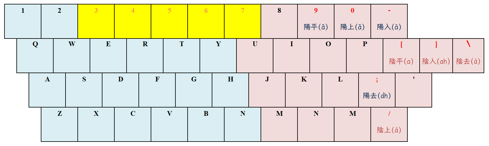

# 河洛白話音

(臺灣語言音標方案)[https://zh.wikipedia.org/zh-tw/%E8%87%BA%E7%81%A3%E8%AA%9E%E8%A8%80%E9%9F%B3%E6%A8%99%E6%96%B9%E6%A1%88]
（英語：Taiwan Language Phonetic Alphabet，TLPA，讀作Thoo-lú-pah）
是台灣語文學會於1991年期間針對臺灣語言所制定的音標系統，內含臺灣閩南語音標系統、
臺灣客家語音標系統、臺灣原住民語音標系統等三套系統。

大致上與白話字相同，但是基於書寫方便做了些微調整，並且將各地腔調差異納入考量增加了幾種新的拼寫法。

## 致謝

為以下高手們無私的貢獻，致上十二萬分的感謝！

- [a-thok/rime-hokkien](https://github.com/a-thok/rime-hokkien)；

- [glll4678/rime-taigi](https://github.com/glll4678/rime-taigi)。

## 安裝

1. **安裝 [RIME](http://rime.im)**；

2. **下載 [rime-taigi](https://github.com/AlanJui/rime-taigi/releases) 壓縮包檔案**；

3. **設定 RIME 使用者設定檔 (`default.custom.yaml`)**；

   各作業系統的 RIME 使用者設定檔，存放 `目錄路徑（資料夾）`：

   - 鼠鬚管：`~/Library/Rime/`(macOS)

   - 小狼毫：`"%APPDATA%\Rime"`(Windows)

   - 中州韻：`~/.config/ibus/rime/`(如：Ubuntu, ArchLinux，採用 Gnome 桌面＋ ibus 輸入作業平台)

4. **重新部署 RIME 輸入法**：將作業系統使用中的輸入法，先切換成 RIME，再執行 RIME
   輸入法中的「重新部署」指令。

## 四聲八調輸入

本輸入法，基本上只需輸入「台羅拼音」字母即可；至於「聲調」則可省略不用。對於喜歡指明聲調者，則可
改用以下所示之操作方式，於台羅拼音字母完成輸入後，再補以「聲調按鍵」輸入，即可指定拼音所用之聲調。

| 調號 | 四聲八調  | 聲調按鍵 | 漢字 | 台羅拼音 | 按鍵輸入 |
| :--: | :-------- | :------: | :--: | :------- | :------- |
|  1   | 陰平 (a)  |    [     |  東  | tang     | tang[    |
|  2   | 陰上 (á)  |    /     |  黨  | tóng     | tong/    |
|  3   | 陰去 (à)  |    \     |  棟  | tòng     | tong\    |
|  4   | 陰入 (ah) |    ]     |  督  | tok      | tok]     |
|  5   | 陽平 (â)  |    9     |  同  | tông     | tong9    |
|  6   | 陽上 (ǎ)  |    0     |  動  | tǒng     | tong0    |
|  7   | 陽入 (ā)  |    -     |  洞  | tōng     | tong-    |
|  8   | 陽去 (a̍h) |    '     |  毒  | to̍k      | tok'     |

## 字形

以下建議使用之字形，均為開源、免費字形：

- [思源黑體](https://github.com/adobe-fonts/source-han-sans)

- [Noto Sans Traditional Chinese](https://fonts.google.com/noto/specimen/Noto+Sans+TC)

- [字咍](https://github.com/ButTaiwan/taigivs/releases)

- [豆腐烏](https://github.com/glll4678/tshiuthau)

- [Fira Sans](https://github.com/mozilla/Fira)

