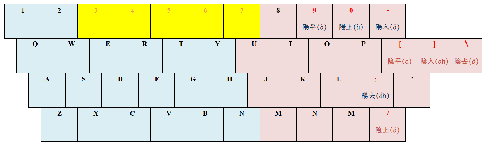

# 專案摘要

使用 RIME 輸入法平台，發展符合河洛話之漢字發音之輸入法。漢字之注音碼，採用
「[臺灣語言音標方案（TLPA）](https://zh.wikipedia.org/zh-tw/%E8%87%BA%E7%81%A3%E8%AA%9E%E8%A8%80%E9%9F%B3%E6%A8%99%E6%96%B9%E6%A1%88)」。
專案之目的，不在於政治認同之表態；重點落於：
朌望先祖之漢字雅音得以永世流傳，不使斷絕！

## 專案目標

本專案預計發展之輸入法，計有：

- 河洛注音：河洛話之方音符號輸入法；
- 河洛白話：河洛話之白話音輸入法；
- 河洛十五音：河洛話之文讀音輸入法（TLPA 編碼之十五音輸入法）；
- 河洛廣韻：河洛話之廣韻韻書音輸入法；

## 安裝

1. **安裝 [RIME](http://rime.im)**；

2. **下載 [rime-taigi](https://github.com/AlanJui/rime-taigi/releases) 壓縮包檔案**；

3. **設定 RIME 使用者設定檔 (`default.custom.yaml`)**；

   各作業系統的 RIME 使用者設定檔，存放 `目錄路徑（資料夾）`：

   - 鼠鬚管：`~/Library/Rime/`(macOS)

   - 小狼毫：`"%APPDATA%\Rime"`(Windows)

   - 中州韻：`~/.config/ibus/rime/`(如：Ubuntu, ArchLinux，採用 Gnome 桌面＋ ibus 輸入作業平台)

4. **重新部署 RIME 輸入法**：將作業系統使用中的輸入法，先切換成 RIME，再執行 RIME
   輸入法中的「重新部署」指令。

## 輸入法鍵盤

### 河洛白話

本輸入法，只需輸入 TLPA 音標，即可顯示相對應之漢字；至於「聲調」，可略去不用。
對於喜歡指明聲調者，則可參考以下之鍵盤，於 TLPA 音標之後，補入「聲調」。

## 字形

以下建議使用之字形，均為開源、免費字形：

- [思源黑體](https://github.com/adobe-fonts/source-han-sans)

- [Noto Sans Traditional Chinese](https://fonts.google.com/noto/specimen/Noto+Sans+TC)

- [字咍](https://github.com/ButTaiwan/taigivs/releases)

- [豆腐烏](https://github.com/glll4678/tshiuthau)

- [Fira Sans](https://github.com/mozilla/Fira)

| 調號 | 四聲八調 | 聲調按鍵 | 漢字 | 台羅拼音 | 按鍵輸入 |
| :--: | :-------- | :------: | :--: | :------- | :------- |
| 1 | 陰平 (a) | [ | 東 | tang | tang[ |
| 2 | 陰上 (á) | / | 黨 | tóng | tong/ |
| 3 | 陰去 (à) | \ | 棟 | tòng | tong\ |
| 4 | 陰入 (ah) | ] | 督 | tok | tok] |
| 5 | 陽平 (â) | 9 | 同 | tông | tong9 |
| 6 | 陽上 (ǎ) | 0 | 動 | tǒng | tong0 |
| 7 | 陽入 (ā) | - | 洞 | tōng | tong- |
| 8 | 陽去 (a̍h) | ' | 毒 | to̍k | tok' |

