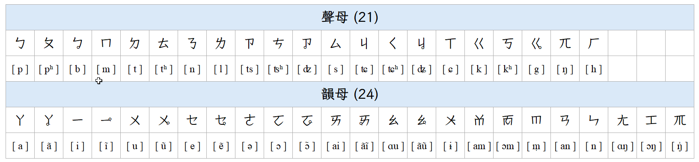
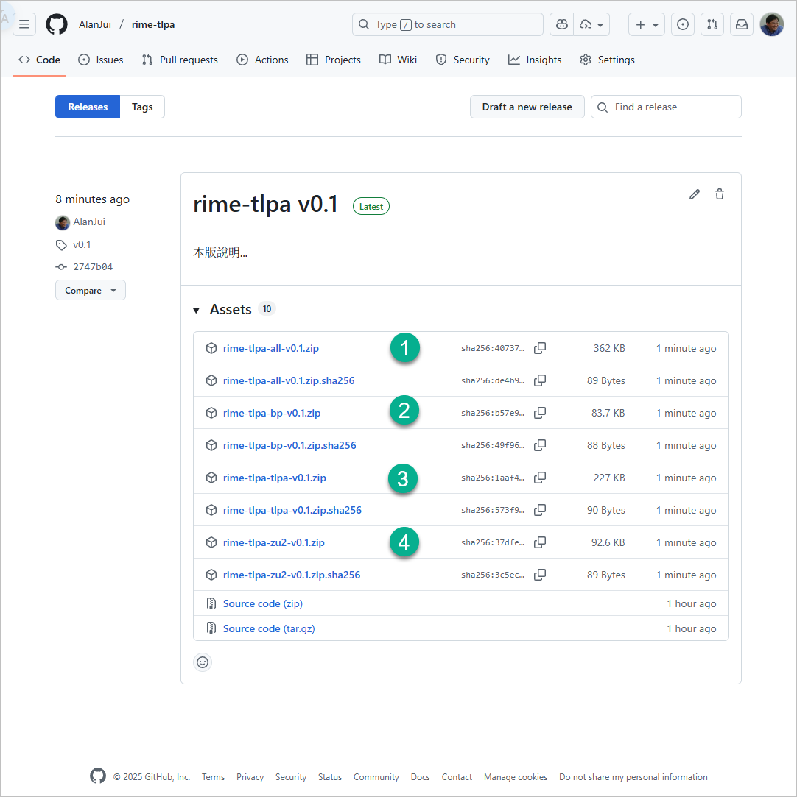
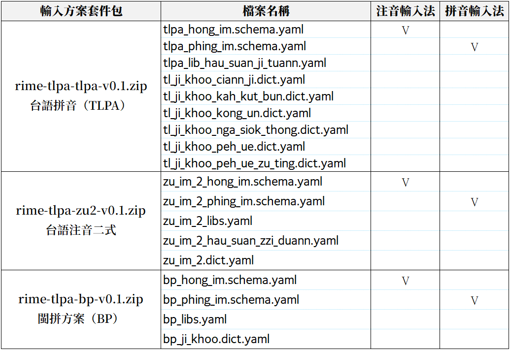
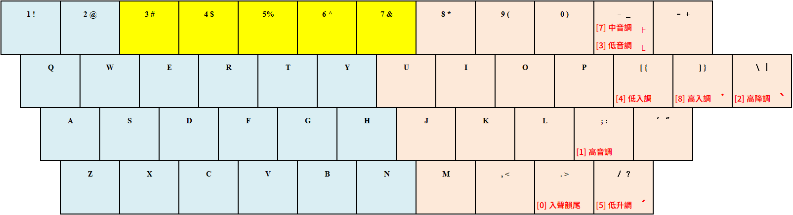
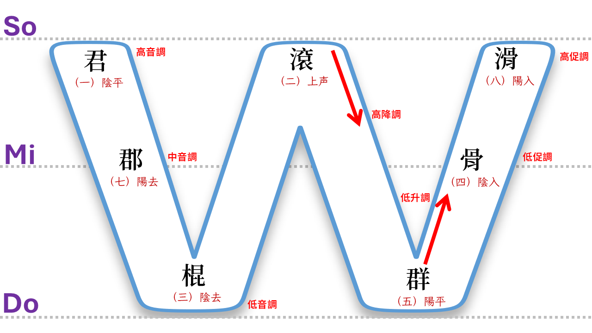
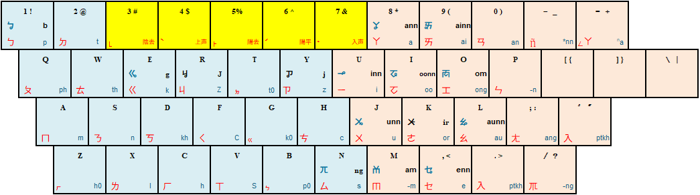

# 專案指引

## 摘要

閩南話傳自遠古。隨著歷史長河推波向前，朝代興衰不斷更迭，
朝堂官話早已不復採用此語，故而逐漸式微，甚至已令人擔心，此語終將消亡。

世間事物種種，只要為人所用，自會綿延不息、流傳不止；若否，則如「學而不思則罔」
般「不用則亡」：日常使用不上之事物，自然便會為人所淡忘，隨著時間逐漸消亡。

時至今日，閩南話常見「有音無字」的問題，依然困擾著人們。古人為求功名，需要勤讀書，
漢字與閩南話文讀音的關聯，尚能在《廣韻》、《康煕字典》找到蛛絲馬跡；但白話音則幾乎
全無。我手寫我口，目前仍是難以企及之美夢。

閩南話特有的四聲、八調，用於誦讀：古文、詩、詞，乃至經文，總能令人感受到一股濃濃
的風雅韻味。先祖所傳之漢字、雅音，此等珍貴的文化遺産，只朌它永世流傳，勿使斷絕！
一介草民，無權、沒錢，能做什麼呢？先從發展閩南話的漢字輸入法開頭吧！！

## 專案目標

【漢字標音】方法，大致有幾下幾種：

（1）【反切法】：自古流傳下來之反切呼音法，如【廣韻】、【彙集雅俗通十五音】；

（2）【注音輸入法】：使用【注音符號】之注音法，如【方音符號】；

（3）【拼音輸入法】：使用【羅馬拼音字母】之拼音法，如【白話字】、【台羅拼音】、【台語拼音】及
【閩拼方案】、【台語注音二式】。

輸入法類型。規劃將開發之輸入法，計有：

- 拼音輸入法：支援【台語拼音（TLPA）】、【台語注音二式（WSL）】、【閩拼方案（BP）】羅馬字拼音系統；
- 注音輸入法：支援【方音符號】之注音符號標音系統；
- 反切輸入法：支援【彙集雅俗通十五音】之反切呼音系統。

### 注音符號標準

採用[【方音符號】](https://zi-hi.com/%E6%96%B9%E9%9F%B3%E7%AC%A6%E8%99%9F)作為標準。
台灣方音符號由台灣省國語推行委員會方言組的朱兆祥教授設計，以注音符號為基礎，增補華語沒有的發音符號而成。台灣大學中文系退休教授吳守禮所著的《國臺對照活用辭典》及鄉土文學作家楊青矗所著的《台華雙語辭典》皆採方音符號。

#### 方音符號表

### 羅馬拼音字母標準

【拼音輸入法】為求使用上之簡便，故以【台語拼音】之羅馬拼音字母作為輸入標準。（全名：
[臺灣語言音標方案；簡稱：TLPA）](https://zh.wikipedia.org/zh-tw/%E8%87%BA%E7%81%A3%E8%AA%9E%E8%A8%80%E9%9F%B3%E6%A8%99%E6%96%B9%E6%A1%88)。TLPA 是台灣語文學會於 1991 年期間，針對臺灣主要語言，所制定的
音標系統，適用於為：臺灣閩南語、臺灣客家語、臺灣原住民語標注讀音。之後教育部
更在 2003 年 2 月，將「閩南語」部份與「國際語音符號（國際音標）」、「教會羅馬字
」系統整合，隨後於 2006 年 10 月 14 日公布為「[臺灣閩南語羅馬字拼音方案（簡稱：
台羅拼音）](https://zi-hi.com/%E5%8F%B0%E7%BE%85%E6%8B%BC%E9%9F%B3)」。

### 輸入法引擎

專案産出之輸入法，以【中州韻輸入法引擎（簡稱：RIME）】為作業平臺。因 RIME 為
跨越作業系統之輸入法框架；故而專案所産出之輸入法可跨平台，能於 Windows, macOS, Linux
各類作業系統操作使用。

## 安裝作業

安裝作業之主要流程，各步驟之執行要點摘要說明如下。如需操作細節之詳細說明，請參考
[Wiki](https://github.com/AlanJui/rime-tlpa/wiki) 之安裝作業指引文件。

1. **下載及安裝 [RIME 中州韻輸入法引擎](http://rime.im)**；

   RIME 可於不同之作業系統運作，且各有其名稱，使用者該擇用何者，請參考如下之說明：

   - macOS: 鼠鬚管
   - Windows: 小狼毫
   - Linux: 中州韻 (ibus-rime, fcitx-rime, fcitx5-rime)

   【註】： 由於 Linux 作業系統發布版眾多（如：Ubuntu, LinuxMint, ArchLinux）...，
            且 Linux 的各個發布版又有不同的【輸入法框架】，如：iBus, Fcitx 和 Gcin...。
            目前 RIME 在 Linux 作業系統可運作的輸入法框架，有：ibus-rime, fcitx-rime
            及 fcit5-rime 共三種。所以，在安裝 RIME 之前，得先確認 Linux 作業
            系統安裝的【輸入法框架】為何者。

2. **下載及安裝 [輸入法發行套件包](https://github.com/AlanJui/rime-taigi/releases)
ZIP 壓縮檔案**；

   1. rime-tlpa-all-v0.1.zip: 專案産出之所有輸入法
   2. rime-tlpa-bp-v0.1.zip: 漢字庫採【閩拼方案】拼音系統之輸入法
   3. rime-tlpa-tlpa-v0.1.zip: 漢字庫採【台語拼音】拼音系統之輸入法
   4. rime-tlpa-zu2-v0.1.zip: 漢字庫採【台語注音二式】拼音系統之輸入法

### 聲調按鍵

| 調號 | 四聲八調   | 聲調按鍵 | 漢字 | 台語音標 | 按鍵輸入 |
| :--: | :--------- | :------: | :--: | :------- | :------- |
| 1    | 陰平 (ㄚ) | \<SP\>   |  東  |  tong1   |ㄊㆲ     |
| 2    | 陰上 (ㄚˋ) | 4        |  黨  |  tong2   |ㄊㆲˋ     |
| 3    | 陰去 (ㄚ˪) | 3        |  棟  |  tong3   |ㄊㆲ˪     |
| 4    | 陰入 (ㄚ˙) | 7        |  督  |  tok4    |ㄊㆦㆻ    |
| 5    | 陽平 (ㄚˊ) | 6        |  同  |  tong5   |ㄊㆲˊ     |
| 6    | 陽上 (ㄚˋ) | 4        |  動  |  tong6   |ㄊㆲˋ     |
| 7    | 陽去 (ㄚ˫) | 5        |  洞  |  tong7   |ㄊㆲ˫     |
| 8    | 陽入 (ㄚ˙) | 7        |  毒  |  tok8    |ㄊㆦㆻ˙   |

## 字形

為使注音輸入法的【注音符號】能正常顯示，建議使用 Windows 作用系統預設的新細明體字型；或在
作業系統安裝以下之開源中文字型：

3. **編輯 RIME 設定檔，啟用專案之輸入法**；

   RIME 設定檔名稱為：`default.custom.yaml`，各作業系統之 RIME 設定檔存放
   `目錄路徑（資料夾）`條列如下：

   - 鼠鬚管(macOS)：`~/Library/Rime/`

   - 小狼毫(Windows)：`"%APPDATA%\Rime"`

   - 中州韻(Linux)：`~/.config/ibus/rime/`

4. **重新部署 RIME 輸入法**：將作業系統使用中的輸入法，先切換成 RIME，再執行 RIME
   輸入法中的「重新部署」指令。

## 拼音輸入法

使用【羅馬拼音字母】作為輸入法之【按鍵】，熟悉【英文打字】、【漢語拼音】之人，最容易上手之
輸入法。採用【台語音標（TLPA）】作為漢字之拼音系統。

### 輸入鍵盤

### 聲調按鍵

| 調號 | 四聲八調   | W聲調圖   | 聲調按鍵 |  漢字 | 台語音標  | 按鍵輸入 |
| :--: | :--------- | :------ | :------: | :--: | :------- | :------- |
| 1    | 陰平 (a)   | 高音調   | ;        |  東  |  tong1   | tong;    |
| 7    | 陽去 (ā)   | 中音調   | -        |  洞  |  tong7   | tong-    |
| 3    | 陰去 (à)   | 低音調   | _        |  棟  |  tong3   | tong_    |
| 2    | 陰上 (á)   | 高降調   | \        |  黨  |  tong2   | tong\\   |
| 5    | 陽平 (â)   | 低升調   | /        |  同  |  tong5   | tong/    |
| 4    | 陰入 (ah)  | 低促調   | [        |  督  |  tok4    | tok[     |
| 8    | 陽入 (a̍h)  | 高促調   | ]        |  毒  |  tok8    | tok]     |
| 0    | 陰入 (ah)  | 低促調   | .        |  督  |  tok0    | tok.     |
| 0    | 陽入 (a̍h)  | 高促調   | .        |  毒  |  tok0    | tok.     |

## 注音輸入法

漢字之輸入，使用【[方音符號](https://zh.wikipedia.org/zh-tw/%E8%87%BA%E7%81%A3%E6%96%B9%E9%9F%B3%E7%AC%A6%E8%99%9F)】作為輸入法之【按鍵】。由於【方音符號】源自
【注音符號】，經改良後使之適用於閩南話標音。故此輸入法適用於已熟悉【注音符號】之人。

### 輸入鍵盤

### 聲調按鍵

| 調號 | 四聲八調   | 聲調按鍵 | 漢字 | 台語音標 | 按鍵輸入 |
| :--: | :--------- | :------: | :--: | :------- | :------- |
| 1    | 陰平 (ㄚ) | \<SP\>   |  東  |  tong1   |ㄊㆲ     |
| 2    | 陰上 (ㄚˋ) | 4        |  黨  |  tong2   |ㄊㆲˋ     |
| 3    | 陰去 (ㄚ˪) | 3        |  棟  |  tong3   |ㄊㆲ˪     |
| 4    | 陰入 (ㄚ˙) | 7        |  督  |  tok4    |ㄊㆦㆻ    |
| 5    | 陽平 (ㄚˊ) | 6        |  同  |  tong5   |ㄊㆲˊ     |
| 6    | 陽上 (ㄚˋ) | 4        |  動  |  tong6   |ㄊㆲˋ     |
| 7    | 陽去 (ㄚ˫) | 5        |  洞  |  tong7   |ㄊㆲ˫     |
| 8    | 陽入 (ㄚ˙) | 7        |  毒  |  tok8    |ㄊㆦㆻ˙   |

## 字形

為使注音輸入法的【注音符號】能正常顯示，建議使用 Windows 作用系統預設的新細明體字型；或在
作業系統安裝以下之開源中文字型：

- [霞鶩文楷TC](https://github.com/lxgw/LxgwWenkaiTC)

- [字咍](https://github.com/ButTaiwan/taigivs/releases)

- [豆腐烏](https://github.com/glll4678/tshiuthau)

## 參考資料

- [方音符號](https://zh.wikipedia.org/zh-tw/%E8%87%BA%E7%81%A3%E6%96%B9%E9%9F%B3%E7%AC%A6%E8%99%9F)

- [台灣語言音標方案（TLPA）維基百科簡介](https://zh.wikipedia.org/zh-tw/%E8%87%BA%E7%81%A3%E8%AA%9E%E8%A8%80%E9%9F%B3%E6%A8%99%E6%96%B9%E6%A1%88)

- [閩南話拼音方案維基百科簡介](https://zh.wikipedia.org/wiki/%E9%96%A9%E5%8D%97%E8%A9%B1%E6%8B%BC%E9%9F%B3%E6%96%B9%E6%A1%88)

- [彙集雅侻通十五音維基百科簡介](https://zh.wikipedia.org/wiki/%E5%BD%99%E9%9B%86%E9%9B%85%E4%BF%97%E9%80%9A%E5%8D%81%E4%BA%94%E9%9F%B3)

- [中州韻輸入法引擎(RIME)官網](https://rime.im/)

