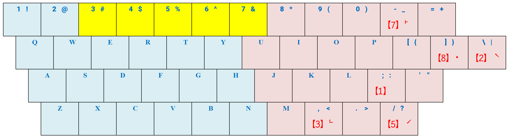
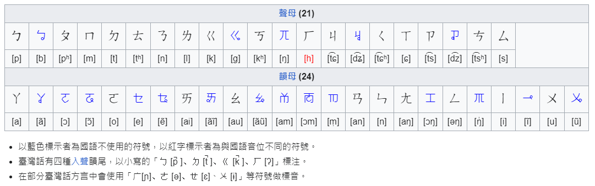
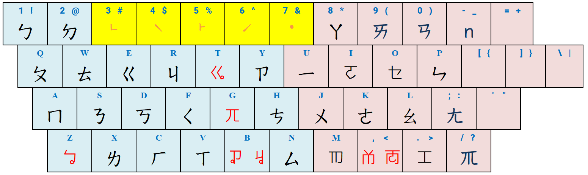
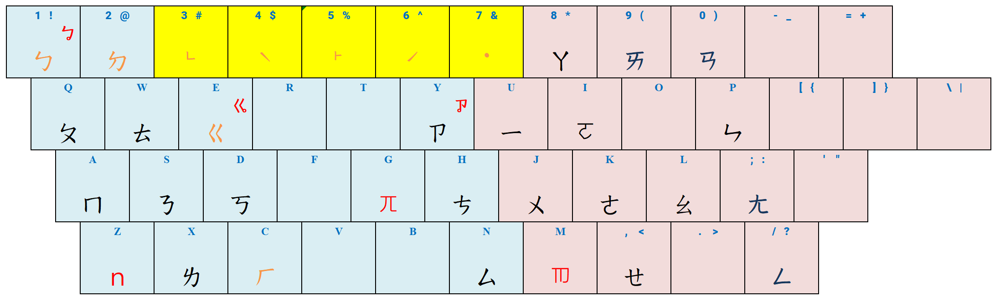
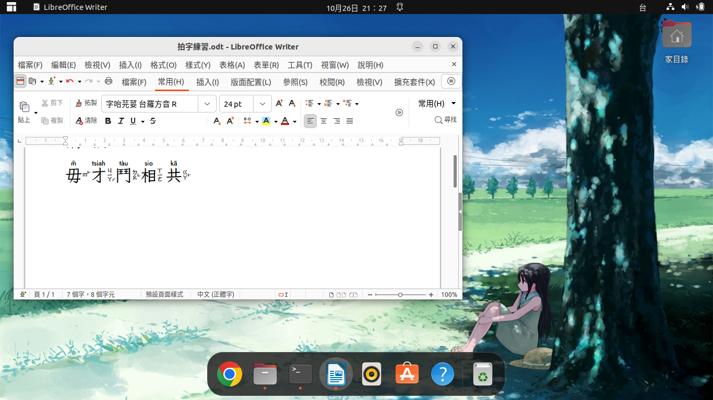
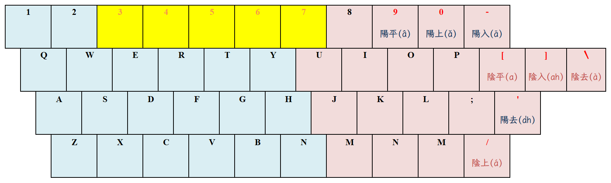

# 專案摘要

台灣的河洛話（俗稱：台語），傳自遠古漢族人的語言。隨著歷史的推演，朝代的更迭，
可惜這語言不再是漢人使用的官話，故而日常使用變得式微，更糟的是能說一口流利河洛
話的人，亦無法正確地使用漢字書寫河洛話。本專案所發展之【河洛話輸入法】，期待可
協助能說河洛話之人，使用正確的漢字書寫河洛話。

中州韻輸入法引擎（以下簡稱：RIME），是一個跨平台的輸入法框架；或說是：輸入法
執行平台。專案的産出：【河洛話輸入法】，係架構在 RIME 平台之上的輸入法。選擇
RIME 作為輸入法平台，主要是借重 RIME 可於 Windows, macOS, Linux 多種作業系統
運作的特性。

【河洛話輸入法】屬「拼音輸入法」類型，對於「漢字」之注音，採用：
「[臺灣語言音標方案（以下簡稱：TLPA 拼音）](https://zh.wikipedia.org/zh-tw/%E8%87%BA%E7%81%A3%E8%AA%9E%E8%A8%80%E9%9F%B3%E6%A8%99%E6%96%B9%E6%A1%88)」。
方法標注漢字讀音。TLPA 是台灣語文學會於 1991 年期間，針對臺灣主要語言，所制定的
音標系統，適用於為：臺灣閩南語、臺灣客家語、臺灣原住民語標注讀音。之後教育部
更在 2003 年 2 月，將「閩南語」部份與「國際語音符號（國際音標）」、「教會羅馬字
」系統整合，隨後於 2006 年 10 月 14 日公布為「臺灣閩南語羅馬字拼音方案（簡稱：
台羅拼音）」。

河洛話特有的四聲、八調，用於誦讀：古文、詩、詞，乃至經文，總能讓我感受到一股濃濃
的風雅韻味。先祖的漢字、雅音，這個珍貴的遺産，祈願得以永世流傳，不使斷絕！

## 專案目標

本專案預計發展之輸入法，計有：

- 河洛白話：河洛話之白話音輸入法；
- 河洛十五音：河洛話之文讀音輸入法（TLPA 編碼之十五音輸入法）；
- 河洛廣韻：河洛話之廣韻韻書音輸入法；
- 河洛注音：河洛話之方音符號輸入法；

## 安裝作業

RIME 在不同作業系統之間，各有不同的「軟體套件名稱」。其下載、安裝操作細節，請
參考 [Wiki](https://github.com/AlanJui/rime-tlpa/wiki) 中的操作指引文件。以下
說明為下載及安裝作業之摘要參考。

1. **下載及安裝 [RIME 中州韻輸入法引擎](http://rime.im)**；

   不同作業系統的 RIME 名稱：

   - macOS: 鼠鬚管
   - Windows: 小狼毫
   - Linux: 中州韻 (ibus-rime, fcitx-rime, fcitx5-rime)

   【註】： 由於 Linux 作業系統發布版眾多（如：Ubuntu, LinuxMint, ArchLinux）...，
            且 Linux 的各個發布版又有不同的【輸入法框架】，如：iBus, Fcitx 和 Gcin...。
            目前 RIME 在 Linux 作業系統可運作的輸入法框架，有：ibus-rime, fcitx-rime
            及 fcit5-rime 共三種。所以，在安裝 RIME 之前，得先確認 Linux 作業
            系統安裝的【輸入法框架】為何者。

2. **下載及安裝 [河洛輸入法套件包](https://github.com/AlanJui/rime-taigi/releases) 
ZIP 壓縮檔案**；

3. **編輯 RIME 設定檔準備啟用河洛輸入法**；

   RIME 設定檔名稱為：`default.custom.yaml`，各作業系統之 RIME 設定檔存放
   `目錄路徑（資料夾）`條列如下：

   - 鼠鬚管(macOS)：`~/Library/Rime/`

   - 小狼毫(Windows)：`"%APPDATA%\Rime"`

   - 中州韻(Linux)：`~/.config/ibus/rime/`

4. **重新部署 RIME 輸入法**：將作業系統使用中的輸入法，先切換成 RIME，再執行 RIME
   輸入法中的「重新部署」指令。

## 輸入法鍵盤

### 河洛白話

河洛輸入法允許使用者只輸入【羅馬拼音字母】，推導相對映可能之漢字，並顯示於輸入法
之【候選字】清單中，供使用者選擇；至於「聲調」則可略去不用指明。但聲調數值之輸入
，可使輸入法精準地縮小【候選字】之範圍，更容易快速找到所要輸入之漢字。對於喜歡
自行輸入聲調數值之使用者，可參考以下之鍵盤說明，於羅馬拼音字母之後補入「聲調」。

### 河洛方音

[方音符號](https://zh.wikipedia.org/zh-tw/%E8%87%BA%E7%81%A3%E6%96%B9%E9%9F%B3%E7%AC%A6%E8%99%9F)
有人簡稱為：「台語注音符號」。顧名思義可知：這是一套將國語注音符號改良，可用來標注
台灣河洛話的注音符號系統。

【河洛方音輸入法】使用之聲母符號及韻母符號，各注音符號之按鍵位置，請參考下圖。

### 河洛注音

【河洛注音輸入法】這是個人研究用之輸入法，請慎用！發展這套輸入法之目的，最主要
是個人對「羅馬字拼音字母」一直用不慣；但在學著使用「方音符號」的過程，覺得這套
方法有些複雜。有回在 YouTube 看到[1. 台語音標，只須用國語注音符號 【台語古今談 - ㄅㄆㄇ】](https://www.youtube.com/watch?v=EEndKSmeG5I)
這影片深受啟發，所以也想做個試驗：「如何運用現有的注音符號與方音符號，使其更為簡化，
可為河洛話標讀音」。

## 字形

以下建議使用之字形，均為開源、免費字形：

- [思源黑體](https://github.com/adobe-fonts/source-han-sans)

- [Noto Sans Traditional Chinese](https://fonts.google.com/noto/specimen/Noto+Sans+TC)

- [字咍](https://github.com/ButTaiwan/taigivs/releases)

- [豆腐烏](https://github.com/glll4678/tshiuthau)

- [Fira Sans](https://github.com/mozilla/Fira)

| 調號 | 四聲八調 | 聲調按鍵 | 漢字 | 台羅拼音 | 按鍵輸入 |
| :--: | :-------- | :------: | :--: | :------- | :------- |
| 1 | 陰平 (a) | [ | 東 | tang | tang[ |
| 2 | 陰上 (á) | / | 黨 | tóng | tong/ |
| 3 | 陰去 (à) | \ | 棟 | tòng | tong\ |
| 4 | 陰入 (ah) | ] | 督 | tok | tok] |
| 5 | 陽平 (â) | 9 | 同 | tông | tong9 |
| 6 | 陽上 (ǎ) | 0 | 動 | tǒng | tong0 |
| 7 | 陽入 (ā) | - | 洞 | tōng | tong- |
| 8 | 陽去 (a̍h) | ' | 毒 | to̍k | tok' |

