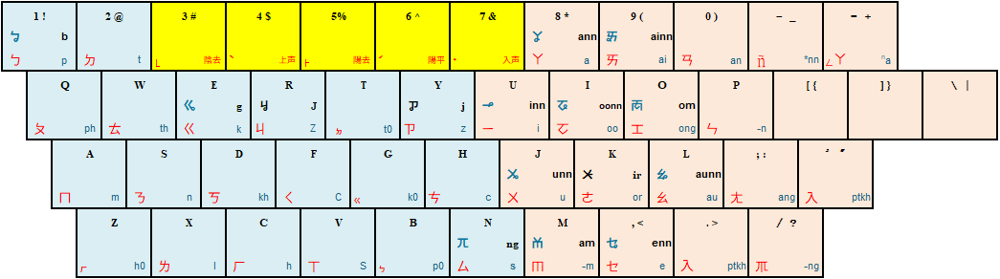

# 專案指引

## 摘要

閩南話傳自遠古。隨著歷史長河推波向前，朝代興衰更迭，此語不復作為朝堂雅言，退化成一地方音，不僅日漸式微，距離消亡似乎僅只是一步之遙；關心此語傳承人士，不免開始人擔心此語終將消逝。

世間事物種種，只要為人所用，自會綿延不息、流傳不止；反之，則如「學而不思則罔」之理，終將「不用則亡」：只要是日常生活，派不上用場之事物，自會被人淡忘，隨著歳月流逝而逐漸消亡。

時至今日，閩南話「有音無字」的困境，依然困擾著無數的使用人們。古人為求功名，勤讀詩書，故而漢字與閩南話之關聯，尚能自文讀音獲取，《廣韻》、《康煕字典》等古籍，更能為之佐證；然「白話音」則幾近空白，我手寫我口，目前仍是難以企及的美夢。

閩南話特有的四聲、八調，用於誦讀：古文、詩、詞，乃至經文，總能令人感受到一股醇厚雋永的風雅韻味。先祖所傳之漢字、雅音，此等彌足珍貴的文化遺産，盼能永世流傳，勿使斷絕！一介草民，無權、無財，所能者何？且從閩南話的漢字輸入法發展開頭吧！

### 專案目標

閩南話的【漢字標音】方法，種類繁多。本專案發展的【輸入方案】，可分以下三大類別：

（1）【反切類】輸入法：自古流傳之反切呼音法，如【彙集雅俗通十五音】；

（2）【注音類】輸入法：使用【注音符號】為漢字標注讀音，如【方音符號】、【台語音標用注音符號】；

（3）【拼音類】輸入法：使用【羅馬拼音字母】為漢字標注拼音，如【白話字】、【台語拼音】、【台羅拼音】及
【閩拼方案】、【台語注音二式】。

**【輸入方案套件包清單】**

| 類  別 | 輸入方案名稱               | 輸入方案識別號 | 漢字字典編碼 | 漢字標音系統       |
| ------ | -------------------------- | -------------- | ------------ | ------------------ |
| 反切類 | 反切輸入法【方音符號】     | huan_ciat_tps  | 台羅拼音     | 方音符號(TFS)      |
| 反切類 | 反切輸入法【台語音標】     | huan_ciat_tlpa | 台羅拼音     | 台語音標(TLPA+)    |
| 注音類 | 注音輸入法【方音符號】     | zu_im_tps      | 台羅拼音     | 方音符號(TPS)      |
| 注音類 | 注音輸入法【台語音標】     | zu_im_tlpa     | 台羅拼音     | 台語注音符號(TLPA+)|
| 注音類 | 注音輸入法【台語注音二式】 | zu_im_bpm2     | 台語注音二式 | 台語注音二式(BPM2) |
| 拼音類 | 拼音輸入法【台語音標】     | phing_im_tlpa  | 台羅拼音     | 台語音標(TLPA+)    |
| 拼音類 | 拼音輸入法【台羅拼音】     | phing_im_tl    | 台羅拼音     | 台羅拼音(TL)       |
| 拼音類 | 拼音輸入法【白話字】       | phing_im_poj   | 台羅拼音     | 白話字(POJ)        |
| 拼音類 | 拼音輸入法【閩拼方案】     | phing_im_bp    | 台羅拼音     | 閩拼方案(BP)       |
| 拼音類 | 拼音輸入法【台語注音二式】 | phing_im_bpm2  | 台語注音二式 | 台語注音二式(BPM2) |

### 輸入法引擎

專案所開發之輸入方案，以【中州韻輸入法引擎】（簡稱：RIME）作為輸入法作業平臺。RIME 因俱備跨越作業系統之特性；故而本專案産出之輸入法，可於 Windows, macOS, Linux 各類作業系統操作使用。

RIME 設定檔名稱為：`default.custom.yaml`，各作業系統之存放 `目錄路徑（資料夾）`，條列如下：

- 小狼毫(Windows)：`"%APPDATA%\Rime"`
- 中州韻(Linux)：`~/.config/ibus/rime/`
- 鼠鬚管(macOS)：`~/Library/Rime/`

## 安裝作業

安裝作業之主要流程，其執行要點摘要如下。如需操作細節詳述，請參考 [Wiki](https://github.com/AlanJui/rime-tlpa/wiki) 之安裝作業指引文件。

1. **下載及安裝 [RIME 中州韻輸入法引擎](http://rime.im)**。

   RIME 可於不同之作業系統運作，且各有其名稱，使用者該擇用何者，請參考如下之說明：
   - macOS: 鼠鬚管
   - Windows: 小狼毫
   - Linux: 中州韻 (ibus-rime, fcitx-rime, fcitx5-rime)

   【註】： 由於 Linux 作業系統發布版眾多（如：Ubuntu, LinuxMint, ArchLinux）...，
   且 Linux 的各個發布版又有不同的【輸入法框架】，如：iBus, Fcitx 和 Gcin...。
   目前 RIME 在 Linux 作業系統可運作的輸入法框架，有：ibus-rime, fcitx-rime
   及 fcit5-rime 共三種。所以，在安裝 RIME 之前，得先確認 Linux 作業
   系統安裝的【輸入法框架】為何者。

2. **下載 [輸入方案套件包](https://github.com/AlanJui/rime-tlpa/releases)。**

- rime-tlpa-all-v0.1.zip: 專案産出所有的輸入方案（包函：反切/注音/拼音，所有的輸入方案）
- rime-tlpa-huan_ciat-v0.1.zip：【反切類輸入方案】壓縮包
- rime-tlpa-zu_im-v0.1.zip：【注音類輸入方案】壓縮包
- rime-tlpa-phing_im-v0.1.zip：【拼音類輸入方案】壓縮包

3. **下載及執行[安裝程式](https://github.com/AlanJui/rime-tlpa/releases)。**

下載輸入方案安裝程式執行檔： RIME_TLPA_Installer.exe

**【安裝程式注意要項】**：

- 安裝程式 `RIME_TLPA_Installer.exe` **不內含**輸入方案檔；請**先**下載上述
    `rime-tlpa-*.zip` 任一壓縮包（如僅需全部方案，下載 `rime-tlpa-all-*.zip` 即可）。
- 將下載的 `.zip` 壓縮檔放到**安裝程式（.exe）所在資料夾**，或保留在
    **【下載 (Downloads)】資料夾**即可——安裝程式啟動時會自動偵測這兩處
    （以及目前工作目錄）的 `rime-tlpa-*.zip`。
- 執行 `RIME_TLPA_Installer.exe` 後，於畫面上方的下拉選單**選擇要安裝的壓縮檔**，
    再點擊【開始安裝】；若壓縮檔放在其他位置，可點【瀏覽…】自行指定。
- 若未偵測到任何壓縮檔，安裝程式會中止並提示先行下載，請依提示完成下載後再重試。

## 輸入方案引用標準

### 注音符號

台灣方音符號由台灣省國語推行委員會方言組的朱兆祥教授設計，以注音符號為基礎，增補華語沒有的發音符號而成。台灣大學中文系退休教授吳守禮所著的《國臺對照活用辭典》及鄉土文學作家楊青矗所著的《台華雙語辭典》皆採方音符號。

#### 聲母表

| 序    號 | 1 | 2 | 3 | 4  | 5 | 6 | 7 | 8  | 9 | 10 | 11 | 12  | 13 | 14 | 15 | 16 | 17 | 18 | 19 | 20 | 21 |
|------|---|---|---|----|---|---|---|----|---|----|----|-----|----|----|----|----|----|----|----|----|----|
| 注音符號 | ㆠ | ㄅ | ㄆ | ㄇ  | ㄋ | ㄉ | ㄊ | ㄌ  | ㆣ | ㄍ  | ㄎ  | ㄫ   | ㄏ  | ㆡ  | ㄗ  | ㄘ  | ㄙ  | ㆢ  | ㄐ  | ㄑ  | ㄒ  |
| 台語注音 | ㄪ | ㄅ | ㄆ | ㄇ  | ㄋ | ㄉ | ㄊ | ㄌ  | ㄫ | ㄍ  | ㄎ  | ⁰ㄫ  | ㄏ  | ㄖ  | ㄗ  | ㄘ  | ㄙ  | ㄖ  | ㄐ  | ㄑ  | ㄒ  |
| 國際音標 | m | b | p | pʰ | n | l | t | tʰ | ŋ | ɡ  | k  | kʰ  | ʣ  | ʦ  | ʦʰ | s  | ʥ  | ʨ  | ʨʰ | ɕ  | h  |

#### 韻母表

| 序    號 | 1 | 2 | 3 | 4 | 5 | 6 | 7 | 8  | 9 | 10 | 11 | 12 | 13 | 14 | 15 | 16 | 17 | 18 | 19 | 20 | 21 | 22 | 23  | 24  | 25 | 26 | 27 | 28 |
|------|---|---|---|---|---|---|---|----|---|----|----|----|----|----|----|----|----|----|----|----|----|----|-----|-----|----|----|----|----|
| 注音符號 | ㄚ | ㄧ | ㆨ | ㄨ | ㆤ | ㆦ | ㄜ | ㆬ  | ㄣ | ㆭ  | ㄞ  | ㄠ  | ㆰ  | ㄢ  | ㄤ  | ㆱ  | ㆲ  | ㆩ  | ㆪ  | ㆫ  | ㆥ  | ㆧ  | ㆮ   | ㆯ   | ㆴ  | ㆵ  | ㆻ  | ㆷ  |
| 台語注音 | ㄚ | ㄧ | 0 | ㄨ | ㄝ | ㄛ | ㄜ | ㄇ  | ㄣ | ㄥ  | ㄞ  | ㄠ  | ㄚㄇ | ㄢ  | ㄤ  | ㄛㄇ | ㄛㄥ | ⁰ㄚ | ⁰ㄧ | ⁰ㄨ | ⁰ㄝ | ⁰ㄛ | ⁰ㄞ  | ⁰ㄠ  | ㄅ  | ㄉ  | ㄍ  | ㄏ  |
| 國際音標 | a | i | ɯ | u | e | ɔ | ə | m̩ | n | ŋ̍ | aɪ | aʊ | am | an | aŋ | ɔm | ɔŋ | ã | ĩ  | ũ | ẽ  | ɔ̃ | ãɪ | ãʊ | p̚ | t̚ | k̚ | ʔ  |

### 羅馬拼音字母

【拼音輸入法】為求使用上之簡便，故以【台語拼音】之羅馬拼音字母作為輸入標準。（全名：
[臺灣語言音標方案；簡稱：TLPA）](https://zh.wikipedia.org/zh-tw/%E8%87%BA%E7%81%A3%E8%AA%9E%E8%A8%80%E9%9F%B3%E6%A8%99%E6%96%B9%E6%A1%88)。TLPA 是台灣語文學會於 1991 年期間，針對臺灣主要語言，所制定的
音標系統，適用於為：臺灣閩南語、臺灣客家語、臺灣原住民語標注讀音。之後教育部
更在 2003 年 2 月，將「閩南語」部份與「國際語音符號（國際音標）」、「教會羅馬字
」系統整合，隨後於 2006 年 10 月 14 日公布為「[臺灣閩南語羅馬字拼音方案（簡稱：
台羅拼音）](https://zi-hi.com/%E5%8F%B0%E7%BE%85%E6%8B%BC%E9%9F%B3)」。

#### 聲母表

| 序    號 | 1  | 2 | 3  | 4  | 5 | 6 | 7  | 8  | 9  | 10 | 11 | 12 | 13 | 14 | 15 | 16  | 17 | 18 | 19  | 20   | 21 |
|--------|----|---|----|----|---|---|----|----|----|----|----|----|----|----|----|-----|----|----|-----|------|----|
| 台語音標   | b  | p | ph | m  | n | t | th | l  | g  | k  | kh | ng | h  | j  | ts | tsh | s  | ji | tsi | tshi | si |
| 台語注音二式 | bb | b | p  | m  | n | d | t  | l  | gg | g  | k  | ng | h  | zz | z  | c   | s  | jj | j   | ch   | sh |
| 國際音標   | m  | b | p  | pʰ | n | l | t  | tʰ | ŋ  | ɡ  | k  | kʰ | ʣ  | ʦ  | ʦʰ | s   | ʥ  | ʨ  | ʨʰ  | ɕ    | h  |

#### 韻母表

| 序    號 | 1 | 2 | 3  | 4 | 5 | 6  | 7  | 8  | 9 | 10 | 11 | 12 | 13 | 14 | 15  | 16  | 17  | 18  | 19  | 20  | 21  | 22   | 23   | 24   | 25 | 26 | 27 | 28 |
|--------|---|---|----|---|---|----|----|----|---|----|----|----|----|----|-----|-----|-----|-----|-----|-----|-----|------|------|------|----|----|----|----|
| 台語音標   | a | i | ir | u | e | oo | o  | m  | n | ng | ai | au | am | an | ang | om  | ong | ann | inn | unn | enn | onn  | ainn | aunn | p  | t  | k  | h  |
| 台語注音二式 | a | i | 0  | u | e | oo | or | m  | n | ng | ai | au | am | an | ang | oom | ong | ann | inn | unn | enn | oonn | ainn | aunn | p  | t  | k  | h  |
| 國際音標   | a | i | ɯ  | u | e | ɔ  | ə  | m̩ | n | ŋ̍ | aɪ | aʊ | am | an | aŋ  | ɔm  | ɔŋ  | ã  | ĩ   | ũ  | ẽ   | ɔ̃   | ãɪ  | ãʊ  | p̚ | t̚ | k̚ | ʔ  |

## 注音類輸入法

漢字之輸入，使用【[方音符號](https://zh.wikipedia.org/zh-tw/%E8%87%BA%E7%81%A3%E6%96%B9%E9%9F%B3%E7%AC%A6%E8%99%9F)】作為輸入法之【按鍵】。【方音符號】源自【注音符號】，經改良使之適用於閩南話之漢字標音。故此類之輸入方案，適用於熟悉【注音符號】使用人士。

### 輸入鍵盤

### 音調按鍵

| 調號 | 四聲八調   | 音調按鍵 | 漢字 | 台語音標 | 按鍵輸入 |
| :--: | :--------- | :------: | :--: | :------- | :------- |
|  1   | 陰平 (ㄚ)  |  \<SP\>  |  東  | tong1    | ㄊㆲ     |
|  2   | 陰上 (ㄚˋ) |    4     |  黨  | tong2    | ㄊㆲˋ    |
|  3   | 陰去 (ㄚ˪) |    3     |  棟  | tong3    | ㄊㆲ˪    |
|  4   | 陰入 (ㄚ˙) |    7     |  督  | tok4     | ㄊㆦㆻ   |
|  5   | 陽平 (ㄚˊ) |    6     |  同  | tong5    | ㄊㆲˊ    |
|  6   | 陽上 (ㄚˋ) |    4     |  動  | tong6    | ㄊㆲˋ    |
|  7   | 陽去 (ㄚ˫) |    5     |  洞  | tong7    | ㄊㆲ˫    |
|  8   | 陽入 (ㄚ˙) |    7     |  毒  | tok8     | ㄊㆦㆻ˙  |

## 拼音類輸入法

使用【羅馬拼音字母】為漢字標注讀音，對於熟悉【英文打字】、【漢語拼音】的人們，可免去背記按鍵之苦，因而易於上手。

### 輸入鍵盤

### 音調按鍵

| 調號 | 四聲八調  | W音調圖 | 音調按鍵 | 漢字 | 台語音標 | 按鍵輸入 |
| :--: | :-------- | :------ | :------: | :--: | :------- | :------- |
|  1   | 陰平 (a)  | 高音調  |    ;     |  東  | tong1    | tong;    |
|  7   | 陽去 (ā)  | 中音調  |    -     |  洞  | tong7    | tong-    |
|  3   | 陰去 (à)  | 低音調  |    \_    |  棟  | tong3    | tong\_   |
|  2   | 陰上 (á)  | 高降調  |    \     |  黨  | tong2    | tong\\   |
|  5   | 陽平 (â)  | 低升調  |    /     |  同  | tong5    | tong/    |
|  4   | 陰入 (ah) | 低促調  |    [     |  督  | tok4     | tok[     |
|  8   | 陽入 (a̍h) | 高促調  |    ]     |  毒  | tok8     | tok]     |
|  0   | 陰入 (ah) | 低促調  |    .     |  督  | tok0     | tok.     |
|  0   | 陽入 (a̍h) | 高促調  |    .     |  毒  | tok0     | tok.     |

## 方音符號與 Unidoce 編碼

### Unicode 編碼區段

「方音符號」有專屬的 Unicode 區段：

方音符號：U+31A0 ～ U+31BF

注音符號：U+3100 ～ U+312F

注音符號擴充：U+31A0 ～ U+31BF

台灣方音符號補充（部分符號會在 Unicode Extensions 或 CJK 擴充區裡）

### 瀏覽字型對方音符號的支援

某些字型不支援【方音符號】；或是會發顯示錯誤之問題。

- 無法顯示【台語注音調號】
  - 陰去調：˪ U+02EA MODIFIER LETTER YIN DEPARTING TONE MARK
  - 陽去調：˫ U+02EB MODIFIER LETTER YANG DEPARTING TONE MARK

- 無法顯示入聲韻尾符號/或是將 ㆻ 顯示成 ㆶ
  - ㆴ U+31B4 BOPOMOFO FINAL LETTER P
  - ㆵ U+31B5 BOPOMOFO FINAL LETTER T
  - ㆶ U+31B6 BOPOMOFO FINAL LETTER K
  - ㆷ U+31B7 BOPOMOFO FINAL LETTER H
  - ㆻ U+31BB BOPOMOFO FINAL LETTER G（收錄於2020年Unicode v.13，當下多數作業系統內建字體都尚未添加此字）

## 字形

為使注音輸入法的【注音符號】能正常顯示，建議使用 Windows 作用系統預設的新細明體字型；或在
作業系統安裝以下之開源中文字型：

- [霞鶩文楷](https://github.com/lxgw/LxgwWenkaiTC)

- [字咍字咍台語字型](https://buttaiwan.github.io/taigivs/intro)

- [吳守禮台語注音字型](https://xiaoxue.iis.sinica.edu.tw/download/wsl_tps_font.htm)

- [思源宋體字（Noto Serif Traditional Chinese](https://fonts.google.com/noto/specimen/Noto+Serif+TC)

- [思源黑體字（Noto Sans Traditional Chinese）](https://fonts.google.com/noto/specimen/Noto+Sans+TC)

- [豆腐烏](https://github.com/glll4678/tshiuthau)

## 參考資料

- [方音符號](https://zh.wikipedia.org/zh-tw/%E8%87%BA%E7%81%A3%E6%96%B9%E9%9F%B3%E7%AC%A6%E8%99%9F)

- [閩南話拼音方案維基百科簡介](https://zh.wikipedia.org/wiki/%E9%96%A9%E5%8D%97%E8%A9%B1%E6%8B%BC%E9%9F%B3%E6%96%B9%E6%A1%88)

- [彙集雅侻通十五音維基百科簡介](https://zh.wikipedia.org/wiki/%E5%BD%99%E9%9B%86%E9%9B%85%E4%BF%97%E9%80%9A%E5%8D%81%E4%BA%94%E9%9F%B3)

- [台灣語言音標方案（TLPA）維基百科簡介](https://zh.wikipedia.org/zh-tw/%E8%87%BA%E7%81%A3%E8%AA%9E%E8%A8%80%E9%9F%B3%E6%A8%99%E6%96%B9%E6%A1%88)

- [中州韻輸入法引擎(RIME)官網](https://rime.im/)

## 授權條款 / License

Copyright 2025 Alan Jui (居正中) <AlanJui.1960@gmail.com>

本專案採用 [Apache License 2.0](LICENSE) 授權條款。
This project is licensed under the [Apache License 2.0](LICENSE).
