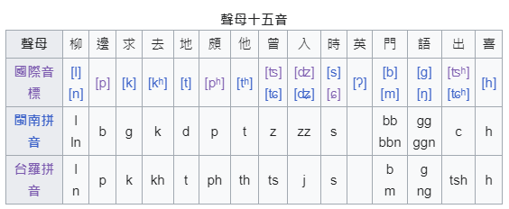
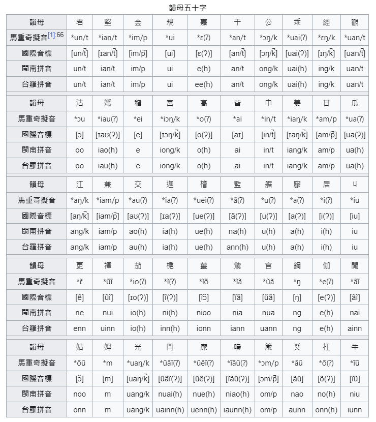

# 河洛十五音

閩南語十五音是一種用於拼寫閩南語音系的方法，起源於泉州《彙音妙悟》及
漳州[《彙集雅俗通十五音》](https://zh.wikipedia.org/wiki/%E5%BD%99%E9%9B%86%E9%9B%85%E4%BF%97%E9%80%9A%E5%8D%81%E4%BA%94%E9%9F%B3)
等閩南語韻書。十五音的拼寫方式起源於由泉州人黃謙於
《彙音妙悟》中提出的〈三推成字法〉，成為閩南語發展最早的拼字法。
十五音的說法是一種代稱，「十五音」是閩南語的「聲母十五音」，
此外還須搭配「韻母字母」以及「聲調八音」，才能完整拼寫出一個漢字讀音。

《彙集雅俗通十五音》清朝嘉慶23年（1818年）東苑謝秀嵐編纂成的一部以漳州音為主的
閩南語音韻學書籍，後再由顏錦華於1869年刻版印行。其採用用紅、黑二色套印，又稱
《紅字十五音》亦稱《增註雅俗通十五音》。

內容以韻母五十字為經，以聲母十五音為緯，再以聲調八音梳櫛貫穿其間。
（以下聲母十五音、韻母五十字、聲調八音等須以漳州之語音來唸讀）

## 聲母

## 韻母

