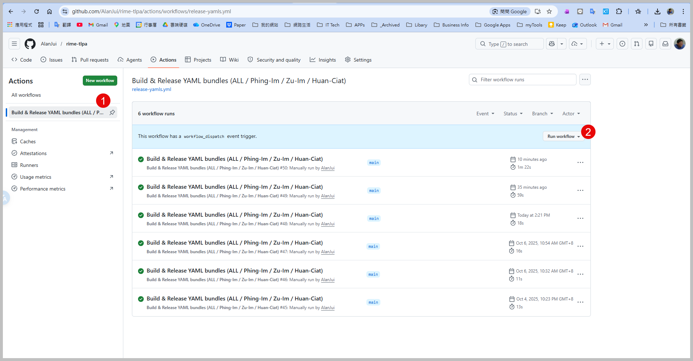
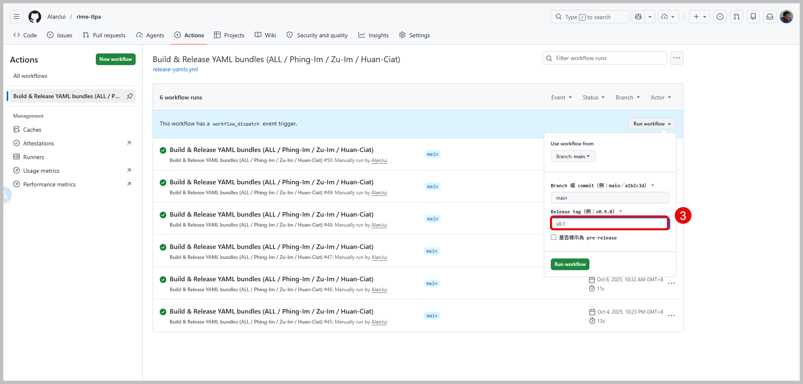
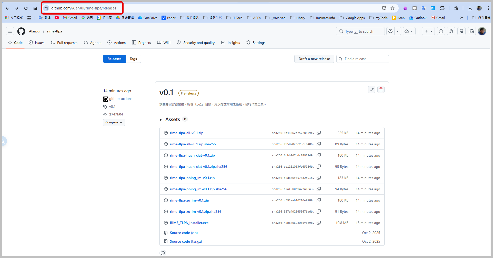
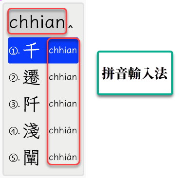
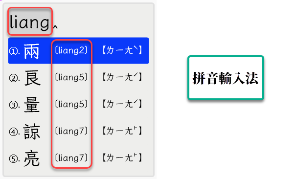
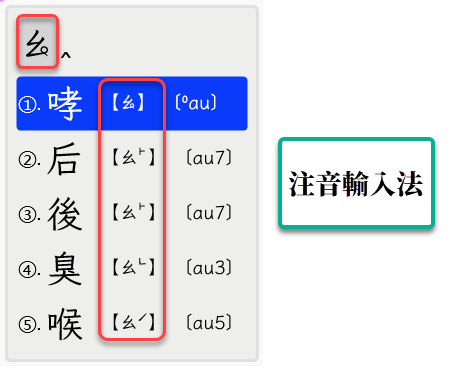
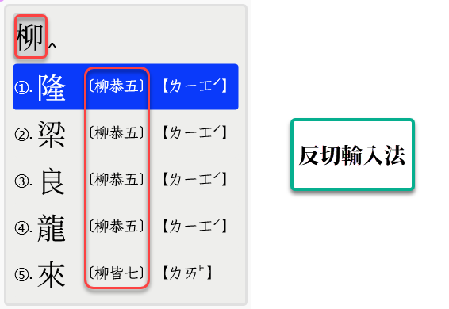

# 輸入法版本發行作業指引 v0.2

## 發行作業程序

1. 進入專案的 GitHub 網站： https://github.com/AlanJui/rime-tlpa 。

2. 切換到 [Actions](https://github.com/AlanJui/rime-tlpa/actions)。



3. 先點選`【Build & Release YAML bundles (ALL / Phing-Im / Zu-Im / Huan-Ciat)】` Actions Script；再按下`【Run workflow】`按鈕。


4. 在`【Release tag】`欄位，先輸入【**版本編號**】，然後按下`【Run workflow】`按鈕。



5. 待 Run workflow 執行完畢後，在網址： https://github.com/AlanJui/rime-tlpa/releases ，確認輸出結果。



## 發行作業用腳本

在 GitHub 網站使用之 workflow scripts（YAML檔案格式）。

- 存放目錄： .github/workflows/
- 檔案名稱： release-yamls.yml

```yml
name: "Build & Release YAML bundles (ALL / Phing-Im / Zu-Im / Huan-Ciat)"

permissions:
  contents: write # ★ 讓 GITHUB_TOKEN 可發 Release / 建 tag

on:
  push:
    tags:
      - "v*"
      - "kb-*"
      - "bp-*"
      - "zu-*"
  workflow_dispatch:
    inputs:
      ref:
        description: "Branch 或 commit（例：main／a1b2c3d）"
        required: true
        default: "main"
      tag_name:
        description: "Release tag（例：v0.9.0）"
        required: true
      prerelease:
        description: "是否標示為 pre-release"
        type: boolean
        required: false
        default: false

jobs:
  build-bundles:
    runs-on: ubuntu-latest
    outputs:
      TAG: ${{ steps.meta.outputs.TAG }}
      REF: ${{ steps.meta.outputs.REF }}
    steps:
      - name: Resolve ref / tag
        id: meta
        shell: bash
        run: |
          if [[ "${{ github.event_name }}" == "workflow_dispatch" ]]; then
            echo "REF=${{ github.event.inputs.ref }}" >> $GITHUB_OUTPUT
            echo "TAG=${{ github.event.inputs.tag_name }}" >> $GITHUB_OUTPUT
            echo "PRERELEASE=${{ github.event.inputs.prerelease }}" >> $GITHUB_OUTPUT
          else
            echo "REF=${{ github.ref_name }}" >> $GITHUB_OUTPUT
            echo "TAG=${{ github.ref_name }}" >> $GITHUB_OUTPUT
            echo "PRERELEASE=false" >> $GITHUB_OUTPUT
          fi
          echo "Resolved REF=$(cat $GITHUB_OUTPUT | sed -n 's/^REF=//p'), TAG=$(cat $GITHUB_OUTPUT | sed -n 's/^TAG=//p')"

      - name: Checkout repository at ref
        uses: actions/checkout@v4
        with:
          fetch-depth: 0
          ref: ${{ steps.meta.outputs.REF }}

      - name: Build 4 bundles (ALL/Phing-Im/Zu-Im/Huan-Ciat)
        shell: bash
        env:
          TAG: ${{ steps.meta.outputs.TAG }}
        run: |
          set -euo pipefail
          shopt -s nullglob nocaseglob

          echo "== [DEBUG] pwd: $(pwd) =="
          ls -l *.yaml || true

          PREFIX=""   # 若檔案不在根目錄，改成例如：PREFIX="rime/"

          mkdir -p dist

          make_zip() {
            local name="$1"; shift
            local listfile="$1"; shift
            local zip="dist/rime-tlpa-${name}-${TAG}.zip"

            if [[ -s "$listfile" ]]; then
              echo ">>> Packing ${name} ($(wc -l < "$listfile") files)"
              zip "$zip" -@ < "$listfile" >/dev/null
              (cd dist && sha256sum "$(basename "$zip")" > "$(basename "$zip").sha256")
              ls -lh "dist/$(basename "$zip")"
            else
              echo "::warning::Skip ${name} (no files)"
            fi
          }

          # ---------- ALL ----------
          # 1) 優先使用 release-include.txt；2) 不存在就抓根目錄所有 *.yaml
          ALL_LIST="dist/_all.list"
          if [[ -f release-include.txt ]]; then
            echo "Use release-include.txt for ALL"
            awk 'NR==1{sub(/^\xef\xbb\xbf/,"")}{print}' release-include.txt \
              | sed -e 's/\r$//' -e 's/^[[:space:]]*//' -e 's/[[:space:]]*$//' \
              | sed -e '/^$/d' -e '/^#/d' \
              | tr '\\' '/' \
              | while read -r p; do
                  [[ -z "$p" ]] && continue
                  f="${PREFIX}${p}"
                  [[ -f "$f" ]] && echo "$f"
                done > "$ALL_LIST"
          else
            echo "No release-include.txt, fallback to *.yaml"
            : > "$ALL_LIST"
            for f in ${PREFIX}*.yaml; do
              [[ -f "$f" ]] && echo "$f" >> "$ALL_LIST"
            done
          fi

          # ---------- COMMON：輸入方案共用模組及插件函式庫 ----------
          COMMON_LIST="dist/_common.list"
          : > "$COMMON_LIST"
          for p in \
            rime.lua \
            lua/*.lua \
            hau_suan_tuann_bp.yaml \
            hau_suan_tuann_bpm2.yaml \
            hau_suan_tuann_sni_and_tps.yaml \
            hau_suan_tuann_tlpa_and_tps.yaml \
            hau_suan_tuann_tlpa.yaml \
            hau_suan_tuann_tps.yaml \
            lib_phing_im.yaml \
            keymap_piau_tian.yaml
          do
            f="${PREFIX}${p}"
            [[ -f "$f" ]] && echo "$f" >> "$COMMON_LIST" || echo "::warning::Missing COMMON: $f"
          done

          # ---------- 【拼音輸入方案】 ----------
          PhingIm_LIST="dist/_PhingIm.list"
          : > "$PhingIm_LIST"
          for pat in \
            phing_im_*.schema.yaml \
            ji_khoo_tl.dict.yaml \
            ji_khoo_bpm2.dict.yaml
          do
            for f in ${PREFIX}${pat}; do
              [[ -f "$f" ]] && echo "$f" >> "$PhingIm_LIST"
            done
          done
          # 排除任何 *kb*（鍵盤練習工具）
          sed -i -e '/kb.*\.schema\.yaml/Id' "$PhingIm_LIST" || true

          # ---------- 【注音輸入方案】 ----------
          ZuIm_LIST="dist/_ZuIm.list"
          : > "$ZuIm_LIST"
          for pat in \
            zu_im_*.schema.yaml \
            ji_khoo_tl.dict.yaml \
            ji_khoo_bpm2.dict.yaml
          do
            for f in ${PREFIX}${pat}; do
              [[ -f "$f" ]] && echo "$f" >> "$ZuIm_LIST"
            done
          done
          sed -i -e '/kb.*\.schema\.yaml/Id' "$ZuIm_LIST" || true

          # ---------- 【反切輸入方案】 ----------
          HuanCiat_LIST="dist/_HuanCiat.list"
          : > "$HuanCiat_LIST"
          for pat in \
            huan_ciat_*.schema.yaml \
            ji_khoo_tl.dict.yaml \
            ji_khoo_bpm2.dict.yaml
          do
            for f in ${PREFIX}${pat}; do
              [[ -f "$f" ]] && echo "$f" >> "$HuanCiat_LIST"
            done
          done
          sed -i -e '/kb.*\.schema\.yaml/Id' "$HuanCiat_LIST" || true

          # ---------- 鍵盤練習工具（只放 All） ----------
          KB_LIST="dist/_kb.list"
          : > "$KB_LIST"
          for pat in \
            kb_*.schema.yaml
          do
            for f in ${PREFIX}${pat}; do
              [[ -f "$f" ]] && echo "$f" >> "$KB_LIST"
            done
          done

          # --------- 合併清單 ----------
          sort -u "$ALL_LIST" > dist/all.final
          cat "$COMMON_LIST" "$PhingIm_LIST" | sort -u > dist/phing_im.final
          cat "$COMMON_LIST" "$ZuIm_LIST"  | sort -u > dist/zu_im.final
          cat "$COMMON_LIST" "$HuanCiat_LIST"   | sort -u > dist/huan_ciat.final

          # All 另外把 KB 與 COMMON 也併進去（確保 rime.lua 等共用檔被包含）
          cat dist/all.final "$COMMON_LIST" "$KB_LIST" | sort -u > dist/all.plus

          # 簡易偵測：確認 rime.lua 是否出現在各包清單
          for pkg in phing_im zu_im huan_ciat; do
            echo "[DEBUG] ${pkg}.final lines: $(wc -l < dist/${pkg}.final)"
            grep -n "rime\.lua" "dist/${pkg}.final" || echo "[DEBUG] rime.lua not found in dist/${pkg}.final"
          done
          echo "[DEBUG] all.plus lines: $(wc -l < dist/all.plus)"
          grep -n "rime\.lua" dist/all.plus || echo "[DEBUG] rime.lua not found in all.plus (will still proceed)"

          echo "== COUNT =="
          echo "ALL: $(wc -l < dist/all.plus) | PHING_IM: $(wc -l < dist/phing_im.final) | ZU_IM: $(wc -l < dist/zu_im.final) | HUAN_CIAT: $(wc -l < dist/huan_ciat.final)"

          # --------- 打包 ----------
          make_zip "all"  "dist/all.plus"
          make_zip "phing_im" "dist/phing_im.final"
          make_zip "zu_im"  "dist/zu_im.final"
          make_zip "huan_ciat"   "dist/huan_ciat.final"

      - name: Create / Update GitHub Release + upload 4 assets
        uses: softprops/action-gh-release@v2
        with:
          tag_name: ${{ steps.meta.outputs.TAG }}
          target_commitish: ${{ steps.meta.outputs.REF }}
          prerelease: ${{ github.event.inputs.prerelease || false }} # ← 布林，不用字串
          files: |
            dist/*.zip
            dist/*.sha256

  build-installer:
    needs: build-bundles
    runs-on: windows-latest
    steps:
      - name: Checkout repository at ref
        uses: actions/checkout@v4
        with:
          fetch-depth: 0
          ref: ${{ needs.build-bundles.outputs.REF }}

      - name: Set up Python
        uses: actions/setup-python@v5
        with:
          python-version: "3.11"

      - name: Install PyInstaller
        run: pip install pyinstaller

      - name: Build RIME_TLPA_Installer.exe
        run: pyinstaller RIME_TLPA_Installer.spec

      - name: Upload installer to GitHub Release
        uses: softprops/action-gh-release@v2
        with:
          tag_name: ${{ needs.build-bundles.outputs.TAG }}
          files: dist/RIME_TLPA_Installer.exe
```

## 專案産出之輸入方案

專案之【輸入方案】，可分以下三大類別之輸入法：

- 拼音輸入法：使用【羅馬拼音字母】當作【音標】之輸入法

- 注音輸入法：使用【注音符號】改良後適用於閩南話之【注音】輸入法

- 反切輸入法：使用閩南十五音（指《彙集雅俗通十五音》）之【反切】輸入法

**`輸入方案對照表`**

| 輸入法類別 | 輸入方案名稱               | 輸入方案識別號 | 字典編碼     | 漢字標音系統全寫   |
| --------- | -------------------------- | -------------- | ------------ | ------------------ |
| 拼音輸入法 | 拼音輸入法【台語音標】     | phing_im_tlpa  | 台羅拼音     | 台語音標(TLPA+)    |
| 拼音輸入法 | 拼音輸入法【台羅拼音】     | phing_im_tl    | 台羅拼音     | 台羅拼音(TL)       |
| 拼音輸入法 | 拼音輸入法【白話字】       | phing_im_poj   | 台羅拼音     | 白話字(POJ)        |
| 拼音輸入法 | 拼音輸入法【閩拼方案】     | phing_im_bp    | 台羅拼音     | 閩拼方案(BP)       |
| 拼音輸入法 | 拼音輸入法【台語注音二式】 | phing_im_bpm2  | 台語注音二式 | 台語注音二式(BPM2) |
| 注音輸入法 | 注音輸入法【台語音標】     | zu_im_tlpa     | 台羅拼音     | 台語音標(TLPA+)    |
| 注音輸入法 | 注音輸入法【台語注音二式】 | zu_im_bpm2     | 台語注音二式 | 台語注音二式(BPM2) |
| 反切輸入法 | 反切輸入法【方音符號】     | huan_ciat_tps  | 台羅拼音     | 方音符號(TFS)      |
| 反切輸入法 | 反切輸入法【台語音標】     | huan_ciat_tlpa | 台羅拼音     | 台語音標(TLPA+)    |

各大類別所屬之輸入方案，則修述如後。

### 拼音輸入法

使用「羅馬拼音字母」輸入法，支援的輸入方案有：

- 台語音標（TLPA+）：phing_im_tlpa
- 台羅拼音（TL）：phing_im_tl
- 白話字（POJ）：phing_im_poj
- 台語注音二式（BPM2）：phing_im_bpm2
- 閩拼方案（BP）：phing_im_bp

#### 單欄標音



#### 兩欄標音

- 左欄：輸入方案使用之「拼音系統」
- 右欄：其它「拼音系統/注音符號/反切」
  

### 注音輸入法

使用依據閩南話發音特性改良的「注音符號」輸入法（目前：僅支援吳守禮先生的【方音符號】）。

但輸入方案使用之「字典」，其「注音編碼」分兩種標準：

- 台語音標（TLPA+）：zu_im_tlpa
- 台語注音二式（BPM2）：zu_im_bpm2



### 反切輸入法

目前尚非「實體」的十五音反切輸入法。反切使用的十五音：【聲母】、【韻母】，仍借用【注音符號】、【羅馬拼音字母】按鍵輸入；經輸入方案轉換成【雅俗通十五音】使用之【聲母】、【韻母】及【調號】。

- 反切輸入法【方音符號】：huan_ciat_tps
- 反切輸入法【台語音標】：huan_ciat_tlpa




## 設定打包黑名單

GitHub 在【發行打包作業】，基本原則：【專案容器】中所有的【目錄】、
【檔案】都會包入【Source code】壓縮檔中。若有某些【目錄】、【檔案】
不想打包，可以透過 .gitattributes 檔案來指定。

```bash
# 減肥示例：把測試、文件、開發腳本排除
_archived/         export-ignore
.vscode/           export-ignore
tests/             export-ignore
huan_ciat/          export-ignore
docs/              export-ignore
src/              export-ignore
*.xlsx             export-ignore
*.csv              export-ignore
settings_to_append.txt export-ignore
clear_rime_cache.bat export-ignore
install.bat export-ignore
install.sh export-ignore
mylist.txt export-ignore
```
