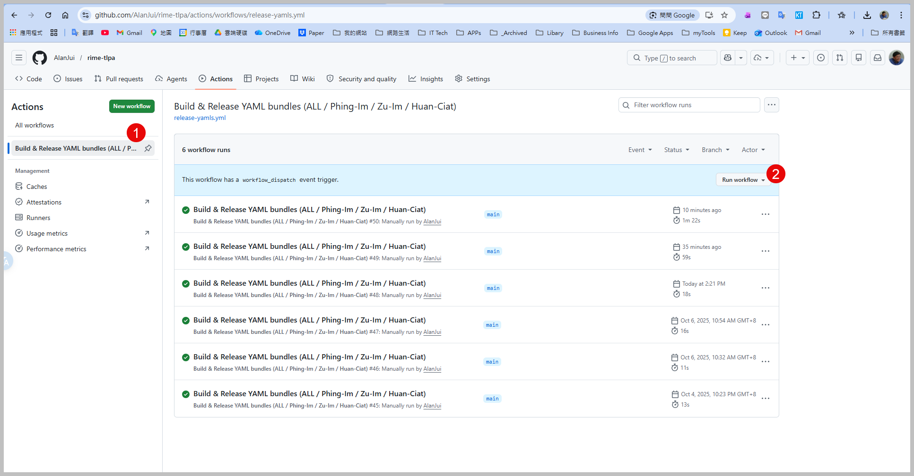
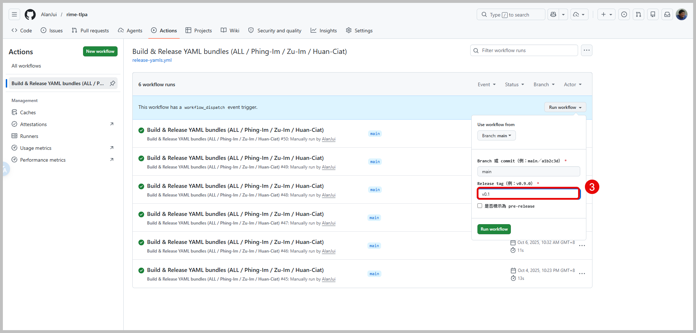
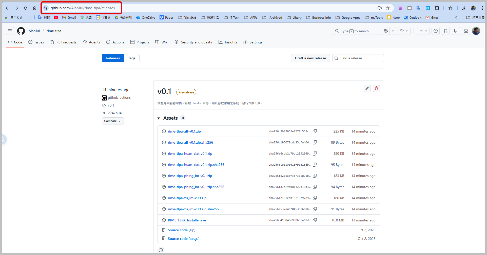
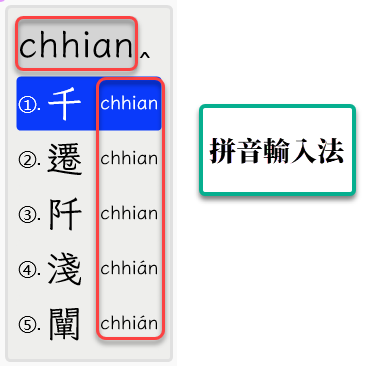
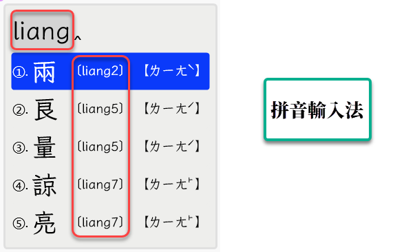
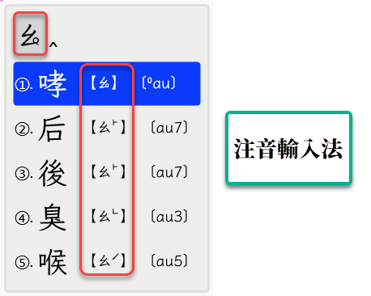
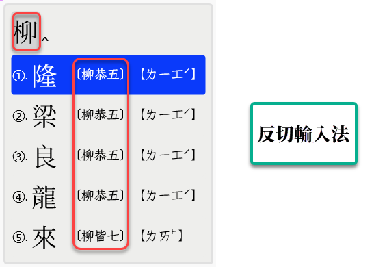

# 輸入法版本發行作業指引 v0.5

## 版本發行總覽（v0.2 起）

自 v0.2 起，日常開發在 `develop`，**正式發行基準為 `main`**。建議依下列順序：

```text
develop 開發／自測
    │
    ├─(可選)─► Actions 以 Ref=develop 試打 pre-release（如 v0.2.0-rc1）
    │
    ▼
PR：develop → main（審查後合併）
    │
    ▼
在 main 打正式 tag（如 v0.2.0）或 Actions 以 Ref=main 手動發行
```

| 階段 | 分支／Ref | Tag 範例 | prerelease |
|------|-----------|----------|------------|
| 試行打包 | `develop` | `v0.2.0-rc1` | 勾選 |
| 正式發行 | `main` | `v0.2.0` | 不勾選 |

### 將 develop 併回 main

正式打 tag 前，須先把 `develop` 的變更併入 `main`（可用 PR，或本機 merge 後 push）。

**【建議：以 Pull Request 合併】**

```powershell
# 確認 develop 已推上遠端
git checkout develop
git status
git push origin develop

# 開 PR：develop → main
gh pr create --base main --head develop --title "Release v0.2.0" --body "合併 develop 作為 v0.2.0 發行基準"

# 審查通過後合併（網頁 Merge，或：）
gh pr merge --merge
```

**【本機直接合併（替代作法）】**

```powershell
git checkout main
git pull origin main
git merge develop
git push origin main
```

合併後同步本機：

```powershell
git checkout main
git pull origin main
```

> **注意**：Actions 手動發行預設 `Ref=main`；若尚未合併就在 `main` 打正式 tag，會打到舊程式。試行打包可暫時以 `Ref=develop`，不必先合併。

### 打包作業指示檔（release-\*.txt）

GitHub Actions（`.github/workflows/release-yamls.yml`）依下列四份**自含清單**打包 zip（路徑相對於專案根目錄）：

| 清單檔 | 產出壓縮檔 |
|--------|------------|
| `release-include.txt` | `rime-tlpa-all-<tag>.zip` |
| `release-phing_im.txt` | `rime-tlpa-phing_im-<tag>.zip` |
| `release-zu_im.txt` | `rime-tlpa-zu_im-<tag>.zip` |
| `release-huan_ciat.txt` | `rime-tlpa-huan_ciat-<tag>.zip` |

**應列入清單**

- 該類別之 `*.schema.yaml`
- 方案 `__patch`／`__include` 引用之 `lib_*.yaml`
- `keymap_piau_tian.yaml`（`import_preset`）
- `rime.lua`、`lua/rime_env.lua`、`lua/tlpa_converter.lua`、`lua/bpm2_converter.lua`
- 方案 `dictionary:` 及其 `import_tables` 所列字典（如 `ji_khoo_tl`／`ji_khoo_bpm2` 與子表）
- 需要一併發佈之輔助方案（如 `kb_*.schema.yaml`）

**不應列入清單**

- `lua/rime_env_state.lua`（執行期由 `rime.lua` 自動產生之使用者狀態）
- `*.userdb/`、`build/`、測試目錄（如 `_rime_test/`）
- 未被子字典引用之開發／來源字典（如 `ji_khoo_kam_ji_tian`、`ji_khoo_tl_orgin`、`ji_khoo_tl_peh_ue`）
- `docs/`、`tools/`、原始 Excel／CSV 等非執行期檔

**由安裝程式另行提供（不進 zip）**

- `config/default.custom.yaml` 與各類別 `default.custom.*.yaml`  
  由 `RIME_TLPA_Installer.exe` 內嵌寫入使用者 `%APPDATA%\Rime\`，無需寫入 `release-*.txt`。

發行前請確認：清單內路徑皆存在；四份分類清單與 `release-include.txt` 之「該類方案＋共用依賴」一致。

---

## 發行作業程序

### 手動發行

在 GitHub 的專案網站，以人工手動執行發行作業。

此種作業方式，尤其適合【pre-release】作業。

1. 進入專案的 GitHub 網站： https://github.com/AlanJui/rime-tlpa 。

2. 切換到 [Actions](https://github.com/AlanJui/rime-tlpa/actions)。



3. 先點選`【Build & Release YAML bundles (ALL / Phing-Im / Zu-Im / Huan-Ciat)】` Actions Script；再按下`【Run workflow】`按鈕。


4. 在`【Release tag】`欄位，先輸入【**版本編號**】，然後按下`【Run workflow】`按鈕。

**【試行／pre-release】（可在合併 main 前驗證打包）**

     1. 填入：
        - Branch：`develop`（試行）或 `main`（已合併後）
        - Ref：同上
        - Release tag：`v0.2.0-rc1`（注意：不能含空白）
        - prerelease：勾選

     2. 按 Run workflow

**【發行正式版】（須已將 develop 併入 main）**

     1. 填入：
        - Branch：`main`
        - Ref：`main`
        - Release tag：`v0.2.0`
        - prerelease：`不勾選`




5. 待 Run workflow 執行完畢後，在網址： https://github.com/AlanJui/rime-tlpa/releases ，確認輸出結果。



### 自動發行

透過 Git 的 tag 觸發發行作業的 Action Workflow.

這個 workflow 已設定當 push 符合 v*、kb-*、bp-*、zu-* 規則的 tag
時自動執行。**正式版請在 `main`（已合併 develop 之後）打 tag**；試行版可在 `develop` 打 pre-release tag。

步驟

0. 確認發行基準分支已就緒（正式版：`main` 已含本次 develop 變更）

```powershell
git checkout main
git pull origin main
git status
```

1. 在目前的 commit 上建立 tag

**【試行版本】（可在 develop）**

```powershell
git checkout develop
git pull origin develop
git tag -a v0.2.0-rc1 -m "Release v0.2.0-rc1"
```

**【正式版本】（在 main）**

```powershell
git checkout main
git pull origin main
git tag -a v0.2.0 -m "Release v0.2.0"
```

2. Push tag 到 GitHub

```powershell
git push origin v0.2.0-rc1
```

```powershell
git push origin v0.2.0
```

或一次推所有本地新 tag：

```powershell
git push --tags
```

---

### 重新發行

如果 標籤(tag) 推錯了想刪掉重來

#### 確認標籤已建置

```powershell
git tag
```


#### 刪本地

```powershell
git tag -d v0.1.0-alpha
```

```powershell
git tag -d v0.1.0
```

#### 刪遠端

會撤回 GitHub 上的 tag，並可能觸發 Release 失效

```powershell
git push origin :refs/tags/v0.1.0-alpha
```

```powershell
git push origin :refs/tags/v0.1.0
```

  ⚠️  刪除遠端 tag 屬於對共用狀態的破壞性動作；如果 tag 已經有對應的 Release 上架且有人下載，請斟酌使用。


## 發行作業用腳本

在 GitHub 網站使用之 workflow scripts（YAML檔案格式）。

- 存放目錄： .github/workflows/
- 檔案名稱： release-yamls.yml

```yml
name: "Build & Release YAML bundles (ALL / Phing-Im / Zu-Im / Huan-Ciat)"

permissions:
  contents: write # ★ 讓 GITHUB_TOKEN 可發 Release / 建 tag

on:
  push:
    tags:
      - "v*"
      - "kb-*"
      - "bp-*"
      - "zu-*"
  workflow_dispatch:
    inputs:
      ref:
        description: "Branch 或 commit（例：main／a1b2c3d）"
        required: true
        default: "main"
      tag_name:
        description: "Release tag（例：v0.9.0）"
        required: true
      prerelease:
        description: "是否標示為 pre-release"
        type: boolean
        required: false
        default: false

jobs:
  build-bundles:
    runs-on: ubuntu-latest
    outputs:
      TAG: ${{ steps.meta.outputs.TAG }}
      REF: ${{ steps.meta.outputs.REF }}
    steps:
      - name: Resolve ref / tag
        id: meta
        shell: bash
        run: |
          if [[ "${{ github.event_name }}" == "workflow_dispatch" ]]; then
            REF="${{ github.event.inputs.ref }}"
            TAG="${{ github.event.inputs.tag_name }}"
            PRERELEASE="${{ github.event.inputs.prerelease }}"
          else
            # tag push：github.ref_name 是 tag 名稱（例如 v0.1.0），
            # 不能當作 target_commitish；改用 github.sha（tag 指到的 commit）
            REF="${{ github.sha }}"
            TAG="${{ github.ref_name }}"
            PRERELEASE="false"
          fi

          # 去除前後空白
          TAG="$(echo -n "$TAG" | sed 's/^[[:space:]]*//; s/[[:space:]]*$//')"

          # tag_name 驗證（方案 A：寬鬆版）
          if [[ -z "$TAG" ]]; then
            echo "::error::tag_name is required"
            exit 1
          fi
          if [[ ! "$TAG" =~ ^[A-Za-z0-9._/-]+$ ]]; then
            echo "::error::Invalid tag_name '$TAG' — only A-Z, a-z, 0-9, '.', '_', '/', '-' are allowed (no spaces). 範例：v0.1.0-alpha"
            exit 1
          fi

          echo "REF=$REF" >> $GITHUB_OUTPUT
          echo "TAG=$TAG" >> $GITHUB_OUTPUT
          echo "PRERELEASE=$PRERELEASE" >> $GITHUB_OUTPUT
          echo "Resolved REF=$REF, TAG=$TAG, PRERELEASE=$PRERELEASE"

      - name: Checkout repository at ref
        uses: actions/checkout@v5
        with:
          fetch-depth: 0
          ref: ${{ steps.meta.outputs.REF }}

      - name: Build 4 bundles (ALL/Phing-Im/Zu-Im/Huan-Ciat)
        shell: bash
        env:
          TAG: ${{ steps.meta.outputs.TAG }}
        run: |
          set -euo pipefail
          shopt -s nullglob nocaseglob

          echo "== [DEBUG] pwd: $(pwd) =="
          ls -l *.yaml || true

          PREFIX=""   # 若檔案不在根目錄，改成例如：PREFIX="rime/"

          mkdir -p dist

          # ---------- helper：解析清單檔 → 輸出排序去重後的實檔路徑 ----------
          # 功能：
          #   - 自動去除 BOM、Windows 換行(\r)、前後空白
          #   - 略過空行與 # 註解
          #   - 反斜線(\) 自動轉為 (/)
          #   - 支援 glob（如 lua/*.lua）
          #   - 找不到對應檔案會發 ::warning::
          resolve_list() {
            local listfile="$1"
            local outfile="$2"
            local label="$3"

            : > "$outfile"
            if [[ ! -f "$listfile" ]]; then
              echo "::warning::${label}: $listfile not found, list is empty"
              return
            fi

            echo ">>> Resolving ${label} from $listfile"
            awk 'NR==1{sub(/^\xef\xbb\xbf/,"")}{print}' "$listfile" \
              | sed -e 's/\r$//' -e 's/^[[:space:]]*//' -e 's/[[:space:]]*$//' \
              | sed -e '/^$/d' -e '/^#/d' \
              | tr '\\' '/' \
              | while read -r p; do
                  [[ -z "$p" ]] && continue
                  found=0
                  for f in ${PREFIX}${p}; do
                    if [[ -f "$f" ]]; then
                      echo "$f"
                      found=1
                    fi
                  done
                  if [[ $found -eq 0 ]]; then
                    echo "::warning::${label}: Missing pattern: ${PREFIX}${p}" >&2
                  fi
                done | sort -u > "$outfile"
          }

          # ---------- helper：打包 zip + 產生 sha256 ----------
          make_zip() {
            local name="$1"; shift
            local listfile="$1"; shift
            local zip="dist/rime-tlpa-${name}-${TAG}.zip"

            if [[ -s "$listfile" ]]; then
              echo ">>> Packing ${name} ($(wc -l < "$listfile") files)"
              zip "$zip" -@ < "$listfile" >/dev/null
              (cd dist && sha256sum "$(basename "$zip")" > "$(basename "$zip").sha256")
              ls -lh "dist/$(basename "$zip")"
            else
              echo "::warning::Skip ${name} (no files)"
            fi
          }

          # ---------- 解析四個 bundle 清單 ----------
          # 每個 release-*.txt 為自含清單（包含其 bundle 所需的全部檔案）
          resolve_list "release-include.txt"   "dist/all.final"       "ALL"
          resolve_list "release-phing_im.txt"  "dist/phing_im.final"  "PhingIm"
          resolve_list "release-zu_im.txt"     "dist/zu_im.final"     "ZuIm"
          resolve_list "release-huan_ciat.txt" "dist/huan_ciat.final" "HuanCiat"

          echo "== COUNT =="
          echo "ALL: $(wc -l < dist/all.final) | PHING_IM: $(wc -l < dist/phing_im.final) | ZU_IM: $(wc -l < dist/zu_im.final) | HUAN_CIAT: $(wc -l < dist/huan_ciat.final)"

          # ---------- 打包 ----------
          make_zip "all"       "dist/all.final"
          make_zip "phing_im"  "dist/phing_im.final"
          make_zip "zu_im"     "dist/zu_im.final"
          make_zip "huan_ciat" "dist/huan_ciat.final"

      - name: Create / Update GitHub Release + upload 4 assets
        uses: softprops/action-gh-release@v2
        with:
          tag_name: ${{ steps.meta.outputs.TAG }}
          target_commitish: ${{ steps.meta.outputs.REF }}
          prerelease: ${{ github.event.inputs.prerelease || false }} # ← 布林，不用字串
          files: |
            dist/*.zip
            dist/*.sha256

  build-installer:
    needs: build-bundles
    runs-on: windows-latest
    steps:
      - name: Checkout repository at ref
        uses: actions/checkout@v5
        with:
          fetch-depth: 0
          ref: ${{ needs.build-bundles.outputs.REF }}

      - name: Set up Python
        uses: actions/setup-python@v5
        with:
          python-version: "3.11"

      - name: Install PyInstaller
        run: pip install pyinstaller

      - name: Build RIME_TLPA_Installer.exe
        run: pyinstaller RIME_TLPA_Installer.spec

      - name: Upload installer to GitHub Release
        uses: softprops/action-gh-release@v2
        with:
          tag_name: ${{ needs.build-bundles.outputs.TAG }}
          files: dist/RIME_TLPA_Installer.exe

```

## 專案産出之輸入方案

專案之【輸入方案】，可分以下三大類別之輸入法：

- 拼音輸入法：使用【羅馬拼音字母】當作【音標】之輸入法

- 注音輸入法：使用【注音符號】改良後適用於閩南話之【注音】輸入法

- 反切輸入法：使用閩南十五音（指《彙集雅俗通十五音》）之【反切】輸入法

**`輸入方案對照表`**

| 輸入法類別 | 輸入方案名稱               | 輸入方案識別號 | 字典編碼     | 漢字標音系統全寫   |
| --------- | -------------------------- | -------------- | ------------ | ------------------ |
| 拼音輸入法 | 拼音輸入法【台語音標】     | phing_im_tlpa  | 台羅拼音     | 台語音標(TLPA+)    |
| 拼音輸入法 | 拼音輸入法【台羅拼音】     | phing_im_tl    | 台羅拼音     | 台羅拼音(TL)       |
| 拼音輸入法 | 拼音輸入法【白話字】       | phing_im_poj   | 台羅拼音     | 白話字(POJ)        |
| 拼音輸入法 | 拼音輸入法【閩拼方案】     | phing_im_bp    | 台語注音二式 | 閩拼方案(BP)       |
| 拼音輸入法 | 拼音輸入法【台語注音二式】 | phing_im_bpm2  | 台語注音二式 | 台語注音二式(BPM2) |
| 注音輸入法 | 注音輸入法【方音符號】     | zu_im_tps      | 台羅拼音     | 方音符號(TPS)      |
| 注音輸入法 | 注音輸入法【台語音標】     | zu_im_tlpa     | 台羅拼音     | 台語音標注音       |
| 注音輸入法 | 注音輸入法【台語注音二式】 | zu_im_bpm2     | 台語注音二式 | 台語注音二式(BPM2) |
| 反切輸入法 | 反切輸入法【方音符號】     | huan_ciat_tps  | 台羅拼音     | 方音符號(TPS)      |
| 反切輸入法 | 反切輸入法【台語音標】     | huan_ciat_tlpa | 台羅拼音     | 台語音標(TLPA+)    |

各大類別所屬之輸入方案，則修述如後。

### 拼音輸入法

使用「羅馬拼音字母」輸入法，支援的輸入方案有：

- 台語音標（TLPA+）：phing_im_tlpa
- 台羅拼音（TL）：phing_im_tl
- 白話字（POJ）：phing_im_poj
- 台語注音二式（BPM2）：phing_im_bpm2
- 閩拼方案（BP）：phing_im_bp

#### 單欄標音



#### 兩欄標音

- 左欄：輸入方案使用之「拼音系統」
- 右欄：其它「拼音系統/注音符號/反切」
  

### 注音輸入法

使用依據閩南話發音特性改良的「注音符號」輸入法。現行方案：

- 方音符號（TPS）：zu_im_tps
- 台語音標注音：zu_im_tlpa
- 台語注音二式（BPM2）：zu_im_bpm2

字典編碼分兩種標準：台羅拼音（`ji_khoo_tl`）、台語注音二式（`ji_khoo_bpm2`）。



### 反切輸入法

目前尚非「實體」的十五音反切輸入法。反切使用的十五音：【聲母】、【韻母】，仍借用【注音符號】、【羅馬拼音字母】按鍵輸入；經輸入方案轉換成【雅俗通十五音】使用之【聲母】、【韻母】及【調號】。

- 反切輸入法【方音符號】：huan_ciat_tps
- 反切輸入法【台語音標】：huan_ciat_tlpa




## 設定打包黑名單

GitHub 在【發行打包作業】，基本原則：【專案容器】中所有的【目錄】、
【檔案】都會包入【Source code】壓縮檔中。若有某些【目錄】、【檔案】
不想打包，可以透過 .gitattributes 檔案來指定。

```bash
# 減肥示例：把測試、文件、開發腳本排除
_archived/         export-ignore
.vscode/           export-ignore
tests/             export-ignore
huan_ciat/          export-ignore
docs/              export-ignore
src/              export-ignore
*.xlsx             export-ignore
*.csv              export-ignore
settings_to_append.txt export-ignore
clear_rime_cache.bat export-ignore
install.bat export-ignore
install.sh export-ignore
mylist.txt export-ignore
```
