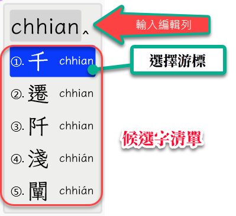
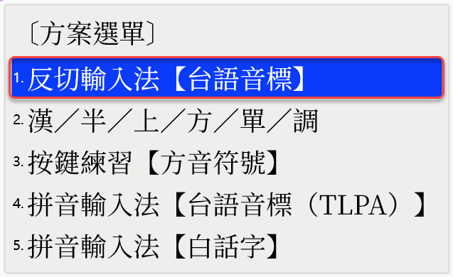
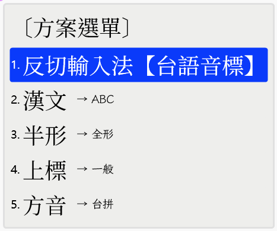
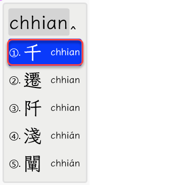
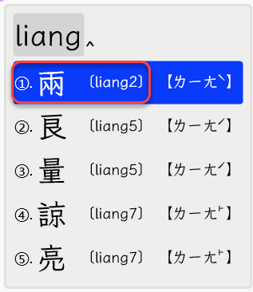
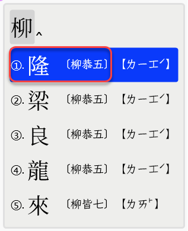
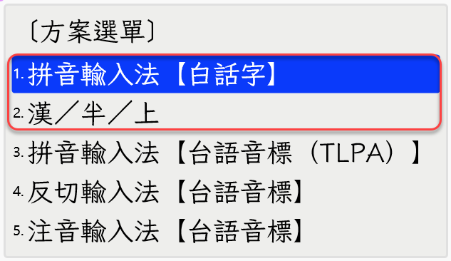
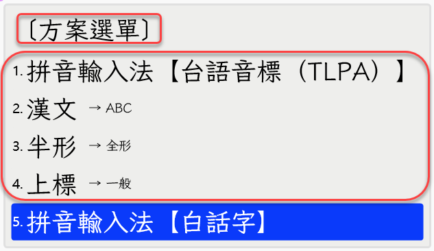

# 輸出漢字標音規格 V0.0.4

規範【輸入方案】不僅可以輸出【漢字】，亦可輸出構成漢字發音的【漢字標音】。

所謂【漢字標音】可能指：羅馬拼音字母/注音符號/十五音切語，其可能選項條列如下：

- 台語音標 (TLPA+)
- 台羅拼音 (TL)
- 白話字 (POJ)
- 閩拼方案 (BP)
- 台語注音二式 (BPM2)
- 十五音 (SNI)：此指《彙集雅俗通十五音》
- 方音符號 (TFS)
- 國際音標 (IPA)

如：閩南話之漢字【千】，其【台語音標】為：[cian1]，而【白話字】拼音為：【chhian】。
當使用者在《拼音輸入法【白話字】》輸入方案，於鍵盤按下：【c, h, h, i, a, n, ;】鍵，
在【輸入編輯列】看到【chhian】，於【候選字清單】則可見 5 項候選漢字，及漢字之【白話字】
羅馬拼音字母；移動【選擇游標】選取某漢字後，若按下 <Space> 鍵，將輸出【千】這漢字；
但若按下 <Enter> 鍵，則輸出為：chhian；或使用者指定之【漢字標音】。

### 功能規格

以下透過【操作情境】來說明及定義功能需求。

#### 設定操作

當使用者已啟動「小狼毫」輸入法後，依下述之【操作步驟】，
可設定本專案所産出之【輸入法方案】，於按下 <Enter> 鍵後，
自動輸出【漢字標音】。

1. 使用按鍵 <Ctrl>+<`> 或 <F4>，打開【方案選單】；
   

2. 使用游標移動鍵，移到 **【漢字標音輸出選項】** 進行設定；
   

- 可供選用
  - 關閉（預設）
    若輸出方案的【候選字清單】為......
    - 【單欄】：以游標座落之候選字選項
      
    - 【雙欄】：以游標座落之候選字選項的【左欄】
      
      
  - 台語音標 (TLPA+)
  - 台羅拼音 (TL)
  - 白話字 (POJ)
  - 閩拼方案 (BP)
  - 台語注音二式 (BPM2)
  - 十五音 (SNI)：此指《彙集雅俗通十五音》
  - 方音符號 (TFS)
  - 國際音標 (IPA)

3. 按 <Enter>, <Space> 鍵表：【設定】；按 <Esc> 鍵表：【取消】。

#### 輸出操作

原本按 <Space> 鍵輸出【漢字】；若改按 <Enter> 鍵，則依據【漢字標音輸出】選寫之設定，輸出【漢字標音】（可能是【羅馬拼音字母】或【注音符號】或【十五音】）。

#### 候選字清單

1. 若輸入方案原本為【單欄】顯示，當【漢字標音輸出】選項被設定後，則【左欄】維持不變；【右欄】輸出【漢字標音】；

2. 若輸入方案原本為【雙欄】顯示，當【漢字標音輸出】選項被設定後，則【左欄】維持不變；【右欄】輸出，改成設定的【漢字標音】。

## 輸入方案類別

目前已開發之輸入方案，共分下述三大類：

- 拼音輸入法
- 注音輸入法
- 反切輸入法

| 輸入法類別 | 輸入方案名稱               | 輸入方案識別號 | 字典編碼     | 漢字標音系統全寫   |
| ---------- | -------------------------- | -------------- | ------------ | ------------------ |
| 拼音輸入法 | 拼音輸入法【台語音標】     | phing_im_tlpa  | 台羅拼音     | 台語音標(TLPA+)    |
| 拼音輸入法 | 拼音輸入法【台羅拼音】     | phing_im_tl    | 台羅拼音     | 台羅拼音(TL)       |
| 拼音輸入法 | 拼音輸入法【白話字】       | phing_im_poj   | 台羅拼音     | 白話字(POJ)        |
| 拼音輸入法 | 拼音輸入法【閩拼方案】     | phing_im_bp    | 台羅拼音     | 閩拼方案(BP)       |
| 拼音輸入法 | 拼音輸入法【台語注音二式】 | phing_im_bpm2  | 台語注音二式 | 台語注音二式(BPM2) |
| 注音輸入法 | 注音輸入法【台語音標】     | zu_im_tlpa     | 台羅拼音     | 台語音標(TLPA+)    |
| 注音輸入法 | 注音輸入法【台語注音二式】 | zu_im_bpm2     | 台語注音二式 | 台語注音二式(BPM2) |
| 反切輸入法 | 反切輸入法【方音符號】     | huan_ciat_tps  | 台羅拼音     | 方音符號(TFS)      |
| 反切輸入法 | 反切輸入法【台語音標】     | huan_ciat_tlpa | 台羅拼音     | 台語音標(TLPA+)    |

各大類別所屬之輸入方案，則修述如後。

## 拼音輸入法

使用「羅馬拼音字母」輸入法，支援的輸入方案有：

- 台語音標（TLPA+）：phing_im_tlpa
- 台羅拼音（TL）：phing_im_tl
- 白話字（POJ）：phing_im_poj
- 台語注音二式（BPM2）：phing_im_bpm2
- 閩拼方案（BP）：phing_im_bp

### 單欄標音

### 兩欄標音

- 左欄：輸入方案使用之「拼音系統」
- 右欄：其它「拼音系統/注音符號/反切」
  

## 注音輸入法

使用依據閩南話發音特性改良的「注音符號」輸入法（目前：僅支援吳守禮先生的【方音符號】）。

但輸入方案使用之「字典」，其「注音編碼」分兩種標準：

- 台語音標（TLPA+）：zu_im_tlpa
- 台語注音二式（BPM2）：zu_im_bpm2

## 反切輸入法

目前尚非「實體」的十五音反切輸入法。反切使用的十五音：【聲母】、【韻母】，仍借用【注音符號】、【羅馬拼音字母】按鍵輸入；經輸入方案轉換成【雅俗通十五音】使用之【聲母】、【韻母】及【調號】。

- 反切輸入法【方音符號】：huan_ciat_tps
- 反切輸入法【台語音標】：huan_ciat_tlpa

---

## 漢字標音輸出設計規格

不論輸入方案屬「拼音/注音/反切」何種類別，不論該輸入方案
原本提供的【候選字清單】為【單欄式】或【雙欄式】，皆是以【右欄】
作為【漢字標音輸出欄】。

【候選字清單】在【漢字標音輸出欄】，該顯示何種：拼音/注音/反切標準
，由【方案選單】來控制。

在輸入方案(x.schema.yaml)的【switches】，定義**【漢字標音輸出】**
設定選項：

### 【漢字標音輸出】設定選項

- name: piau_im_output
- states: [ NA, TLPA, BP, TL, POJ, BPM2, TFS, SNI, IPA ]

**英文縮寫定義**：

- NA：關閉輸出（此為預設值）
- TLPA: 台語音標（TLPA+）
- BP：閩拼方案
- TL: 台羅拼音
- POJ: 白話字
- BPM2: 台語注音二式
- TFS: 方音符號
- SNI: 十五音（指：雅俗通十五音）
- IPA: 國際音標

### 實作

### 函數

1. 在 `lua\tlpa_converter.lua` 已有以【台語音標】為核心的【漢字標音轉換用】函數。

【註】： tlpa_converter.lua 程式碼，基本上是參考路徑：C:\work\Piau-Im\docs\assets\javascripts\ 的 JavaScript 改寫而來：

- phonetic_mapping.json
- phonetic_switcher.js

2. 上述之 Lua Script 已含 IPA 轉換函數在內。

參考文件：

- 100\_聲韻調對映規則.md
- 120\_漢字標音轉換指引.md

tlpa_converter.lua 以 TLPA 為核心，可轉換所有格式——但前提是字典資料能提供 TLPA 讀音。

3. 各種轉換函數備妥狀態

- **使用【台羅拼音】（TL）之字典**：已能自【台語音標】（TLPA）轉換成
  - 台羅拼音（TL）
  - 白話字（POJ）
  - 閩拼方案（BP）
  - 台語注音二式（BPM2）
  - 方音符號（TFS）
  - 國際音標（IPA）

- **使用【台語注音二式】（BPM2 字典）**：BPM2 轉換函數待實作如下：
  - 台語音標（TLPA）
  - 台羅拼音（TL）
  - 白話字（POJ）
  - 閩拼方案（BP）
  - 方音符號（TFS）
  - 國際音標（IPA）

#### 字典

目前的字典，使用以下兩種【羅馬拼音系統】，對漢字之讀音進行標注：

- 台羅拼音（TL）：輸入方案會將台羅拼音轉換成【台語音標】（TLPA+）
- 台語注音二式（BPM2）
