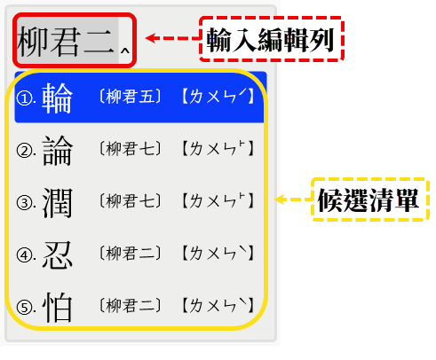
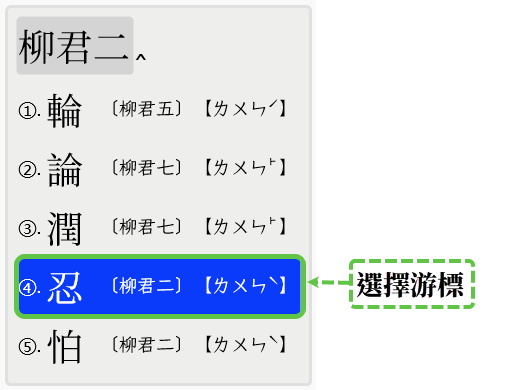
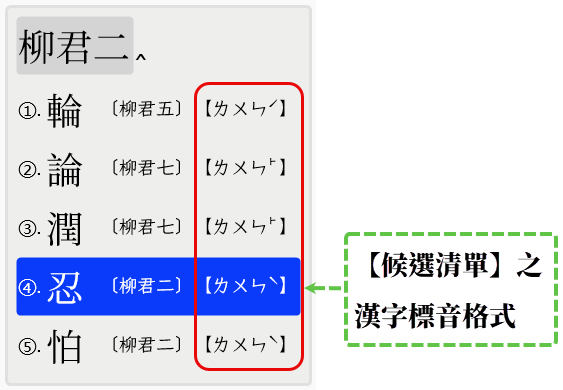

# 反切輸入法【台語音標】設計規格

`版本：V0.1.2`

1. 十五音輸入方案，依：【聲】、【韻】、【調】之順序進行輸入處理；

2. 十五音輸入【聲】與【韻】，不用漢字，改採【羅馬拼音字母】輸入。本輸入方案之【輸入處理】，
會將輸入之【聲】、【韻】的【拼音字母】，轉換成相對映之【漢字】並於【輸入編輯列】顯示。

3. 十五音輸入【調】之輸入，使用【調號】。【調號】與閩南語之【四聲八調】對映關係如下表所示：

**`調號輸入按鍵`**

|序次|按鍵|調號|調名|
|:-:|:--:|:--:|:--:|
|1	|;	 |一  |上平 / 陰平|
|2	|\	 |二  |上上 / 陰上|
|3	|_	 |三  |上去 / 陰去|
|4	|[	 |四  |上入 / 陰入|
|5	|/	 |五  |下平 / 陽平|
|6	|(無)|六  |下上 / 陽上|
|7	|-	 |七  |下去 / 陽去|
|8	|]	 |八  |下入 / 陽入|

如：上平（或稱：陰平）調，其【調號】值為：一，對映【按鍵】為：【；】。

---
以下用實例，說明本【輸入方案】之【輸入處理】，如何處理漢字【忍】之輸入。

如：漢字：【忍】，【台語音標】之羅馬拼音字母為：lun2 = l + un + 2 = 聲 + 韻 + 調。

綜合上述，對映於【十五音】漢字標音為：【柳君二】
- 聲： l  ==> 【柳】
- 韻： un ==> 【君】
- 調： 2 ==> 【二】

輸入方案之【輸入處理】：

1. 【聲】之輸入：自鍵盤接收到按鍵：【l】後，於【輸入編輯列】顯示相對映之【十五音聲母】：【柳】；
2. 【韻】之輸入：自鍵盤接收到按鍵：【u】、【n】後，於【輸入編輯列】顯示相對映之【十五音韻母】：【君】；
3. 【調】之輸入：自鍵盤接收到按鍵：【\】後，於【輸入編輯列】顯示相對映之【二】。

---

## 【輸入編輯列】顯示格式

本【輸入方案】對使用者自鍵盤之按鍵輸入處理作法說明如下。

輸入漢字【忍】：其【台語音標】為：lun2，對映【十五音】為：柳君二。

1. 輸入【聲】：鍵盤按：【l】鍵；
2. 輸入【韻】：鍵盤按：【u】+【n】鍵；
3. 輸入【調】：鍵盤按：【\】鍵。

## 【候選清單】顯示格式

使用者在【鍵盤】的按鍵，除了在【輸入編輯列】會顯示其輸入外；
同時，輸入方案亦會根據使用者已輸入之按鍵，如：【柳君二】，
條列所有已符合之：【聲】、【韻】、【調】，顯示於【候選字視窗】中：

1. 忍〔lun2〕 【 ㄌㄨㄣˋ 】
2. 碖〔lun2〕 【 ㄌㄨㄣˋ 】
3. 懍〔lun2〕 【 ㄌㄨㄣˋ 】
4. 圇〔lun2〕 【 ㄌㄨㄣˋ 】

---

## 【選擇游標】移動

---
## 連續輸入處理

如【辭彙】：「呑忍」之輸入操作...

|漢字|台語音標|十五音標音|方音符號|
|:--:|:----:|:-------:|:----:|
|呑	|thun1	|他君一	|ㄊㄨㄣ |
|忍	|lun2	|柳君二	|ㄌㄨㄣˋ|

使用者欲完成「呑忍」之輸入，可用漢字逐一輸入方式完成；亦可使用【連續輸入】方式完成。

在中州韻(RIME)輸入法平台，其【連續輸入】操作步驟如下：

1. 輸入【辭彙】之第一字：在鍵盤按：【t】【h】【u】【n】【;】鍵；

    - 【輸入編輯列】顯示： `【他君一】`；
    - 【候選字視窗】顯示： `呑〔thun1〕 【 ㄊㄨㄣˉ 】`。

2. 輸入【辭彙】第二字：不要按【空白】鍵，接繼在鍵盤按：【l】【u】【n】【\】建。

    - 【輸入編輯列】顯示： `【他君一 柳君二】`；
    - 【候選字視窗】顯示： `呑忍 〔thun1 lun2〕 【 ㄊㄨㄣˉ lun2 】`

---

## 輸入方案設計規格

以下規範本輸入方案之設計規格（ **`【huan_ciat_tlpa.schema.yaml】`** ）：

### 【輸入編輯列】之漢字標音格式

【輸入輯輯列】已有的按鍵輸入，可依此處之設定，進行【輸出】：

- switches/name: key_in_piau_im
- 輸出格式：
    - 台語音標（lun2）
    - 十五音（君二柳）
    - 方音符號（ㄌㄨㄣˋ）
    - 台羅拼音（lún）
    - 白話字（lún）
    - 閩拼方案（lǔn）
    - 台語注音二式（lun2）
    - 國際音標（lun2）

### 【候選清單】之漢字標音格式

【候選清單】中顯示之【漢字標音】，可依此處之設定，變更其【顯示格式】。

- switches/name: hau_suan_piau_im
- 輸出格式：
    - 十五音
    - 方音符號
    - 台語音標

