# 反切輸入法【台語音標】設計規格

`版本：V0.1.6.5`

---

## 摘要

### 特性說明

- 【輸入類型】：反切輸入法（採用：《彙集雅俗通十五音》）
- 【字典標準】：採漢字拼音法之【台羅拼音】，但在【輸入方案】之始，會轉換成【台語音標】
- 【按鍵編碼】：以【台語音標】對映【十五音】之【聲】、【韻】、【調】
- 【候選清單】：採【雙欄】顯示
  1. 左欄為【十五音】
  2. 右欄為【台語音標】（字典採用之【漢字標音法】）
- 【輸出類型】：
  1. 可輸出漢字
  2. 亦可輸出多種之【漢字標音】
        漢字：【老】...
        - 台語音標：lo2
        - 注音二式：lor2
        - 台羅拼音：ló
        - 白話字：ló
        - 閩拼方案：lǒ
        - 十五音：高二柳
        - 方音符號：ㄌㄜˋ
        - 國際音標：lɔ²

>#### 【漢字標音法及英文簡稱】
>
>|英文簡稱|漢字標音法  |反切/注音/拼音|
>|--------|------------|--------------|
>|sni     |十五音      |高二柳        |
>|--------|------------|--------------|
>|tps     |方音符號    |ㄌㄜˋ        |
>|--------|------------|--------------|
>|tlpa    |台語音標    |lo2           |
>|tl      |台羅拼音    |ló            |
>|bpm2    |台語注音二式|lor2          |
>|poj     |白話字      |ló            |
>|bp      |閩拼方案    |lǒ            |
>|--------|------------|--------------|
>|ipa     |國際音標    |lɔ²           |


## 操作情境

以漢字【忍】為例，說明本輸入方案，如何將【台語音標】：lun2，轉換成【十五音】：【君二柳】，並於【輸入編輯列】及【候選清單】顯示，最後將【漢字】或【漢字標音】輸出。

- 韻母（韻）：un --> 君
- 聲調（調）：2 --> 二
- 聲母（聲）：l --> 柳


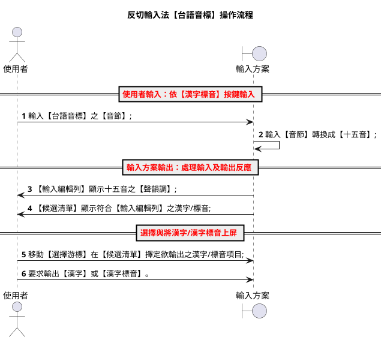

### 1. 輸入【台語音標】之【音節】

使用者自鍵盤，依【音節】之結構，依序輸入：【聲】+【韻】+【調】。

- 【聲】與【韻】為【羅馬拼音字母按鍵】；
- 【調】為【符號按鍵】。

以漢字【忍】為例，在「**反切輸入法【台語音標】**」，應輸入【台語音標】：`lun2` 。

- 聲母（聲）：【l】
- 韻母（韻）：【u】、【n】
- 聲調（調）：【\】

==《羅馬拼音之調號按鍵》==

|調號|符號按鍵|調名|
|:--:|:--:|:--:|
| 1 |;	 |上平 / 陰平|
| 2 |\	 |上上 / 陰上|
| 3 |_	 |上去 / 陰去|
| 4 |[	 |上入 / 陰入|
| 5 |/	 |下平 / 陽平|
| 6 |(無)|下上 / 陽上|
| 7 |-	 |下去 / 陽去|
| 8 |]	 |下入 / 陽入|

如：上平（或稱：陰平）調，其【調號】值為：一，對映【按鍵】為：【；】。

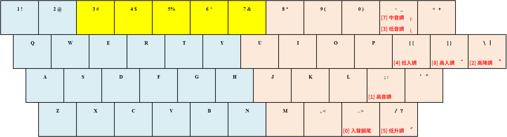


在「**反切輸入法【方音符號】**」，則應輸入【方音符號】：`ㄌㄨㄣˋ` 。

- 聲母（聲）：【ㄌ】
- 韻母（韻）：【ㄨ】、【ㄣ】
- 聲調（調）：【4】

==《注音符號之調號按鍵》==

|調號|符號按鍵|調名|
|:--:|:--:|:--:|
| 1 |:	 |上平 / 陰平|
| 2 |4	 |上上 / 陰上|
| 3 |3	 |上去 / 陰去|
| 4 |[	 |上入 / 陰入|
| 5 |6	 |下平 / 陽平|
| 6 |(無)|下上 / 陽上|
| 7 |5	 |下去 / 陽去|
| 8 |]	 |下入 / 陽入|

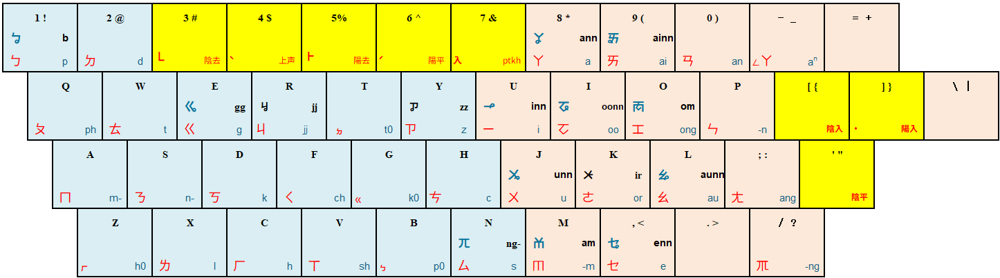

### 2. 輸入【音節】轉換成【十五音】

【輸入方案】之 YAML Script (preedit_fromat)，負責將鍵盤接收之【按鍵】輸入，循轉換作業，將【台語音標】之【聲母】、【韻母】、【調號】，轉換成【十五音】之【聲母】、【韻母】、【調號】。

#### 台語音標轉換成十五音

- 聲母（聲）：l     ==> 柳
- 韻母（韻）：un    ==> 君
- 聲調（調）：\     ==> 二

   |按鍵|台語音標|十五音|
   |:---|--------|:----:|
   | l  | l      | 柳 |
   | un | un     | 君 |
   | \  | 2      | 二 |

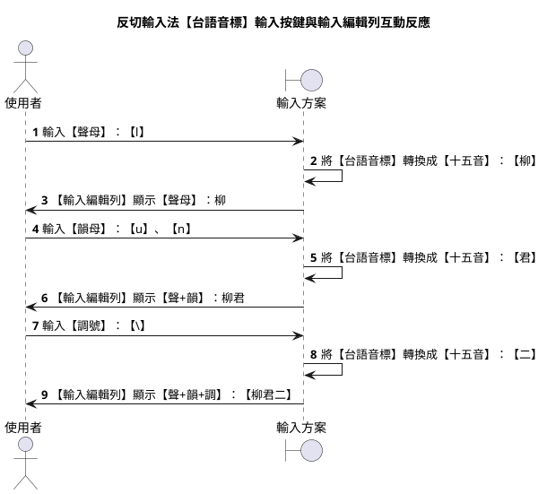

#### 方音符號轉換成十五音

- 聲母（聲）：ㄌ     ==> 柳
- 韻母（韻）：ㄨㄣ   ==> 君
- 聲調（調）：ˋ     ==> 二

   |按鍵|台語音標|十五音|
   |:---|--------|:----:|
   | x  |ㄌ      |  柳  |
   | jp |ㄨㄣ    |  君  |
   | 4  |ˋ      |  二  |

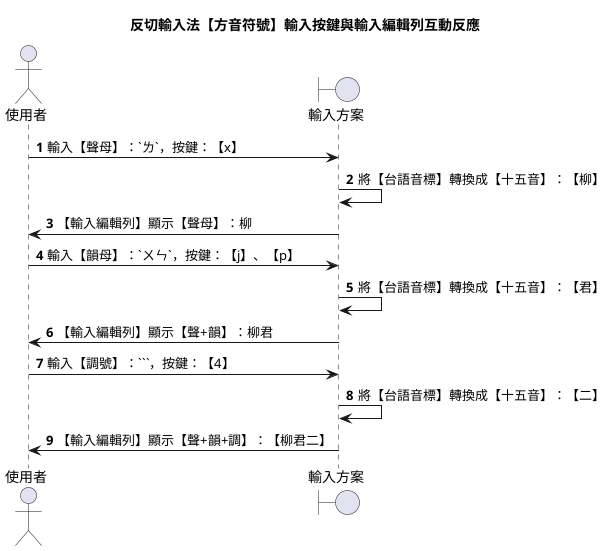


### 3. 【輸入編輯列】顯示十五音之聲韻調

按鍵經轉換處理後，以【十五音】之【聲母】、【韻母】、【調號】，於【輸入編輯列】顯示。

以下詳述：【輸入方案】自鍵盤取得之【按鍵】，經過 preedit_format 的 yaml script 處理後，
如何轉譯成【聲+韻+調】之【十五音】音節，並將之顯示於【輸入編輯列】。

1. 自【鍵盤】，輸入【台語音標】之【聲母】，按鍵：【l】。
2. 【輸入方案】的 preedit_format ，負責將：`l`，轉換成`柳`。
3. 【輸入編輯列】顯示：

    ```plantuml
    @startsalt
    {
        | "柳↑       "
    }
    @endsalt
    ```

1. 自【鍵盤】，輸入【台語音標】之【韻母】，按鍵：【u】、【n】。
2. 【輸入方案】的 preedit_format ，負責將：`u`、`n`，轉換成`君`。
3. 【輸入編輯列】顯示：

    ```plantuml
    @startsalt
    {
        | "柳君↑     "
    }
    @endsalt
    ```

1. 自【鍵盤】，輸入【台語音標】之【聲調】，按鍵：【\】。
2. 【輸入方案】的 preedit_format ，負責將：`\`，轉換成`二`。
3. 【輸入編輯列】顯示：

    ```plantuml
    @startsalt
    {
        | "柳君二↑   "
    }
    @endsalt
    ```

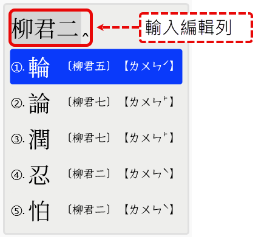

>【註】：傳統【十五音】標音，其【音節】結構格式為：**【韻母】+【調號】+【聲母】**。【輸入方案】不在【輸入編輯列】進行處理；改在【候選清單】校調十五音之【音節】格式。**校調作業**則交由【輸入方案】的【插件】：**reformat_comment_filter** 處理。

>
>《**舉例**》：【漢字】：忍，其【台語音標】為：lun2 = `l` + `un` + `2` ...
>- 聲母（聲）：l
>- 韻母（韻）：un
>- 調號（調）：2
>
>但【十五音】的【音節】結構卻為：【韻母】+【調號】+【聲母】。
>
>- 韻母（韻）：君 (un)
>- 調號（調）：二 (2)
>- 聲母（聲）：柳 (l)
>
>當【**輸入方案**】使用【**台語音標**】，作為【字典】的`【漢字標音法】`時，導致【輸入編輯列】(preedit_fromat) 處理來自鍵盤的按鍵輸入，亦會受限於【字典】的先天限制：【音節】得依【聲、韻、調】的順序排列。故【忍】字的【台語音標】：`lun2`，轉換成【十五音】只能是`【柳君二】`。
>
>但，標準的【十五音】其【漢字標音法】的【音節】結構為：`【韻、調、聲】`。所以，【忍】字的【十五音】為`【君二柳】`。此【輸入方案】不在【輸入編輯列】調整輸入的`【聲、韻、調】`，而在【候選清單】顯示正確的`韻、調、聲`【十五音】。
>

### 4. 【候選清單】顯示符合【輸入編輯列】之漢字/標音

【輸入方案】中 `comment_format` 段之 YAML Script ，負責將**符合**【輸入編輯列】已取得之輸入，於【候選清單】顯示符合輸入之【漢字】、【十五音】、【台語音標】（`預設`）。

【候選清單】中所顯示之【漢字標音】共有兩種，分別為：
- 左欄：十五音，即：輸入方案使用的【漢字標音】；
- 右欄：台語音標，即：輸入方案【字典】所使用的【漢字標音】。

**反切輸入法【台語音標】之候選清單格式**

以下說`「反切輸入法【台語音標】」`輸入方案，其**候選清單**應顯示之內容及排列格式。

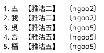

**反切輸入法【方音符號】之候選清單格式**

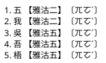

> 【註】：未來將新增功能，令使用者可於【輸入方案】之【選項】變更【預設】，改成【方音符號】。

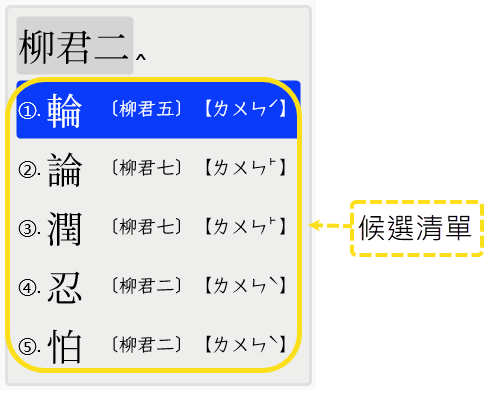

>**`【註】`**：
>1. 在【輸入編輯列】顯示之十五音，其【音節】格式為：**【聲】、【韻】、【調】**；然【候選清單】所顯示之十五音，則為傳統之十五音格式（**【韻】、【調】、【聲】**）。
>2. 【台語音標】或【台語注音二式】之【漢字標音法】，其【音節】結構均為：【聲母】+【韻母】+【調號】。

### 5. 移動【選擇游標】決定輸出之漢字/標音

移動【**選擇游標**】，選擇欲輸出之【項目】。

- 每個【候選清單】最多可顯示 5 條項目；
- 每條項目之結構為：【漢字】、【十五音】漢字標音、【台語音標/方音符號】漢字標音。
    - 反切輸入法【台語音標】的項目結構為：【漢字】、【十五音】、【台語音標】；
    - 反切輸入法【方音符號】的項目結構為：【漢字】、【十五音】、【方音符號】。


【候選清單】中顯示之項目，可借由【pgup】、【pgdn】、【↑】、【↓】鍵之操作來進行選取。本輸入方案仿 `vim` 編輯器之 **hjkl** 按鍵，亦可用於操作【選擇游標】之移動。

- 翻到上一頁： [ctrl] + [h]
- 翻到下一頁： [ctrl] + [l]
- 移到上一個： [ctrl] + [j]
- 移到下一個： [ctrl] + [k]

- 移到中央處： [ctrl] + [m]
- 移到頂端處： [ctrl] + [<]
- 移到底端處： [ctrl] + [>]


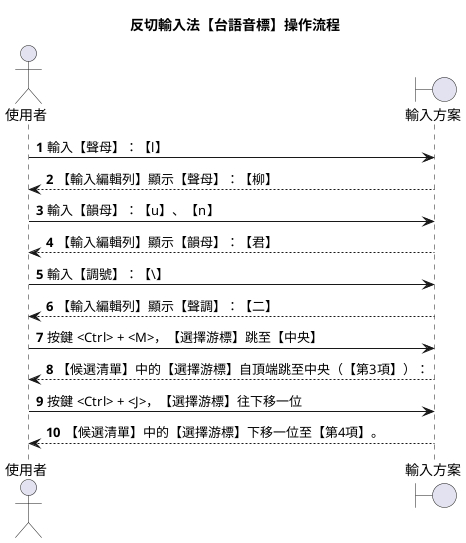

### 6. 輸出使用者之輸入結果

【輸入方案】預設之【輸出】為：【漢字】，使用【按鍵】為：【空白】鍵；若是需要輸出：**【漢字標音】**（如：十五音、方音符號、台語音標...等），則可使用：【**enter**】按鍵。

- [Space] 按鍵：輸出漢字
- [Enter] 按鍵：輸出漢字標音


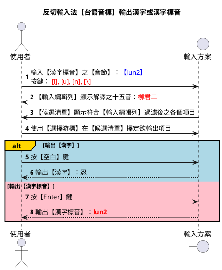


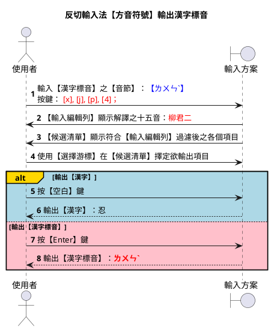

#### 各式輸出按鍵

除上述之【空白】、【Enter】鍵外，【輸入方案】可用的全部輸出按鍵，詳述如下：

- `space` → 漢字
- `enter (commit_composition)` → 【漢字標音輸出】選項，設定之【漢字標音】
- `ctrl+enter (commit_raw_input)` → 【輸入編輯列】接收之【按鍵】輸入
- `shift+enter (commit_script_text)` → 【輸入編輯列】顯示經處理後之【漢字標音法】==》【十五音】
- `shift+ctrl+enter (commit_comment)` → 【候選清單】選擇項目顯示之【漢字標音】

##### 反切輸入法【台語音標】

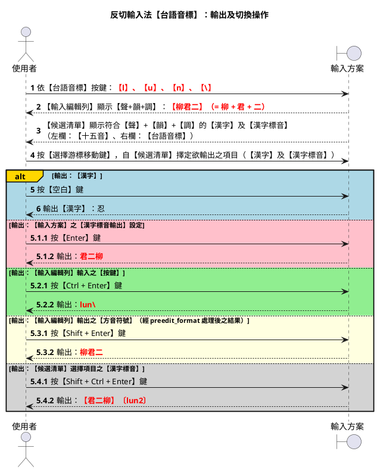

##### 反切輸入法【方音符號】

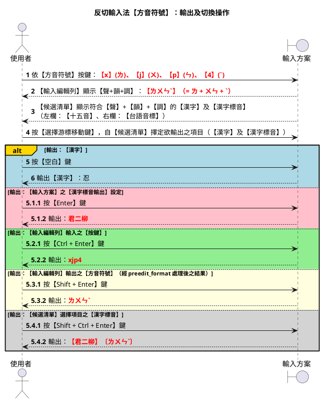

**操作情境說明**：

1. 操作步驟【1-4】，描述：輸入漢字：【忍】之【台語音標】：`lun2`。【輸入方案】如何處理：【按鍵】、【輸入編輯列】、【候選清單】，三者所發生之連動關係。

    - 【鍵盤】按鍵：【l】【u】【n】【\】
    - 【輸入編輯列】顯示經 preedit_format 處理之結果： `【柳君二】`
    - 【候選清單】挑選【項目】： `忍  【君二柳】〔lun2〕`


2. 操作步驟【5-6】，描述：使用【`空白`】鍵，可輸出漢字：【忍】；

3. 操作步驟【5.1.1 - 5.1.2】，描述：使用【`enter`】鍵，可輸出`【漢字標音輸出】`選項指定之【漢字標音】：`十五音`，需要輸出某特定【漢字】之【漢字標音】時，適用此種操作；
    - 按【enter】鍵，輸出：`君二柳`；
    - 在「`反切輸入法【方音符號】`」輸入方案，亦輸出：`君二柳`

4. 操作步驟【5.2.1 - 5.2.2】，描述：使用【`ctrl + enter`】鍵，可輸出`【輸入編輯列】`由那些【按鍵】所構成。因【輸入編輯列】所見結果，為 preedit_format 處理後之産出，其工作為：將接收之【按鍵】，依 preedit_comment 解譯成輸入方案使用之【漢字標音】；
    - 按【Ctrl + Enter】鍵，輸出：`lun\`；
    - 在「`反切輸入法【方音符號】`」輸入方案，輸出則為：`xjp4`

5. 操作步驟【5.3.1 - 5.3.2】，描述：使用【`shift + enter`】鍵，可輸出`【輸入編輯列】`所見之【漢字標音】：
    - 按【Shift + Enter】鍵，輸出：`柳君二`；
    - 在「`反切輸入法【方音符號】`」輸入方案，輸出則為：`ㄌㄨㄣˋ`

6. 操作步驟【5.4.1 - 5.4.2】，描述：如何輸出`【候選清單】顯示之【漢字標音】：`
輸出【漢字標音】選項`之變更，按【enter】鍵，可得輸出為【方音符號】：`ㄌㄨㄣˋ`。
    - 按【Shift + Ctrl + Enter】鍵，輸出：`【君二柳】〔lun2〕`。
    - 在「`反切輸入法【方音符號】`」輸入方案，輸出則為：`【君二柳】〔ㄌㄨㄣˋ〕`


#### 切換【漢字標音輸出】設定

【輸入方案】遇按下【**Enter**】鍵，便依【候選清單】中【選擇游標】擇定之【項目】，輸出【漢字標音輸出】選項，設定之【漢字標音】。

輸入方案可供輸出之【漢字標音】種類，列舉如下...

**漢字【老】**:

- 台語音標：lo2
- 注音二式：lor2
- 台羅拼音：ló
- 白話字：ló
- 閩拼方案：lǒ
- 十五音：高二柳
- 方音符號：ㄌㄜˋ
- 國際音標：lɔ²

以下詳述：

1. 如何使用【Enter】鍵輸出預設之【漢字標音】；
2. 如何變更【漢字標音輸出】選項。

##### 操作情境

```plantuml
@startuml
title 輸出【漢字】及切換【漢字標音】輸出
actor 使用者 as user
boundary 輸入方案 as ime
autonumber

user -> ime: 輸入【台語音標】：<font color=red>lun2</font>
user -> ime : 移動【選擇游標】選擇【項目】：<font color=blue><b>忍 〔居二柳〕【ㄌㄨㄣˋ】</b></font>
user -> ime : 按<font color=red>【空白】</font>鍵
ime --> user : 輸出【漢字】：<font color=red><b>忍</b></font>

autonumber resume "<font color=red><b>0"
partition#Gold 以【漢字標音輸出】之【預設】輸出【漢字標音】
user -> ime: 輸入【台語音標】：<font color=blue>lun2</font>
user -> ime : 移動【選擇游標】選擇【項目】：<font color=blue><b>忍 〔居二柳〕【ㄌㄨㄣˋ】</b></font>
user -> ime : 按<font color=blue>【Enter】</font>鍵
ime --> user : 輸出【漢字標音】：<font color=blue>君二柳</font>（【漢字標音輸出】選項的【預設】）
end

autonumber resume "<font color=red><b>0"
partition#Gold #Lightblue 切換【漢字標音輸出】設定為【台羅拼音】
user -> ime : <font color=red><b>按 [Ctrl] + [`] 鍵，進入【輸入方案】之選項切換功能</b></font>
user -> ime : 將【漢字標音輸出】選項切換成<font color=red><b>【台羅拼音】</b></font>

user -> ime: 輸入【台語音標】：<font color=red>lun2</font>
user -> ime : 移動【選擇游標】選擇【項目】：<font color=blue><b>忍 〔居二柳〕【ㄌㄨㄣˋ】</b></font>
user -> ime : 按<font color=red>【Enter】</font>鍵
ime --> user : 輸出【漢字標音】：<font color=red>lún</font>
end

autonumber 9.1
partition#Gold #LightGrey 切換【漢字標音輸出】設定為【閩拼方案】
user -> ime : <font color=red><b>按 [Ctrl] + [`] 鍵，進入【輸入方案】之選項切換功能</b></font>
user -> ime : 將【漢字標音輸出】選項切換成<font color=red><b>【閩拼方案】</b></font>

user -> ime: 輸入【台語音標】：<font color=red>lun2</font>
user -> ime : 移動【選擇游標】選擇【項目】：<font color=blue><b>忍 〔居二柳〕【ㄌㄨㄣˋ】</b></font>
user -> ime : 按<font color=red>【Enter】</font>鍵
ime --> user : 輸出【漢字標音】：<font color=red>lûn</font>
end

@enduml
```

#### 多音節連續輸入處理

漢字為：一字一音，本輸入方案提供【連續輸入】操作方式，供使用者連續輸入多個【音節】，一次完成多個【漢字】輸入。

如【辭彙】：「呑忍」之輸入操作...

|漢字|台語音標|十五音標音|方音符號|
|:--:|:----:|:-------:|:----:|
|呑	|thun1	|他君一	|ㄊㄨㄣ |
|忍	|lun2	|柳君二	|ㄌㄨㄣˋ|

使用者欲完成「呑忍」之輸入，可用漢字逐一輸入方式完成；亦可使用【連續輸入】方式完成。

在中州韻(rime)輸入法平台，其【連續輸入】操作步驟如下：

1. 輸入【辭彙】之第一字：在鍵盤按：【t】【h】【u】【n】【;】鍵；

    - 【輸入編輯列】顯示： `【他君一】`；
    - 【候選視窗】顯示： `呑 〔thun1〕【 ㄊㄨㄣˉ 】`。

2. 輸入【辭彙】第二字：不要按【空白】鍵，接繼在鍵盤按：【l】【u】【n】【\】建。

    - 【輸入編輯列】顯示： `【他君一 柳君二】`；
    - 【候選視窗】顯示： `呑忍 〔thun1 lun2〕【 ㄊㄨㄣˉ lun2 】`


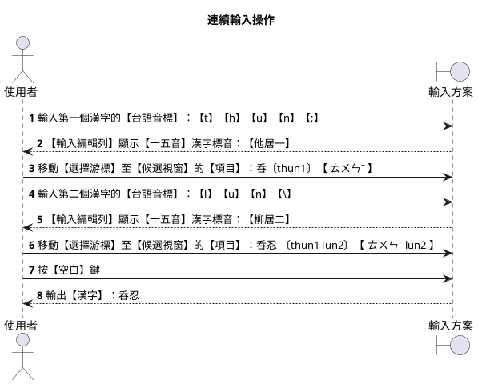

---

## 輸入方案設計規範

以下說明本輸入方案：如何於**中州韻(rime)輸入法平台**，實作【輸入方案】之規範。

- 識別代碼：**`huan_ciat_tlpa`**
- 檔案名稱：**`huan_ciat_tlpa.schema.yaml`**

### 主要操作情境

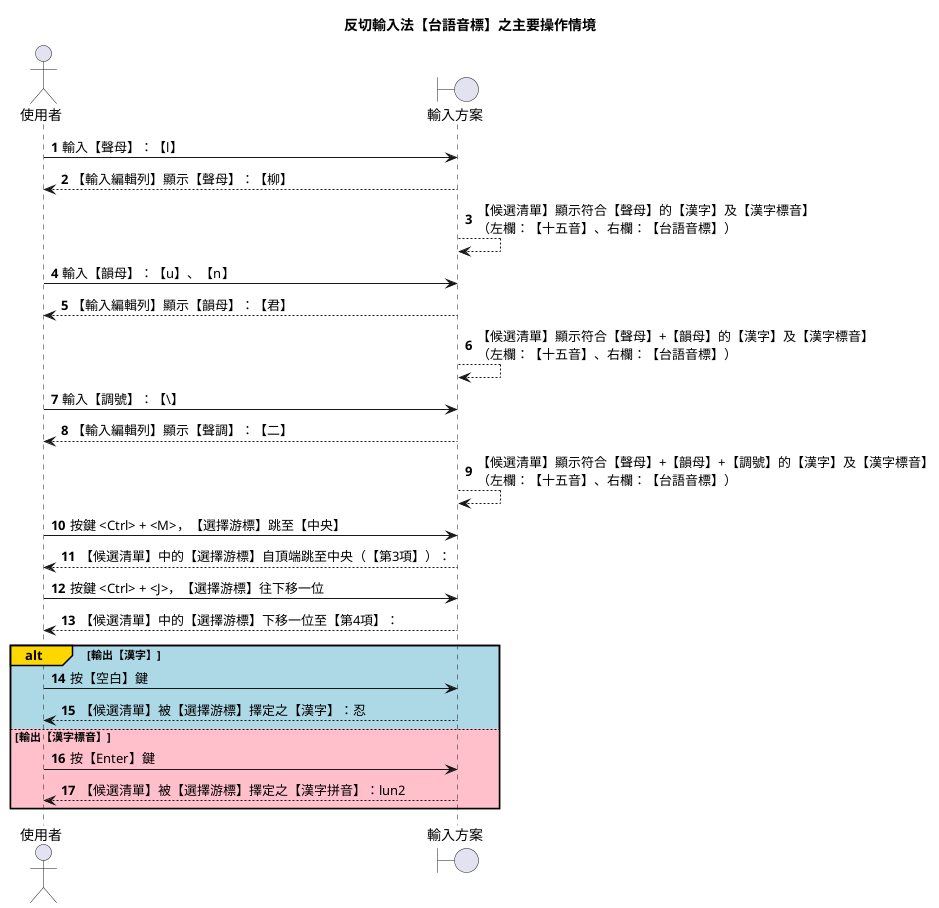

### 字典輸入與輸入方案編碼

`字典檔（.dict.yaml）`採用【漢字拼音法】之【台羅拼音】。

由於輸入方案，底層核心仍為：【台語音標】（tlpa+），故自【字典檔】讀入之【聲】、【韻】、【調】等【音節】資料，需進行【編碼轉換】，其作業需特別處理以下所列要項：

`台羅拼音轉台語音標作業要點`

1. 聲母轉換

    **tlpa+** 為 tlpa 之**改良版**，兩者之間的差異在於：tlpa+ 的【羅馬拼音字母】均為單一字元；且其羅馬拼音字母之使用與【漢語拼音】有著更高之相容度：

    |台羅拼音| tlpa | tlpa+ |
    |:------|:---- |:----- |
    |  tsh  | ch   | c     |
    |   ts  | c    | z     |

2. 韻母轉換

    |台羅拼音|台語音標|
    |:------|:---- |
    |  onn  | oonn |

【註】：<ctrl+v> u 207f ==> ⁿ

---

### 候選清單

#### 修正左欄：【十五音】音節結構

【候選清單】在【左欄】顯示之【十五音】，由【輸入方案】之 YAML Script（comment_fromat）負責産出。産出來源取自【字典】，而【字典】採用之【漢字標音法】為：【台羅拼音】。

因【台羅拼音】之【音節】結構為：【聲母】+【韻母】+【調號】。故【輸入方案（yaml）】産出之【十五音】，其【音節】格式亦為：【聲+韻+調】，為求符合傳統【十五音】之格式，需調整變更成：【韻+調+聲】。

【**例**】：忍【lun2】
--> [ l + un + 2 ]
--> 【 柳+君+二 】
--> 【 柳君二 】
--> 【 居二柳 】

#### 使用插件：lua_filter@reformat_comment_filter

```yaml
engine:
  processors:
    ...
  segmentors:
    ...
  translators:
    ...
  filters:
    - lua_filter@reformat_comment_filter
```

---

### 變更【漢字標音輸出】選項

自【侯選清單】指定欲輸出之項目後，可使用 [Enter] 按鍵，將【漢字標音】輸出。
各【輸入方案】有各自的【預設】。

- 反切輸入法【台語音標】：十五音
- 反切輸入法【方音符號】：十五音
- 注音輸入法【方音符號】：方音符號
- 注音輸入法【台語注音二式】：方音符號
- 注音輸入法【台語注音符號】：台語注音符號（即：台語音標使用的【注音符號】）
- 拼音輸入法【台羅拼音】：台羅拼音
- 拼音輸入法【閩拼方案】：台羅拼音
- 拼音輸入法【白話字】：白話字


#### 指定使用之 Lua 插件

在【輸入方案】中之【switches】段落，完成如下之設定，以便啟用 Lua Script 插件。

==輸入方案插件：lua_processor@aux_commit==

```yaml
engine:
  processors:
    ...
  segmentors:
    ...
  translators:
    ...
  filters:
    - lua_processor@aux_commit
```

#### 設置輸入方案使用之選項

為求能令使用者自行依需求進行變更，在【輸入方案】中之【engine】段落，需有`【輸出漢字標音選項】`供使用者變更設定：以便按下【Enter】鍵，能輸出需要使用之【漢字標音】。

```yaml
switches:
  # 【漢字標音】輸出選項
  # reset: 0 → 預設 → 十五音
  - options:
      [ key_in_piau_im_sni, key_in_piau_im_tps, key_in_piau_im_tlpa,
        key_in_piau_im_tl, key_in_piau_im_poj, key_in_piau_im_bp,
        key_in_piau_im_bpm2, key_in_piau_im_ipa ]
    reset: 2
    states: [ 十五音, 方音符號, 台語音標, 台羅拼音, 白話字, 閩拼方案, 台語注音二式, 國際音標 ]
```

#### 輸入方案【editor】設定

```yaml
editor:
  bindings:
    Return: commit_composition              # 【漢字標音輸出】選項設定
    Control+Return: commit_raw_input        # 【鍵盤按鍵】（未經 preedit_format 轉換的原始輸入）：xjp4
    Shift+Return: commit_script_text        # 【輸入編輯列】（經 preedit_format 轉換後的結構）：ㄌㄨㄣˋ
    Control+Shift+Return: commit_comment    # 【候選字清單】選擇項目：【君二柳】〔ㄌㄨㄣˋ〕
```

---

## 輸入方案/字典編碼/候選清單右欄對照


本專案開發之【輸入方案】，其【字典編碼】、【輸入編輯列】與【候選清單】之左/右欄，有著連動之關係。各【輸入方案】在【字典編碼】、【輸入編輯列】與【候選清單】之左/右欄，其使用之【漢字標音】對照關係，詳述如下：

|類別|輸入方案名稱           |漢字標音法|字典編碼|鍵盤按鍵|輸入編輯列|候選清單左欄|候選清單右欄|
|----|-----------------------|----------|--------|--------|----------|------------|------------|
|反切|反切輸入法【台語音標】 |十五音    |台羅拼音|lo\     |柳二高    |高二柳　　　|lo2         |
|反切|反切輸入法【方音符號】 |十五音    |台羅拼音|ㄌㄜˋ  |柳二高    |高二柳      |ㄌㄨㄣˋ    |
|注音|注音輸入法【方音符號】 |方音符號  |台羅拼音|ㄌㄜˋ  |ㄌㄜˋ    |ㄌㄜˋ      |lo2         |
|注音|注音輸入法【注音二式】 |方音符號  |注音二式|ㄌㄜˋ  |ㄌㄜˋ    |ㄌㄜˋ      |lor2        |
|拼音|拼音輸入法【台語音標】 |台語音標  |台羅拼音|lo\     |lo2       |lo2         |lo2         |
|拼音|拼音輸入法【台羅拼音】 |台羅拼音  |台羅拼音|lo\     |ló        |ló          |lo2         |
|拼音|拼音輸入法【白話字】   |台羅拼音  |台羅拼音|lo\     |ló        |ló          |lo2         |
|拼音|拼音輸入法【閩拼方案】 |台羅拼音  |台羅拼音|lo\     |lǒ        |lǒ          |lo2         |
|拼音|拼音輸入法【注音二式】 |注音二式  |注音二式|lor\    |lor2      |lor2        |lor2        |

>漢字：【老】...
>
>- 台語音標：lo2
>- 注音二式：lor2
>- 台羅拼音：ló
>- 白話字：ló
>- 閩拼方案：lǒ
>- 十五音：高二柳
>- 方音符號：ㄌㄜˋ

### 雙欄式【候選清單】格式摘要

#### 拼音類輸入法（phing_im_*.schema.yaml）

兩欄式【候選清單】格式：
【輸入方案使用之拼音類漢字標音】〔字典編碼使用之漢字標音〕

#### 注音類輸入法（zu_im_*.schema.yaml）

兩欄式【候選清單】格式：
【輸入方案使用之注音類漢字標音】〔字典編碼使用之漢字標音〕

#### 反切類輸入法（huan_ciat_*.schema.yaml）

兩欄式【候選清單】格式：
【傳統十五音】〔字典編碼使用之漢字標音（台語音標）/方音符號〕

- huan_ciat_tlpa ==> 【十五音】〔台語音標〕
- huan_ciat_tps ==> 【十五音】〔方音符號〕

---

## 漢字標音轉換對照

### 聲母對照

| 識別號 | 國際音標 | 台羅拼音 | 台語音標 | 注音二式 | 閩拼方案 | 白話字  | 方音符號 | 十五音 | 漢字例 | 備註               |
|-----|------|------|------|------|------|------|------|-----|-----|------------------|
| 1   | l    | l    | l    | l    | l    | l    | ㄌ    | 柳   | 理   |                  |
| 2   | p    | p    | p    | b    | b    | p    | ㄅ    | 邊   | 比   |                  |
| 3   | k    | k    | k    | g    | g    | k    | ㄍ    | 求   | 己   |                  |
| 4   | kʰ   | kh   | kh   | k    | k    | kh   | ㄎ    | 去   | 起   |                  |
| 5   | t    | t    | t    | d    | d    | t    | ㄉ    | 地   | 底   |                  |
| 6   | pʰ   | ph   | ph   | p    | p    | ph   | ㄆ    | 頗   | 鄙   |                  |
| 7   | tʰ   | th   | th   | t    | t    | th   | ㄊ    | 他   | 恥   |                  |
| 8   | ʦ    | ts   | z    | z    | z    | ch   | ㄗ    | 曾   | 阻   |                  |
| 9   | ʣ    | j    | j    | zz   | zz   | j    | ㆡ    | 入   | 熱   |                  |
| 10  | s    | s    | s    | s    | s    | s    | ㄙ    | 時   | 詞   |                  |
| 11  | ʔ    | Ø    | Ø    | Ø    | Ø    | Ø    | Ø    | 英   | 以   |                  |
| 12  | b    | b    | b    | bb   | bb   | b    | ㆠ    | 門   | 美   |                  |
| 13  | ɡ    | g    | g    | gg   | gg   | g    | ㆣ    | 語   | 禦   |                  |
| 14  | ʦʰ   | tsh  | c    | c    | c    | chh  | ㄘ    | 出   | 取   |                  |
| 15  | h    | h    | h    | h    | h    | h    | ㄏ    | 喜   | 喜   |                  |
| 16  | m    | m    | m    | m    | bbn  | m    | ㄇ    | 毛   | 毛   | b/m 本不分，此處分門/毛   |
| 17  | n    | n    | n    | n    | ln   | n    | ㄋ    | 耐   | 耐   | l/n 本不分，此處分柳/耐   |
| 18  | ŋ    | ng   | ng   | ng   | ggn  | ng   | ㄫ    | 雅   | 雅   | g/ng 本不分，此處分語/雅  |
| 19  | ʥ    | ji   | ji   | jji  | zzi  | ji   | ㆢ    | 入   | 熱   | ㆢ = ㆡㄧ           |
| 20  | ʨ    | tsi  | zi   | ji   | zi   | chi  | ㄐ    | 曾   | 止   | ㄐ = ㄗㄧ           |
| 21  | ʨʰ   | tshi | ci   | chi  | ci   | chhi | ㄑ    | 出   | 測   | ㄑ = ㄘㄧ           |
| 22  | ɕ    | si   | si   | shi  | si   | si   | ㄒ    | 時   | 惜   | ㄒ = ㄙㄧ           |

### 韻母對照

| 序號 | 國際音標      | 台羅拼音   | 台語音標   | 台語注音二式 | 閩拼方案   | 白話字   | 方音符號 | 十五音 |
|----|-----------|--------|--------|--------|--------|-------|------|-----|
| 1  | a         | a      | a      | a      | a      | a     | ㄚ    | 膠舒  |
| 2  | ã         | ann    | ann    | ann    | na     | aⁿ    | ㆩ    | 監舒  |
| 3  | aʔ        | ah     | ah     | ah     | ah     | ah    | ㄚㆷ   | 膠促  |
| 4  | ãʔ        | annh   | ahnn   | annh   | nah    | ahⁿ   | ㆩㆷ   | 監促  |
| 5  | am        | am     | am     | am     | am     | am    | ㆰ    | 甘舒  |
| 6  | an        | an     | an     | an     | an     | an    | ㄢ    | 干舒  |
| 7  | aŋ        | ang    | ang    | ang    | ang    | ang   | ㄤ    | 江舒  |
| 8  | ap̚       | ap     | ap     | ap     | ap     | ap    | ㄚㆴ   | 甘促  |
| 9  | at̚       | at     | at     | at     | at     | at    | ㄚㆵ   | 干促  |
| 10 | ak̚       | ak     | ak     | ak     | ak     | ak    | ㄚㆻ   | 江促  |
| 11 | aɪ        | ai     | ai     | ai     | ai     | ai    | ㄞ    | 皆舒  |
| 12 | ãɪ        | ainn   | ainn   | ainn   | nai    | aiⁿ   | ㆮ    | 閒舒  |
| 13 | aɪʔ       | aih    | aih    | aih    | aih    | aih   | ㄞㆷ   | 皆促  |
| 14 | au        | au     | au     | au     | ao     | au    | ㄠ    | 交舒  |
| 15 | auʔ       | auh    | auh    | auh    | aoh    | auh   | ㄠㆷ   | 交促  |
| 16 | e         | e      | ei     | e      | e      | e     | ㆤ    | 稽舒  |
| 17 | ẽ         | enn    | enn    | enn    | ne     | eⁿ    | ㆥ    | 更舒  |
| 18 | eʔ        | eh     | eh     | eh     | eh     | eh    | ㆤㆷ   | 伽促  |
| 19 | ẽʔ        | ennh   | ennh   | ennh   | ennh   | ehⁿ   | ㆥㆷ   | 更促  |
| 20 | i         | i      | i      | i      | i      | i     | ㄧ    | 居舒  |
| 21 | ĩ         | inn    | inn    | inn    | ni     | iⁿ    | ㆪ    | 梔舒  |
| 22 | iʔ        | ih     | ih     | ih     | ih     | ih    | ㄧㆷ   | 居促  |
| 23 | im        | im     | im     | im     | im     | im    | ㄧㆬ   | 金舒  |
| 24 | in        | in     | in     | in     | in     | in    | ㄧㄣ   | 巾舒  |
| 25 | iŋ        | ing    | ing    | ing    | ing    | eng   | ㄧㄥ   | 經舒  |
| 26 | ip̚       | ip     | ip     | ip     | ip     | ip    | 一ㆴ   | 金促  |
| 27 | it̚       | it     | it     | it     | it     | it    | ㄧㆵ   | 巾促  |
| 28 | ik̚/ɪək̚  | ik     | ik     | ik     | ik     | ek    | ㄧㆻ   | 經促  |
| 29 | ɪa        | ia     | ia     | ia     | ia     | ia    | ㄧㄚ   | 迦舒  |
| 30 | iã        | iann   | iann   | iann   | nia    | iaⁿ   | ㄧㆩ   | 驚舒  |
| 31 | ɪaʔ       | iah    | iah    | iah    | iah    | iah   | ㄧㄚㆷ  | 迦促  |
| 32 | iãʔ       | iannh  | iannh  | iannh  | iannh  | iahⁿ  | ㄧㆩㆷ  | 迦促  |
| 33 | ɪam       | iam    | iam    | iam    | iam    | iam   | ㄧㆰ   | 兼舒  |
| 34 | ɪan/en    | ian    | ian    | ian    | ian    | ian   | ㄧㄢ   | 堅舒  |
| 35 | ɪaŋ       | iang   | iang   | iang   | iang   | iang  | ㄧㄤ   | 姜舒  |
| 36 | ɪap̚      | iap    | iap    | iap    | iap    | iap   | ㄧㄚㆴ  | 兼促  |
| 37 | ɪat̚/ɪet̚ | iat    | iat    | iat    | iat    | iat   | ㄧㄚㆵ  | 堅促  |
| 38 | ɪak̚      | iak    | iak    | iak    | iak    | iak   | ㄧㄚㆻ  | 姜促  |
| 39 | ɪau       | iau    | iau    | iau    | iao    | iau   | ㄧㄠ   | 嬌舒  |
| 40 | ɪãu       | iaunn  | iaunn  | iaunn  | niao   | iauⁿ  | ㄧㆯ   | 嘄舒  |
| 41 | ɪauʔ      | iauh   | iauh   | iauh   | iaoh   | iauh  | ㄧㄠㆷ  | 嬌促  |
| 42 | ɪə/ɪo     | io     | io     | ior    | io     | io    | ㄧㄜ   | 茄舒  |
| 43 | ɪɔ̃       | ionn   | ionn   | ioonn  | nioo   | ioⁿ   | ㄧㆧ   | 薑舒  |
| 44 | ɪəʔ/ɪoʔ   | ioh    | ioh    | iorh   | ioh    | ioh   | ㄧㄜㆷ  | 茄促  |
| 45 | ɪɔŋ       | iong   | iong   | iong   | iong   | iong  | ㄧㆲ   | 恭舒  |
| 46 | ɪɔk̚      | iok    | iok    | iook   | iok    | iok   | ㄧㆦㆻ  | 恭促  |
| 47 | iu        | iu     | iu     | iu     | iu     | iu    | ㄧㄨ   | 丩舒  |
| 48 | iũ        | iunn   | iunn   | iunn   | niu    | iuⁿ   | ㄧㆫ   | 牛舒  |
| 49 | iũʔ       | iunnh  | iunnh  | iunnh  | niuh   | iuhⁿ  | ㄧㆫㆷ  | 牛促  |
| 50 | ə/o       | o      | o      | or     | o      | o     | ㄜ    | 高舒  |
| 51 | ɔ         | oo     | oo     | oo     | oo     | o͘    | ㆦ    | 沽舒  |
| 52 | ɔ̃        | onn    | onn    | oonn   | noo    | oⁿ    | ㆧ    | 姑舒  |
| 53 | əʔ/oʔ     | oh     | oh     | orh    | oh     | oh    | ㄜㆷ   | 高促  |
| 54 | ɔʔ        | ooh    | ooh    | ooh    | ooh    | o͘h   | ㆦㆷ   | 沽促  |
| 55 | ɔ̃ʔ       | onnh   | ohnn   | onnh   | niuh   | ohⁿ   | ㆧㆷ   | 扛促  |
| 56 | ɔm        | om     | om     | oom    | om     | om    | ㆱ    | 箴舒  |
| 57 | ɔŋ        | ong    | ong    | ong    | ong    | ong   | ㆲ    | 公舒  |
| 58 | ɔp̚       | op     | op     | oop    | op     | op    | ㆦㆴ   | 箴促  |
| 59 | ɔk̚       | ok     | ok     | ok     | ok     | ok    | ㆦㆻ   | 公促  |
| 60 | u         | u      | u      | u      | u      | u     | ㄨ    | 艍舒  |
| 61 | uʔ        | uh     | uh     | uh     | uh     | uh    | ㄨㆷ   | 艍促  |
| 62 | un        | un     | un     | un     | un     | un    | ㄨㄣ   | 君舒  |
| 63 | ut̚       | ut     | ut     | ut     | ut     | ut    | ㄨㆵ   | 君促  |
| 64 | ua        | ua     | ua     | ua     | ua     | oa    | ㄨㄚ   | 瓜舒  |
| 65 | uã        | uann   | uann   | uann   | nua    | oaⁿ   | ㄨㆩ   | 官舒  |
| 66 | uaʔ       | uah    | uah    | uah    | uah    | oah   | ㄨㄚㆷ  | 瓜促  |
| 67 | uan       | uan    | uan    | uan    | uan    | oan   | ㄨㄢ   | 觀舒  |
| 68 | uaŋ       | uang   | uang   | uang   | uang   | oang  | ㄨㄤ   | 光舒  |
| 69 | uat̚      | uat    | uat    | uat    | uat    | oat   | ㄨㄚㆵ  | 觀促  |
| 70 | uai       | uai    | uai    | uai    | uai    | oai   | ㄨㄞ   | 乖舒  |
| 71 | uãi       | uainn  | uainn  | uainn  | nuai   | oaiⁿ  | ㄨㆮ   | 閂舒  |
| 72 | uaiʔ      | uaih   | uaih   | uaih   | uaih   | oaih  | ㄨㄞㆷ  | 乖促  |
| 73 | uãiʔ      | uainnh | uaihnn | uainnh | uainnh | oaihⁿ | ㄨㆮㆷ  | 閂促  |
| 74 | ue        | ue     | ue     | ue     | ue     | oe    | ㄨㆤ   | 檜舒  |
| 75 | ueʔ       | ueh    | ueh    | ueh    | ueh    | oeh   | ㄨㆤㆷ  | 檜促  |
| 76 | ui        | ui     | ui     | ui     | ui     | ui    | ㄨㄧ   | 規舒  |
| 77 | uĩ        | uinn   | uinn   | uinn   | nui    | uiⁿ   | ㄨㆪ   | 褌舒  |
| 78 | uiʔ       | uih    | uih    | uih    | uih    | uih   | ㄨㄧㆷ  | 褌促  |
| 79 | m̩        | m      | m      | m      | m      | m     | ㆬ    | 姆舒  |
| 80 | m̩ʔ       | mh     | mh     | mh     | mh     | mh    | ㆬㆷ   | 姆促  |
| 81 | ŋ̍        | ng     | ng     | ng     | ng     | ng    | ㆭ    | 鋼舒  |
| 82 | ŋ̍ʔ       | ngh    | ngh    | ngh    | ngh    | ngh   | ㆭㆷ   | 鋼促  |

### 聲調對照

1. 【台語音標】使用【調號】，不同於【台羅拼音】、【白話字】使用【調符】（聲調符號）；
2. 【台語音標】與【台羅拼音】、【白話字】使用相同之【調名】與【調號】編號標準；
3. 【閩拼方案】為與【漢語拼音】相容，其使用之【調名】雖與【台語音標】同，但編號之排序法則相異。


#### 拼音輸入法

| 識別號 | W調名 | 四聲八調 | 調值  | 台羅調號 | 拼音調符編碼 | 羅馬拼音調符 | 漢字 | 台語音標  | 注音調符編碼 | 注音調符 | 方音符號 | 鍵盤按鍵 | 閩拼調號 |
|-----|-----|------|-----|------|--------|--------|----|-------|--------|------|------|------|------|
| 1   | 高音調 | 陰平   | 44  | 1    |        | a      | 東  | tong  |        | ㄚ    | ㄉㆲ   | ;    | 1    |
| 2   | 中音調 | 陽去   | 22  | 7    | U+0304 | ā     | 動  | tōng | U+02EB | ㄚ˫   | ㄉㆲ˫  | -    | 6    |
| 3   | 低音調 | 陰去   | 21  | 3    | U+0300 | à     | 棟  | tòng | U+02EA | ㄚ˪   | ㄉㆲ˪  | _    | 5    |
| 4   | 高降調 | 陰上   | 53  | 2    | U+0301 | á     | 董  | tóng | U+0300 | ㄚ̀   | ㄉㆲ̀  | \    | 3    |
| 5   | 低升調 | 陽平   | 13  | 5    | U+030C | ǎ     | 同  | tǒng | U+0301 | ㄚ́   | ㄉㆲ́  | /    | 2    |
| 6   | 低促調 | 陰入   | 32  | 4    |        | ah     | 督  | tok   |        | ㄚㆷ   | ㄉㆦㆻ  | [    | 7    |
| 7   | 高促調 | 陽入   | 121 | 8    | U+030D | a̍h    | 獨  | to̍k  | U+02D9 | ㄚㆷ˙  | ㄉㆦㆻ˙ | ]    | 8    |

#### 注音輸入法

| 識別號 | W調名 | 四聲八調 | 調值  | 台羅調號 | 注音調符編碼 | 注音調符 | 方音符號 | 漢字 | 鍵盤按鍵 |
|-----|-----|------|-----|------|--------|------|------|----|------|
| 1   | 高音調 | 陰平   | 44  | 1    |        | ㄚ    | ㄉㆲ   | 東  | :    |
| 2   | 中音調 | 陽去   | 22  | 7    | U+02EB | ㄚ˫   | ㄉㆲ˫  | 動  | 5    |
| 3   | 低音調 | 陰去   | 21  | 3    | U+02EA | ㄚ˪   | ㄉㆲ˪  | 棟  | 3    |
| 4   | 高降調 | 陰上   | 53  | 2    | U+0300 | ㄚ̀   | ㄉㆲ̀  | 董  | 4    |
| 5   | 低升調 | 陽平   | 13  | 5    | U+0301 | ㄚ́   | ㄉㆲ́  | 同  | 6    |
| 6   | 低促調 | 陰入   | 32  | 4    |        | ㄚㆷ   | ㄉㆦㆻ  | 督  | [    |
| 7   | 高促調 | 陽入   | 121 | 8    | U+02D9 | ㄚㆷ˙  | ㄉㆦㆻ˙ | 獨  | ]    |

---

### 十五音韻母對照

| 識別號 | 國際音標    | 台羅拼音   | 台語音標   | 注音二式   | 閩拼方案  | 白話字   | 方音符號 | 漢字例 | 十五音 | 十五音序 | 舒促聲 |
|-----|---------|--------|--------|--------|-------|-------|------|-----|-----|------|-----|
| 1   | un      | un     | un     | un     | un    | un    | ㄨㄣ   | 汾   | 君   | 1    | 舒聲  |
| 2   | ut      | ut     | ut     | ut     | ut    | ut    | ㄨㆵ   | 不   | 君   | 1    | 促聲  |
| 3   | ɪan     | ian    | ian    | ian    | ian   | ian   | ㄧㄢ   | 掀   | 堅   | 2    | 舒聲  |
| 4   | ɪat̚    | iat    | iat    | iat    | iat   | iat   | ㄧㄚㆵ  | 別   | 堅   | 2    | 促聲  |
| 5   | im      | im     | im     | im     | im    | im    | ㄧㆬ   | 深   | 金   | 3    | 舒聲  |
| 6   | ip̚     | ip     | ip     | ip     | ip    | ip    | 一ㆴ   | 蟄   | 金   | 3    | 促聲  |
| 7   | ui      | ui     | ui     | ui     | ui    | ui    | ㄨㄧ   | 歸   | 規   | 4    | 舒聲  |
| 9   | ɛ       | ee     | ee     | e      | e     |       | ㄝ    | 家   | 嘉   | 5    | 舒聲  |
| 10  | ɛʔ      | eeh    | eeh    | eh     | eh    |       | ㄝㆷ   | 八   | 嘉   | 5    | 促聲  |
| 11  | an      | an     | an     | an     | an    | an    | ㄢ    | 蘭   | 干   | 6    | 舒聲  |
| 12  | at̚     | at     | at     | at     | at    | at    | ㄚㆵ   | 識   | 干   | 6    | 促聲  |
| 13  | ɔŋ      | ong    | ong    | ong    | ong   | ong   | ㆲ    | 風   | 公   | 7    | 舒聲  |
| 14  | ɔk̚     | ok     | ok     | ok     | ok    | ok    | ㆦㆻ   | 福   | 公   | 7    | 促聲  |
| 15  | uai     | uai    | uai    | uai    | uai   | oai   | ㄨㄞ   | 怪   | 乖   | 8    | 舒聲  |
| 16  | uaiʔ    | uaih   | uaih   | uaih   | uaih  | oaih  | ㄨㄞㆷ  | ◯   | 乖   | 8    | 促聲  |
| 17  | ɪŋ      | ing    | ing    | ing    | ing   | eng   | ㄧㄥ   | 情   | 經   | 9    | 舒聲  |
| 18  | ɪk̚     | ik     | ik     | ik     | ik    | ek    | ㄧㆻ   | 益   | 經   | 9    | 促聲  |
| 19  | uan     | uan    | uan    | uan    | uan   | oan   | ㄨㄢ   | 猿   | 觀   | 10   | 舒聲  |
| 20  | uat̚    | uat    | uat    | uat    | uat   | oat   | ㄨㄚㆵ  | 說   | 觀   | 10   | 促聲  |
| 21  | ɔ       | oo     | oo     | oo     | oo    | o͘    | ㆦ    | 捕   | 沽   | 11   | 舒聲  |
| 23  | ɪaʊ     | iau    | iau    | iau    | iao   | iau   | ㄧㄠ   | 遙   | 嬌   | 12   | 舒聲  |
| 24  | ɪaʊʔ    | iauh   | iauh   | iauh   | iaoh  | iauh  | ㄧㄠㆷ  | 噭   | 嬌   | 12   | 促聲  |
| 25  | e       | e      | ei     | e      | e     |       | ㆤ    | 遞   | 稽   | 13   | 舒聲  |
| 27  | ɪɔŋ     | iong   | iong   | iong   | iong  | iong  | ㄧㆲ   | 中   | 恭   | 14   | 舒聲  |
| 28  | ɪɔk̚    | iok    | iok    | iook   | iok   | iok   | ㄧㆦㆻ  | 俗   | 恭   | 14   | 促聲  |
| 29  | o       | o      | o      | or     | o     | o     | ㄜ    | 果   | 高   | 15   | 舒聲  |
| 30  | oʔ      | oh     | oh     | orh    | oh    | oh    | ㄜㆷ   | 卜   | 高   | 15   | 促聲  |
| 31  | aɪ      | ai     | ai     | ai     | ai    | ai    | ㄞ    | 埃   | 皆   | 16   | 舒聲  |
| 33  | in      | in     | in     | in     | in    | in    | ㄧㄣ   | 恩   | 巾   | 17   | 舒聲  |
| 34  | it̚     | it     | it     | it     | it    | it    | ㄧㆵ   | 一   | 巾   | 17   | 促聲  |
| 35  | ɪaŋ     | iang   | iang   | iang   | iang  | iang  | ㄧㄤ   | 將   | 姜   | 18   | 舒聲  |
| 36  | ɪak̚    | iak    | iak    | iak    | iak   | iak   | ㄧㄚㆻ  | 爆   | 姜   | 18   | 促聲  |
| 37  | am      | am     | am     | am     | am    | am    | ㆰ    | 堪   | 甘   | 19   | 舒聲  |
| 38  | ap̚     | ap     | ap     | ap     | ap    | ap    | ㄚㆴ   | 答   | 甘   | 19   | 促聲  |
| 39  | ua      | ua     | ua     | ua     | ua    | oa    | ㄨㄚ   | 花   | 瓜   | 20   | 舒聲  |
| 40  | uaʔ     | uah    | uah    | uah    | uah   | oah   | ㄨㄚㆷ  | 缽   | 瓜   | 20   | 促聲  |
| 41  | aŋ      | ang    | ang    | ang    | ang   | ang   | ㄤ    | 邦   | 江   | 21   | 舒聲  |
| 42  | ak̚     | ak     | ak     | ak     | ak    | ak    | ㄚㆻ   | 角   | 江   | 21   | 促聲  |
| 43  | iam     | iam    | iam    | iam    | iam   | iam   | ㄧㆰ   | 尖   | 兼   | 22   | 舒聲  |
| 44  | iap̚    | iap    | iap    | iap    | iap   | iap   | ㄧㄚㆴ  | 接   | 兼   | 22   | 促聲  |
| 45  | aʊ      | au     | au     | au     | ao    | au    | ㄠ    | 鬧   | 交   | 23   | 舒聲  |
| 46  | aʊʔ     | auh    | auh    | auh    | aoh   | auh   | ㄠㆷ   | 暴   | 交   | 23   | 促聲  |
| 47  | ɪa      | ia     | ia     | ia     | ia    | ia    | ㄧㄚ   | 名   | 迦   | 24   | 舒聲  |
| 48  | ɪaʔ     | iah    | iah    | iah    | iah   | iah   | ㄧㄚㆷ  | 壁   | 迦   | 24   | 促聲  |
| 49  | ue      | ue     | ue     | ue     | ue    | oe    | ㄨㆤ   | 話   | 檜   | 25   | 舒聲  |
| 50  | ueʔ     | ueh    | ueh    | ueh    | ueh   | oeh   | ㄨㆤㆷ  | 拔   | 檜   | 25   | 促聲  |
| 51  | ã       | ann    | ann    | ann    | na    | aⁿ    | ㆩ    | 聽   | 監   | 26   | 舒聲  |
| 52  | ãʔ      | annh   | ahnn   | annh   | nah   | ahⁿ   | ㆩㆷ   | 含   | 監   | 26   | 促聲  |
| 53  | u       | u      | u      | u      | u     | u     | ㄨ    | 夫   | 艍   | 27   | 舒聲  |
| 54  | uʔ      | uh     | uh     | uh     | uh    | uh    | ㄨㆷ   | 勃   | 艍   | 27   | 促聲  |
| 55  | a       | a      | a      | a      | a     | a     | ㄚ    | 些   | 膠   | 28   | 舒聲  |
| 56  | aʔ      | ah     | ah     | ah     | ah    | ah    | ㄚㆷ   | 百   | 膠   | 28   | 促聲  |
| 57  | i       | i      | i      | i      | i     | i     | ㄧ    | 爾   | 居   | 29   | 舒聲  |
| 58  | iʔ      | ih     | ih     | ih     | ih    | ih    | ㄧㆷ   | 逼   | 居   | 29   | 促聲  |
| 59  | iu      | iu     | iu     | iu     | iu    | iu    | ㄧㄨ   | 油   | 丩   | 30   | 舒聲  |
| 61  | ẽ       | enn    | enn    | enn    | ne    | eⁿ    | ㆥ    | 爭   | 更   | 31   | 舒聲  |
| 62  |         |        | ehnn   | ennh   |       | ehⁿ   | ㆥㆷ   | 挾   | 更   | 31   | 促聲  |
| 63  | ũĩ      | uinn   | uinn   | uinn   | nui   | uiⁿ   | ㄨㆪ   | 荒   | 褌   | 32   | 舒聲  |
| 65  | ɪo      | io     | io     | ior    | io    | io    | ㄧㄜ   | 少   | 茄   | 33   | 舒聲  |
| 66  | ɪoʔ     | ioh    | ioh    | iorh   | ioh   | ioh   | ㄧㄜㆷ  | 著   | 茄   | 33   | 促聲  |
| 67  | ĩ      | inn    | inn    | inn    | ni    | iⁿ    | ㆪ    | 庚   | 梔   | 34   | 舒聲  |
| 68  | ĩʔ     | innh   | ihnn   | innh   | nih   | ihⁿ   | ㆪㆷ   | 欷   | 梔   | 34   | 促聲  |
| 69  | ĩɔ̃    | ionn   | ionn   | ioonn  | nioo  | ioⁿ   | ㄧㆧ   | 腔   | 薑   | 35   | 舒聲  |
| 71  | ĩã    | iann   | iann   | iann   | nia   | iaⁿ   | ㄧㆩ   | 且   | 驚   | 36   | 舒聲  |
| 73  | ũã    | uann   | uann   | uann   | nua   | oaⁿ   | ㄨㆩ   | 肝   | 官   | 37   | 舒聲  |
| 75  | ŋ̍      | ng     | ng     | ng     | ng    | ng    | ㆭ    | 床   | 鋼   | 38   | 舒聲  |
| 77  | e       | e      | e      | e      | e     | e     | ㆤ    | 會   | 伽   | 39   | 舒聲  |
| 78  | eʔ      | eh     | eh     | eh     | eh    | eh    | ㆤㆷ   | 伯   | 伽   | 39   | 促聲  |
| 79  | ãĩ    | ainn   | ainn   | ainn   | nai   | aiⁿ   | ㆮ    | 挨   | 閒   | 40   | 舒聲  |
| 81  | ɔ̃      | onn    | onn    | oonn   | noo   | oⁿ    | ㆧ    | 張   | 姑   | 41   | 舒聲  |
| 83  | m̩      | m      | m      | m      | m     | m     | ㆬ    | 姆   | 姆   | 42   | 舒聲  |
| 85  | uaŋ     | uang   | uang   | uang   | uang  | oang  | ㄨㄤ   | 闖   | 光   | 43   | 舒聲  |
| 86  | uak̚    | uak    | uak    | uak    | uak   | oak   | ㄨㄚㆻ  | 伏   | 光   | 43   | 促聲  |
| 87  | ũãĩ  | uainn  | uainn  | uainn  | nuai  | oaiⁿ  | ㄨㆮ   | 檨   | 閂   | 44   | 舒聲  |
| 88  | ũãĩʔ | uainnh | uaihnn | uainnh | nuaih | oaihⁿ | ㄨㆮㆷ  | 蹶   | 閂   | 44   | 促聲  |
| 89  | ũẽ    | uenn   | uenn   | uenn   | nue   | oeⁿ   | ㄨㆥ   | ◯   | 糜   | 45   | 舒聲  |
| 91  | ĩãũ  | iaunn  | iaunn  | iaunn  | niao  | iauⁿ  | ㄧㆯ   | 鳥   | 嘄   | 46   | 舒聲  |
| 92  | ĩãũʔ | iaunnh | iauhnn | iaunnh | niaoh | iauhⁿ | ㄧㆯㆷ  | ◯   | 嘄   | 46   | 促聲  |
| 93  | ɔm      | om     | om     | oom    | om    | om    | ㆱ    | 丼   | 箴   | 47   | 舒聲  |
| 94  | ɔp̚     | op     | op     | oop    | op    | op    | ㆦㆴ   | 吷   | 箴   | 47   | 促聲  |
| 95  | ãũ    | aunn   | aunn   | aunn   | nao   | auⁿ   | ㆯ    | 懸   | 爻   | 48   | 舒聲  |
| 97  | ɔ̃      | onn    | onn    | ornn   | noo   | on    | ㆧ    | 呼   | 扛   | 49   | 舒聲  |
| 98  | ɔ̃ʔ     | onnh   | ohnn   | onnh   | nooh  | ohⁿ   | ㆧㆷ   | ◯   | 扛   | 49   | 促聲  |
| 99  | ĩũ      | iunn   | iunn   | iunn   | niu   | iuⁿ   | ㄧㆫ   | 香   | 牛   | 50   | 舒聲  |

### 字典編碼/鍵盤按鍵/注音符號對照

以下說明本輸入方案之【字典編碼】、【鍵盤按鍵】、【注音符號】三者之對映參照關係。

| 序號 | 台羅拼音 | 字典編碼 | 鍵盤按鍵 | 注音符號 |
|----|--------|------|----|------|
| 1  | b      | b    | !  | ㆠ    |
| 2  | p      | p    | 1  | ㄅ    |
| 3  | ph     | P    | q  | ㄆ    |
| 4  | m      | m    | a  | ㄇ    |
| 5  | n      | n    | s  | ㄋ    |
| 6  | t      | t    | 2  | ㄉ    |
| 7  | th     | T    | w  | ㄊ    |
| 8  | l      | l    | x  | ㄌ    |
| 9  | g      | g    | E  | ㆣ    |
| 10 | k      | k    | e  | ㄍ    |
| 11 | kh     | K    | d  | ㄎ    |
| 12 | ng     | ŋ    | G  | ㄫ    |
| 13 | j      | j    | Y  | ㆡ    |
| 14 | z(ts)  | z    | y  | ㄗ    |
| 15 | c(tsh) | c    | h  | ㄘ    |
| 16 | s      | s    | n  | ㄙ    |
| 17 | h      | h    | c  | ㄏ    |
| 18 | j(i)   | J    | R  | ㆢ    |
| 19 | z(i)   | Z    | r  | ㄐ    |
| 20 | c(i)   | C    | f  | ㄑ    |
| 21 | s(i)   | S    | v  | ㄒ    |
| 22 | a      | a    | 8  | ㄚ    |
| 23 | i      | i    | u  | ㄧ    |
| 24 | ir     | w    | K  | ㆨ    |
| 25 | u      | u    | j  | ㄨ    |
| 26 | e      | e    | ,  | ㆤ    |
| 27 | oo     | O    | i  | ㆦ    |
| 28 | o      | ə    | k  | ㄜ    |
| 29 | -m     | M    | m  | ㆬ    |
| 30 | -n     | N    | p  | ㄣ    |
| 31 | -ng    | G    | /  | ㆭ    |
| 32 | -p     | R    | b  | ㆴ    |
| 33 | -t     | F    | t  | ㆵ    |
| 34 | -k     | Q    | g  | ㆻ    |
| 35 | -h     | V    | z  | ㆷ    |
| 36 | ai     | I    | 9  | ㄞ    |
| 37 | au     | U    | l  | ㄠ    |
| 38 | am     | Y    | M  | ㆰ    |
| 39 | an     | @    | 0  | ㄢ    |
| 40 | ang    | A    | ;  | ㄤ    |
| 41 | om     | W    | O  | ㆱ    |
| 42 | ong    | H    | o  | ㆲ    |
| 43 | aⁿ     | d    | *  | ㆩ    |
| 44 | iⁿ     | f    | U  | ㆪ    |
| 45 | uⁿ     | q    | J  | ㆫ    |
| 46 | eⁿ     | r    | <  | ㆥ    |
| 47 | oⁿ     | v    | I  | ㆧ    |
| 48 | aiⁿ    | x    | (  | ㆮ    |
| 49 | auⁿ    | y    | L  | ㆯ    |
| 50 | 1      | 1    | :  | 一    |
| 51 | 7      | 7    | 5  | 七    |
| 52 | 3      | 3    | 3  | 三    |
| 53 | 2      | 2    | 4  | 二    |
| 54 | 5      | 5    | 6  | 五    |
| 55 | 8      | 8    | ]  | 八    |
| 56 | 4      | 4    | [  | 四    |
| 57 | 0      | 0    | 7  | 入    |
| 58 | L      | L    | N  | ㄥ    |


## 參考用補述

### 反切輸入法【台語音標】操作流程

以 UML 之【活動圖】，表述：反切輸入法【台語音標】操作流程。


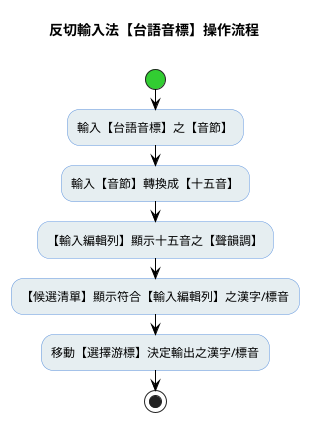

---

### 切換【候選清單】右欄之【漢字標音】（暫不實作）

==本版暫緩實作==
【候選清單】以【三欄】格式顯示，依【輸入編輯列】已接收之輸入，篩選可能的【漢字】及其【十五音】與【台語音標】：

1. 漢字
2. 漢字標音左欄：十五音
3. 漢字標音右欄：【預設】使用`【台語音標】`，即：輸入方案【字典】所使用的【漢字標音】；但使用者可依需求變更。

|序號|漢字|十五音|台語音標|
|:--:|:--:|:-------:|:----:|
|1   |輪  |【柳君五】|〔lun5〕|
|2   |論  |【柳君七】|〔lun7〕|
|3   |潤  |【柳君七】|〔lun7〕|
|4   |忍  |【柳君二】|〔lun2〕|
|5   |怕  |【柳君二】|〔lun2〕|

【候選清單】中顯示之【漢字標音】，可由**候選清單之【漢字標音格式】選項**，控制【候選清單】之【顯示內容】。

|序號|漢字|十五音|方音符號|
|:--:|:--:|:-------:|:----:|
|1   |輪  |〔柳君五〕|【ㄌㄨㄣˊ】|
|2   |論  |〔柳君七〕|【ㄌㄨㄣ˫】|
|3   |潤  |〔柳君七〕|【ㄌㄨㄣ】ˋ|
|4   |忍  |〔柳君二〕|【ㄌㄨㄣ】ˋ|
|5   |怕  |〔柳君二〕|【ㄌㄨㄣ】ˋ|

當**候選清單之【漢字標音】選項**，自預設之`【台語音標】`，切換成`【方音符號】`，【候選清單】顯示內容亦隨之變更：


#### 【漢字標音】選項

- 台語音標（lun2）
- 十五音（君二柳）
- 方音符號（ㄌㄨㄣˋ）
- 台羅拼音（lún
- 白話字（lún）
- 閩拼方案（lǔn）
- 台語注音二式（lun2）
- 國際音標（lun2）

```yaml
switches:
  ...
  # 【候選清單】漢字標音選項
  # reset: 2 → 預設 → 台語音標
  - options:
      [ key_in_piau_im_sni, key_in_piau_im_tps, key_in_piau_im_tlpa,
        key_in_piau_im_tl, key_in_piau_im_poj, key_in_piau_im_bp,
        key_in_piau_im_bpm2, key_in_piau_im_ipa ]
    reset: 0
    states: [ 十五音, 方音符號, 台語音標, 台羅拼音, 白話字, 閩拼方案, 台語注音二式, 國際音標 ]
```

---

### 調號以上標數值顯示（暫不實作）

有些使用者，基於辨識之便，好用【調號】表示【聲調】，且為求美觀，要求調號之數值格式，須以【上標數值】展示。

故輸入方案需提供「supers_tone」選項，決定【調號】之輸出，該用「上標字」或「一般字」

 (1) 輸出拼音字母：Enter（supers_tone=ON） → giam¹ ga¹ ✅
 (2) 輸出拼音字母：Enter（supers_tone=OFF） → giam1 ga1 ✅
 (3) 輸出注音符號：Ctrl+Enter → ㄍㄧㆰ ㄍㄚ（不變）
 (4) 輸出帶調號的注音符號（上標）：Shift+Enter（supers_tone=ON） → ㄍㄧㆰ¹ ㄍㄚ¹（不變）
 (5) 輸出帶調號的注音符號（一般）：Shift+Enter（supers_tone=OFF） → ㄍㄧㆰ1 ㄍㄚ1（不變）
 (6) 輸入候選字清單之【拼音字母】及【注音符號】：Ctrl+Shift+Enter → 〔giam1〕 〔ga1〕 【ㄍㄧㆰ】 【ㄍㄚ】（不變）

```yaml
switches:
  - name: supers_tone
    reset: 0
    states: [一般, 上標]
```
