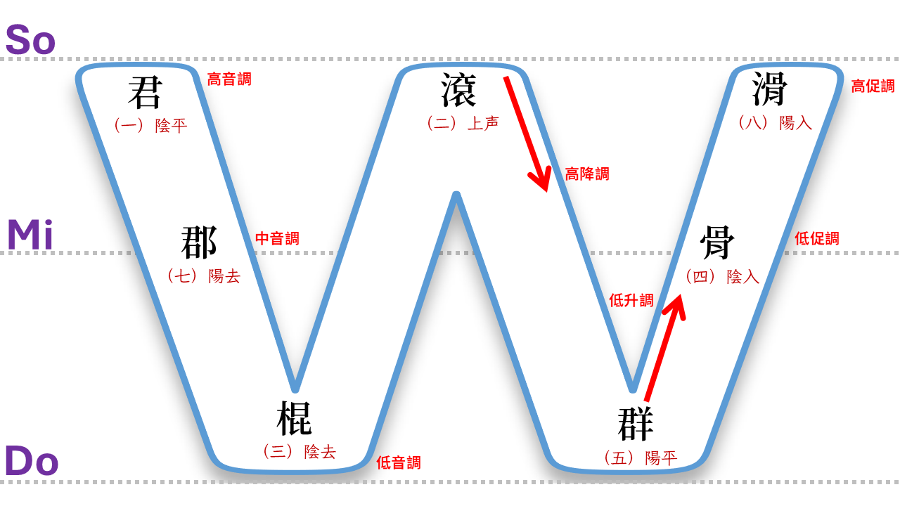

# 反切輸入法【台語音標】設計規格

`版本：V0.1.5`

---

## 摘要

### 特性說明

- 【輸入類型】：反切輸入法（採用：《彙集雅俗通十五音》）
- 【字典標準】：漢字拼音法之【台羅拼音】
- 【按鍵編碼】：以【台語音標】對映【十五音】之【聲】、【韻】、【調】
- 【候選清單】：採【雙欄】顯示
  1. 左欄為【十五音】
  2. 右欄為【方音符號】
- 【特性】包括：
  1. 支持15音調映射
  2. 多樣化拼音兼容性配置（方音與兩岸著重特徵）。

### 操作程序

1. 十五音輸入方案，依：【聲】、【韻】、【調】之順序進行輸入處理；

2. 十五音輸入【聲】與【韻】，不用漢字，改採【羅馬拼音字母】輸入。本輸入方案之【輸入處理】，
會將輸入之【聲】、【韻】的【拼音字母】，轉換成相對映之【漢字】並於【輸入編輯列】顯示。

3. 十五音輸入【調】之輸入，使用【調號】。【調號】與閩南語之【四聲八調】對映關係如下表所示：

---
以下用實例，說明本【輸入方案】之【輸入處理】，如何處理漢字【忍】之輸入。

如：漢字：【忍】，【台語音標】之羅馬拼音字母為：lun2 = l + un + 2 = 聲 + 韻 + 調。

綜合上述，對映於【十五音】漢字標音為：【柳君二】
- 聲： l  ==> 【柳】
- 韻： un ==> 【君】
- 調： 2 ==> 【二】


輸入方案之【輸入處理】：

1. 【聲】之輸入：自鍵盤接收到按鍵：【l】後，於【輸入編輯列】顯示相對映之【十五音聲母】：【柳】；
2. 【韻】之輸入：自鍵盤接收到按鍵：【u】、【n】後，於【輸入編輯列】顯示相對映之【十五音韻母】：【君】；
3. 【調】之輸入：自鍵盤接收到按鍵：【\】後，於【輸入編輯列】顯示相對映之【二】。

---

## 輸入方案設計規範

以下說明本輸入方案：如何於**中州韻(RIME)輸入法平台**，實作【輸入方案】之規範。

### 【字典標準】：

**字典檔（.dict.yaml）**採用【漢字拼音法】之【台羅拼音】。

#### 聲母對照

| 識別號 | 台羅拼音 | 台語音標 | 國際音標 | 漢字例 | 十五音 | 方音符號 | 注音二式 | 閩拼方案 | 白話字 | 備註 |
| --- | --- | --- | --- | --- | --- | --- | --- | --- | --- | --- |
| 1 | l | l | l | 理 | 柳 | ㄌ | l | l | l |   |
| 2 | p | p | p | 比 | 邊 | ㄅ | b | b | p |   |
| 3 | k | k | k | 己 | 求 | ㄍ | g | g | k |   |
| 4 | kh | kh | kʰ | 起 | 去 | ㄎ | k | k | kh |   |
| 5 | t | t | t | 底 | 地 | ㄉ | d | d | t |   |
| 6 | ph | ph | pʰ | 鄙 | 頗 | ㄆ | p | p | ph |   |
| 7 | th | th | tʰ | 恥 | 他 | ㄊ | t | t | th |   |
| 8 | ts | z | ʦ | 阻 | 曾 | ㄗ | z | z | ch |   |
| 9 | j | j | ʣ | 熱 | 入 | ㆡ | zz | zz | j |   |
| 10 | s | s | s | 詞 | 時 | ㄙ | s | s | s |   |
| 11 | Ø | Ø | ʔ | 以 | 英 | Ø | Ø | Ø | Ø |   |
| 12 | b | b | b | 美 | 門 | ㆠ | bb | bb | b |   |
| 13 | g | g | ɡ | 禦 | 語 | ㆣ | gg | gg | g |   |
| 14 | tsh | c | ʦʰ | 取 | 出 | ㄘ | c | c | chh |   |
| 15 | h | h | h | 喜 | 喜 | ㄏ | h | h | h |   |
| 16 | m | m | m | 毛 | 毛 | ㄇ | m | bbn | m | b/m 本不分，此處分門/毛 |
| 17 | n | n | n | 耐 | 耐 | ㄋ | n | ln | n | l/n 本不分，此處分柳/耐 |
| 18 | ng | ng | ŋ | 雅 | 雅 | ㄫ | ng | ggn | ng | g/ng 本不分，此處分語/雅 |
| 19 | ji | ji | ʥ | 熱 | 入 | ㆢ | jji | zzi | ji | ㆢ = ㆡㄧ |
| 20 | tsi | zi | ʨ | 止 | 曾 | ㄐ | ji | zi | chi | ㄐ = ㄗㄧ |
| 21 | tshi | ci | ʨʰ | 測 | 出 | ㄑ | chi | ci | chhi | ㄑ = ㄘㄧ |
| 22 | si | si | ɕ | 惜 | 時 | ㄒ | shi | si | si | ㄒ = ㄙㄧ |


#### 韻母對照

| 識別號 | 台羅拼音 | 台語音標 | 國際音標 | 漢字例 | 韻序 | 十五音 | 舒促聲 | 方音符號 | 注音二式 | 閩拼方案 | 白話字 |
| --- | --- | --- | --- | --- | --- | --- | --- | --- | --- | --- | --- |
| 1 | un | un | un | 汾 | 1 | 君 | 舒聲 | ㄨㄣ | un | un | un |
| 2 | ut | ut | ut | 不 | 1 | 君 | 促聲 | ㄨㆵ | ut | ut | ut |
| 3 | ian | ian | ɪan | 掀 | 2 | 堅 | 舒聲 | ㄧㄢ | ian | ian | ian |
| 4 | iat | iat | ɪat̚ | 別 | 2 | 堅 | 促聲 | ㄧㄚㆵ | iat | iat | iat |
| 5 | im | im | im | 深 | 3 | 金 | 舒聲 | ㄧㆬ | im | im | im |
| 6 | ip | ip | ip̚ | 蟄 | 3 | 金 | 促聲 | 一ㆴ | ip | ip | ip |
| 7 | ui | ui | ui | 歸 | 4 | 規 | 舒聲 | ㄨㄧ | ui | ui | ui |
| 9 | ee | ee | ɛ | 家 | 5 | 嘉 | 舒聲 | ㄝ | e | e |   |
| 10 | eeh | eeh | ɛʔ | 八 | 5 | 嘉 | 促聲 | ㄝㆷ | eh | eh |   |
| 11 | an | an | an | 蘭 | 6 | 干 | 舒聲 | ㄢ | an | an | an |
| 12 | at | at | at̚ | 識 | 6 | 干 | 促聲 | ㄚㆵ | at | at | at |
| 13 | ong | ong | ɔŋ | 風 | 7 | 公 | 舒聲 | ㆲ | ong | ong | ong |
| 14 | ok | ok | ɔk̚ | 福 | 7 | 公 | 促聲 | ㆦㆻ | ok | ok | ok |
| 15 | uai | uai | uai | 怪 | 8 | 乖 | 舒聲 | ㄨㄞ | uai | uai | oai |
| 16 | uaih | uaih | uaiʔ | ◯ | 8 | 乖 | 促聲 | ㄨㄞㆷ | uaih | uaih | oaih |
| 17 | ing | ing | ɪŋ | 情 | 9 | 經 | 舒聲 | ㄧㄥ | ing | ing | eng |
| 18 | ik | ik | ɪk̚ | 益 | 9 | 經 | 促聲 | ㄧㆻ | ik | ik | ek |
| 19 | uan | uan | uan | 猿 | 10 | 觀 | 舒聲 | ㄨㄢ | uan | uan | oan |
| 20 | uat | uat | uat̚ | 說 | 10 | 觀 | 促聲 | ㄨㄚㆵ | uat | uat | oat |
| 21 | oo | oo | ɔ | 捕 | 11 | 沽 | 舒聲 | ㆦ | oo | oo | o͘ |
| 23 | iau | iau | ɪaʊ | 遙 | 12 | 嬌 | 舒聲 | ㄧㄠ | iau | iao | iau |
| 24 | iauh | iauh | ɪaʊʔ | 噭 | 12 | 嬌 | 促聲 | ㄧㄠㆷ | iauh | iaoh | iauh |
| 25 | e | ei | e | 遞 | 13 | 稽 | 舒聲 | ㆤ | e | e |   |
| 27 | iong | iong | ɪɔŋ | 中 | 14 | 恭 | 舒聲 | ㄧㆲ | iong | iong | iong |
| 28 | iok | iok | ɪɔk̚ | 俗 | 14 | 恭 | 促聲 | ㄧㆦㆻ | iook | iok | iok |
| 29 | o | o | o | 果 | 15 | 高 | 舒聲 | ㄜ | or | o | o |
| 30 | oh | oh | oʔ | 卜 | 15 | 高 | 促聲 | ㄜㆷ | orh | oh | oh |
| 31 | ai | ai | aɪ | 埃 | 16 | 皆 | 舒聲 | ㄞ | ai | ai | ai |
| 33 | in | in | in | 恩 | 17 | 巾 | 舒聲 | ㄧㄣ | in | in | in |
| 34 | it | it | it̚ | 一 | 17 | 巾 | 促聲 | ㄧㆵ | it | it | it |
| 35 | iang | iang | ɪaŋ | 將 | 18 | 姜 | 舒聲 | ㄧㄤ | iang | iang | iang |
| 36 | iak | iak | ɪak̚ | 爆 | 18 | 姜 | 促聲 | ㄧㄚㆻ | iak | iak | iak |
| 37 | am | am | am | 堪 | 19 | 甘 | 舒聲 | ㆰ | am | am | am |
| 38 | ap | ap | ap̚ | 答 | 19 | 甘 | 促聲 | ㄚㆴ | ap | ap | ap |
| 39 | ua | ua | ua | 花 | 20 | 瓜 | 舒聲 | ㄨㄚ | ua | ua | oa |
| 40 | uah | uah | uaʔ | 缽 | 20 | 瓜 | 促聲 | ㄨㄚㆷ | uah | uah | oah |
| 41 | ang | ang | aŋ | 邦 | 21 | 江 | 舒聲 | ㄤ | ang | ang | ang |
| 42 | ak | ak | ak̚ | 角 | 21 | 江 | 促聲 | ㄚㆻ | ak | ak | ak |
| 43 | iam | iam | iam | 尖 | 22 | 兼 | 舒聲 | ㄧㆰ | iam | iam | iam |
| 44 | iap | iap | iap̚ | 接 | 22 | 兼 | 促聲 | ㄧㄚㆴ | iap | iap | iap |
| 45 | au | au | aʊ | 鬧 | 23 | 交 | 舒聲 | ㄠ | au | ao | au |
| 46 | auh | auh | aʊʔ | 暴 | 23 | 交 | 促聲 | ㄠㆷ | auh | aoh | auh |
| 47 | ia | ia | ɪa | 名 | 24 | 迦 | 舒聲 | ㄧㄚ | ia | ia | ia |
| 48 | iah | iah | ɪaʔ | 壁 | 24 | 迦 | 促聲 | ㄧㄚㆷ | iah | iah | iah |
| 49 | ue | ue | ue | 話 | 25 | 檜 | 舒聲 | ㄨㆤ | ue | ue | oe |
| 50 | ueh | ueh | ueʔ | 拔 | 25 | 檜 | 促聲 | ㄨㆤㆷ | ueh | ueh | oeh |
| 51 | ann | ann | ã | 聽 | 26 | 監 | 舒聲 | ㆩ | ann | na | aⁿ |
| 52 | annh | ahnn | ãʔ | 含 | 26 | 監 | 促聲 | ㆩㆷ | annh | nah | ahⁿ |
| 53 | u | u | u | 夫 | 27 | 艍 | 舒聲 | ㄨ | u | u | u |
| 54 | uh | uh | uʔ | 勃 | 27 | 艍 | 促聲 | ㄨㆷ | uh | uh | uh |
| 55 | a | a | a | 些 | 28 | 膠 | 舒聲 | ㄚ | a | a | a |
| 56 | ah | ah | aʔ | 百 | 28 | 膠 | 促聲 | ㄚㆷ | ah | ah | ah |
| 57 | i | i | i | 爾 | 29 | 居 | 舒聲 | ㄧ | i | i | i |
| 58 | ih | ih | iʔ | 逼 | 29 | 居 | 促聲 | ㄧㆷ | ih | ih | ih |
| 59 | iu | iu | iu | 油 | 30 | 丩 | 舒聲 | ㄧㄨ | iu | iu | iu |
| 61 | enn | enn | ẽ | 爭 | 31 | 更 | 舒聲 | ㆥ | enn | ne | eⁿ |
| 62 |   | ehnn |   | 挾 | 31 | 更 | 促聲 | ㆥㆷ | ennh |   | ehⁿ |
| 63 | uinn | uinn | ũĩ | 荒 | 32 | 褌 | 舒聲 | ㄨㆪ | uinn | nui | uiⁿ |
| 65 | io | io | ɪo | 少 | 33 | 茄 | 舒聲 | ㄧㄜ | ior | io | io |
| 66 | ioh | ioh | ɪoʔ | 著 | 33 | 茄 | 促聲 | ㄧㄜㆷ | iorh | ioh | ioh |
| 67 | inn | inn | ĩ | 庚 | 34 | 梔 | 舒聲 | ㆪ | inn | ni | iⁿ |
| 68 | innh | ihnn | ĩʔ | 欷 | 34 | 梔 | 促聲 | ㆪㆷ | innh | nih | ihⁿ |
| 69 | ionn | ionn | ĩɔ̃ | 腔 | 35 | 薑 | 舒聲 | ㄧㆧ | ioonn | nioo | ioⁿ |
| 71 | iann | iann | ĩã | 且 | 36 | 驚 | 舒聲 | ㄧㆩ | iann | nia | iaⁿ |
| 73 | uann | uann | ũã | 肝 | 37 | 官 | 舒聲 | ㄨㆩ | uann | nua | oaⁿ |
| 75 | ng | ng | ŋ̍ | 床 | 38 | 鋼 | 舒聲 | ㆭ | ng | ng | ng |
| 77 | e | e | e | 會 | 39 | 伽 | 舒聲 | ㆤ | e | e | e |
| 78 | eh | eh | eʔ | 伯 | 39 | 伽 | 促聲 | ㆤㆷ | eh | eh | eh |
| 79 | ainn | ainn | ãĩ | 挨 | 40 | 閒 | 舒聲 | ㆮ | ainn | nai | aiⁿ |
| 81 | onn | onn | ɔ̃ | 張 | 41 | 姑 | 舒聲 | ㆧ | oonn | noo | oⁿ |
| 83 | m | m | m̩ | 姆 | 42 | 姆 | 舒聲 | ㆬ | m | m | m |
| 85 | uang | uang | uaŋ | 闖 | 43 | 光 | 舒聲 | ㄨㄤ | uang | uang | oang |
| 86 | uak | uak | uak̚ | 伏 | 43 | 光 | 促聲 | ㄨㄚㆻ | uak | uak | oak |
| 87 | uainn | uainn | ũãĩ | 檨 | 44 | 閂 | 舒聲 | ㄨㆮ | uainn | nuai | oaiⁿ |
| 88 | uainnh | uaihnn | ũãĩʔ | 蹶 | 44 | 閂 | 促聲 | ㄨㆮㆷ | uainnh | nuaih | oaihⁿ |
| 89 | uenn | uenn | ũẽ | ◯ | 45 | 糜 | 舒聲 | ㄨㆥ | uenn | nue | oeⁿ |
| 91 | iaunn | iaunn | ĩãũ | 鳥 | 46 | 嘄 | 舒聲 | ㄧㆯ | iaunn | niao | iauⁿ |
| 92 | iaunnh | iauhnn | ĩãũʔ | ◯ | 46 | 嘄 | 促聲 | ㄧㆯㆷ | iaunnh | niaoh | iauhⁿ |
| 93 | om/p | om | ɔm | 丼 | 47 | 箴 | 舒聲 | ㆱ | oom | om/p | om |
| 94 | op | op | ɔp̚ | 吷 | 47 | 箴 | 促聲 | ㆦㆴ | oop | op | op |
| 95 | aunn | aunn | ãũ | 懸 | 48 | 爻 | 舒聲 | ㆯ | aunn | nao | auⁿ |
| 97 | onn | onn | ɔ̃ | 呼 | 49 | 扛 | 舒聲 | ㆧ | ornn | noo | on |
| 98 | onnh | ohnn | ɔ̃ʔ | ◯ | 49 | 扛 | 促聲 | ㆧㆷ | uenn | nooh | ohⁿ |
| 99 | iunn | iunn | ĩũ | 香 | 50 | 牛 | 舒聲 | ㄧㆫ | iunn | niu | iuⁿ |


### 【按鍵編碼】：

由於輸入方案，底層核心仍為：【台語音標】（TLPA+），故自【字典檔】讀入之【聲】、【韻】、【調】等【音節】資料，需進行【編碼轉換】，其作業需特別處理以下所列要項：

`台羅拼音轉台語音標作業要點`

1. 聲母轉換

    **TLPA+** 為 TLPA 之**改良版**，兩者之間的差異在於：TLPA+ 的【羅馬拼音字母】均為單一字元；且其羅馬拼音字母之使用與【漢語拼音】有著更高之相容度：

    |台羅拼音| TLPA | TLPA+ |
    |:------|:---- |:----- |
    |  tsh  | ch   | c     |
    |   ts  | c    | z     |

2. 韻母轉換

    |台羅拼音|台語音標|
    |:------|:---- |
    |  onn  | oonn |

【註】：<Ctrl+v> u 207f ==> ⁿ

#### 按鍵編碼規範

`《調號與按鍵輸入對照表》`

|序次|按鍵|調號|調名|
|:-:|:--:|:--:|:--:|
|1	|;	 |一  |上平 / 陰平|
|2	|\	 |二  |上上 / 陰上|
|3	|_	 |三  |上去 / 陰去|
|4	|[	 |四  |上入 / 陰入|
|5	|/	 |五  |下平 / 陽平|
|6	|(無)|六  |下上 / 陽上|
|7	|-	 |七  |下去 / 陽去|
|8	|]	 |八  |下入 / 陽入|

如：上平（或稱：陰平）調，其【調號】值為：一，對映【按鍵】為：【；】。


`《四聲八調對照表》`

1. 【台語音標】使用【調號】，不同於【台羅拼音】、【白話字】使用【調符】（聲調符號）；
2. 【台語音標】與【台羅拼音】、【白話字】使用相同之【調名】與【調號】編號標準；
3. 【閩拼方案】為與【漢語拼音】相容，其使用之【調名】雖與【台語音標】同，但編號之排序法則相異。

| 四聲八調 | 調名         | 調值 | W調序 | W調名  | 漢字 | 台語音標 | 台語音標簡寫 | 台羅調符編碼 | 台羅拼音 |
| -------- | ------------ | ---- | ----- | ------ | ---- | -------- | ------------ | ------------ | -------- |
| 1        | 陰平         | 44   | 1     | 高音調 | 東   | tong1    | tong         |              | tong     |
| 2        | 陰上（上声） | 53   | 4     | 高降調 | 董   | tong2    | tong2        | U+0301       | tóng     |
| 3        | 陰去         | 21   | 3     | 低音調 | 棟   | tong3    | tong3        | U+0300       | tòng     |
| 4        | 陰入         | 30   | 6     | 低促調 | 督   | tok4     | tok          |              | tok      |
| 5        | 陽平         | 13   | 5     | 低升調 | 同   | tong5    | tong5        | U+030C       | tǒng     |
| 6        | 陽上（上声） |      |       |        |      | tong6    | tong6        |              |          |
| 7        | 陽去         | 22   | 2     | 中音調 | 動   | tong7    | tong7        | U+0304       | tōng     |
| 8        | 陽入         | 50   | 7     | 高促調 | 獨   | tok8     | tok8         | U+030D       | to̍k      |



---

### 【候選清單】：

採【雙欄】顯示：
  1. 左欄：【十五音】
  2. 右欄：【方音符號】


【候選清單】中顯示之項目（漢字+十五音+方音符號），與【輸入編輯列】
有著連動之相互因果關係，說明如下？

#### 【輸入編輯列】顯示格式

以下用一實例，說明本輸入方案如何依據使用者之按鍵，完成【音節】之輸入處理。

- 漢字：【忍】
- 台語音標：lun2
- 十五音】：柳君二

1. 輸入【聲】：鍵盤按：【l】鍵，輸入編輯列顯示【柳】；
2. 輸入【韻】：鍵盤按：【u】+【n】鍵，輸入編輯列顯示【君】；
3. 輸入【調】：鍵盤按：【\】鍵，輸入編輯列顯示【四】。
4. 【輸入編輯列】顯示使用者輸入之【音節】為：【柳君四】。

#### 【候選清單】顯示格式

使用者在【鍵盤】的按鍵輸入，輸入方案會在【輸入編輯列】，顯示其經轉換後之
十五音的【聲】、【韻】、【調】（注意：此序列之格式非傳統標準之十五音格式）；
同時，輸入方案亦根據已取得之【音節】輸入資料，如：【柳君二】，將之轉換成
符合傳統十五音之：【韻】、【調】、【聲】格式，然後再於【候選字視窗】中顯示：

1. 輪 〔柳君五〕 【 ㄌㄨㄣˊ】
2. 論 〔柳君七〕 【 ㄌㄨㄣ˫】
3. 潤 〔柳君七〕 【 ㄌㄨㄣ˫】
4. 忍 〔柳君二〕 【 ㄌㄨㄣˋ】
5. 怕 〔柳君二〕 【 ㄌㄨㄣˋ】

---

## 【選擇游標】移動

【候選清單】中項目之選擇，可借由【PgUp】、【PgDn】、【↑】、【↓】鍵之操作，
移動【選擇游標】來選擇欲進行輸出之【漢字】（或者【音節】之【漢字標音】）。
輸入方案仿： Vim 編輯器傳統之 hjkl 按鍵，操作【候選清單】中【選擇游標】之移動。

1. 翻到上一頁： [Ctrl] + [h]
2. 翻到下一頁： [Ctrl] + [l]
3. 移到上一個： [Ctrl] + [j]
4. 移到下一個： [Ctrl] + [k]
5. 移到中央處： [Ctrl] + [m]
6. 移到底端處： [Ctrl] + [<]
7. 移到頂端處： [Ctrl] + [>]


---
## 連續輸入處理

如【辭彙】：「呑忍」之輸入操作...

|漢字|台語音標|十五音標音|方音符號|
|:--:|:----:|:-------:|:----:|
|呑	|thun1	|他君一	|ㄊㄨㄣ |
|忍	|lun2	|柳君二	|ㄌㄨㄣˋ|

使用者欲完成「呑忍」之輸入，可用漢字逐一輸入方式完成；亦可使用【連續輸入】方式完成。

在中州韻(RIME)輸入法平台，其【連續輸入】操作步驟如下：

1. 輸入【辭彙】之第一字：在鍵盤按：【t】【h】【u】【n】【;】鍵；

    - 【輸入編輯列】顯示： `【他君一】`；
    - 【候選字視窗】顯示： `呑〔thun1〕 【 ㄊㄨㄣˉ 】`。

2. 輸入【辭彙】第二字：不要按【空白】鍵，接繼在鍵盤按：【l】【u】【n】【\】建。

    - 【輸入編輯列】顯示： `【他君一 柳君二】`；
    - 【候選字視窗】顯示： `呑忍 〔thun1 lun2〕 【 ㄊㄨㄣˉ lun2 】`

---

## 輸入方案設計規格

以下規範本輸入方案之設計規格（ **`【huan_ciat_tlpa.schema.yaml】`** ）：

### 【輸入編輯列】之漢字標音格式

使用者在【輸入輯輯列】完成應有之輸入，再搭配【選擇游標】之移動擇定欲輸出之漢字後，最後按下【空白鍵】，則本輸入方案，將輸出【漢字】。

顧及使用者有時需要的【輸出】不是【漢字】，而是【漢字標音】（如：十五音、方音符號、台語音標...等），故輸入方案提供`【輸出漢字標音選項】`。供使用者設定【輸出】使用之【漢字標音】標準。而輸出之按鍵，使用【Enter】鍵。

#### `【需求詳述】`

以漢字：【忍】舉例，其【漢字標音】可為以下任何一種方式呈現：

- 【台語音標(TLPA)】：lun2
- 【十五音(SNI)】：柳君二
- 【方音符號(TPS)】：ㄌㄨㄣˋ
- 【台羅拼音(TL)】：lún
- 【閩拼方案(BP)】：lún

`操作步驟`：

1. 使用者輸入漢字之【台語音標】：lun2；

    - 【鍵盤按鍵】：【t】【h】【u】【n】【;】
    - 【輸入編輯列】顯示： `【柳君二】`
    - 【候選清單】挑選： `忍 〔lun2〕 【ㄌㄨㄣˋ】`

2. 若按【空白】鍵，輸出漢字：【忍】；若按【Enter】鍵，輸出【十五音】：`【柳君二】`。

3. 將`【輸出漢字標音選項】`自預設之【十五音】，切換成【台語音標】；

4. 重覆 2. 步驟之操作，則可於按下【Enter】鍵後，得到輸出【台語音標】：`lun2`。

5. 將`【輸出漢字標音選項】`，切換成【方音符號】；

6. 重覆 2. 步驟之操作，則可於按下【Enter】鍵後，得到輸出【方音符號】：`ㄌㄨㄣˋ`。

#### `【設計規範】`

- switches/name: key_in_piau_im
- 輸出格式：
    - 十五音（君二柳）：**預設**
    - 方音符號（ㄌㄨㄣˋ）
    - 台語音標（lun2）
    - 台羅拼音（lún）
    - 白話字（lún）
    - 閩拼方案（lǔn）
    - 台語注音二式（lun2）
    - 國際音標（lun2）
- 輸入方案插件： engine/processors: lua_processor@aux_commit

### 【候選清單】之漢字標音格式

【候選清單】中顯示之【漢字標音】，可由**候選清單之漢字標音格式選項**，控制【候選清單】之【顯示內容】。


#### `【需求詳述】`

本輸入方案之【候選清單】，以【三欄】格式，顯示【輸入編輯列】已接收之輸入，可能的【漢字】及其【十五音標音】與【方音符號】：
1. 漢字
2. 十五音標音
3. 方音符號

|序號|漢字|十五音標音|方音符號|
|:--:|:--:|:-------:|:----:|
|1   |輪  |〔柳君五〕|【ㄌㄨㄣˊ】|
|2   |論  |〔柳君七〕|【ㄌㄨㄣ˫】|
|3   |潤  |〔柳君七〕|【ㄌㄨㄣ】ˋ|
|4   |忍  |〔柳君二〕|【ㄌㄨㄣ】ˋ|
|5   |怕  |〔柳君二〕|【ㄌㄨㄣ】ˋ|

當【**候選清單之漢字標音格式選項**】，自預設之【方音符號】，切換成【台語音標】，則【候選清單】顯示內容變更如下：

|序號|漢字|十五音標音|台語音標|
|:--:|:--:|:-------:|:----:|
|1   |輪  |〔柳君五〕|【lun5】|
|2   |論  |〔柳君七〕|【lun7】|
|3   |潤  |〔柳君七〕|【lun7】|
|4   |忍  |〔柳君二〕|【lun2】|
|5   |怕  |〔柳君二〕|【lun2】|


#### `【設計規範】`

- switches/name: key_in_piau_im
- 輸出格式：
    - 台語音標（lun2）
    - 十五音（君二柳）
    - 方音符號（ㄌㄨㄣˋ）
    - 台羅拼音（lún
    - 白話字（lún）
    - 閩拼方案（lǔn）
    - 台語注音二式（lun2）
    - 國際音標（lun2）

### 【候選清單】之漢字標音格式

【候選清單】中顯示之【漢字標音】，可由**候選清單之漢字標音格式選項**，控制【候選清單】之【顯示內容】。


- switches/options: hau_suan_piau_im_*

- 選項：
   | states | options |
   |:-------|:--------|
   |方音符號（預設）| hau_suan_piau_im_tps |
   |台語音標 | hau_suan_piau_im_tlpa |

- 使用插件：
    engine/filters: lua_filter@reformat_comment_filter

### 函式：format_comment(comment_string, mode)

變更雙欄候選清單中，左欄之漢字標音、右欄之漢字標音。

- 因【輸入方案】支援【連續輸入】，取漢字之音節，需考量音節數不一定為單一

- 左欄之漢字標音：
    - 漢字標音法採：`十五音`，各音節以符號`〔...〕`包裹標示；
    - 由【輸入方案（YAML）】傳來之原始音節格式為：【聲+韻+調】，需變更成：【韻+調+聲】格式；
    【例】：忍【lun2】--> [l + un + 2] --> 【柳+君+二】--> 【柳君二】==> 【居二柳】

- 右欄之漢字標音：
    - 漢字標音法採：`方音符號`，各音節以符號`【...】`包裹標示；
    - 右欄漢字標音：非固定，依【**候選清單之漢字標音格式選項**】之設定變更。
        - 預設為：方音符號 (hau_suan_piau_im_tps)，可由【輸入方案】傳入，無需進行轉換；
        - 若切換成：台語音標 (hau_suan_piau_im_tlpa)，則需進行漢字標音轉換，改成【台語音標】。

---

## 待整理內容

以下內容請怱略：

```lua
------------------------------------------------------------------------------------------
-- aux_commit：切換輸入方案【輸出】之【漢字標音】格式
-- （1）漢字、（2）【羅馬拼音字母】、（3）【方音符號】、（4）【帶調號之方音符號】、
-- （5）候選字清單顯示結果：【羅馬拼音字母】＋【方音符號】一起輸出（候選字清單的顯示結果）
------------------------------------------------------------------------------------------
-- 扶：〔hu5〕  【ㄏㄨˊ】
-- Space → 漢字
-- Enter → 羅馬拼音字母：hu5
-- Ctrl+Enter → 方音符號：ㄏㄨˊ
-- Shift+Enter → 帶調號方音符號：ㄏㄨ5
-- Ctrl+Shift+Enter → 候選字清單顯示結果：〔hu5〕  【ㄏㄨˊ】
------------------------------------------------------------------------------------------
-- 注意：本功能須配合 schema 的 key_binder，將 Enter、Ctrl+Enter、Shift+Enter、Ctrl+Shift+Enter 綁定到 lua_aux_commit
-- 例如：
--   "key_binder/bindings/accept": "lua_aux_commit"
--   "key_binder/bindings/accept_next": "lua_aux_commit"
--   "key_binder/bindings/accept_previous": "lua_aux_commit"
--   "key_binder/bindings/accept_alternate": "lua_aux_commit"
------------------------------------------------------------------------------------------
-- 另外，請在 schema 的 switches 中加入「supers_tone」選項
-- 例如：
--  "switches": [
--    { "name": "supers_tone", "reset": 1, "states": ["上標", "一般"] }
--  ]
------------------------------------------------------------------------------------------
-- 這樣 Shift+Enter 輸出時，會依「supers_tone」選項，決定輸出「上標」或「一般數字」
------------------------------------------------------------------------------------------
-- 【程式處理指引】：
-- 能從候選註解（不論是原本「配對顯示」或你剛重排後的「左 TLPA、右注音」）解析出所有音節。

-- 沒候選單時，改從 inline 取資料：TLPA 取 ctx.input（自動依 ' 切音節）、注音取 ctx:get_script_text()（會是像 ㄅ'ㄙ，自動拆成 ㄅ、ㄙ）。

-- Enter：輸出 TLPA（多音節用 ' 連接）
-- Ctrl+Enter：輸出注音（保留聲調符號，音節間一格空白）
-- Shift+Enter：依 supers_tone 輸出上標或數字（每個音節各自轉換，再以空白連接）
-- Ctrl+Shift+Enter：輸出「候選雙欄格式」：〔tlpa1〕 〔tlpa2〕 … 【bpmf1】 【bpmf2】 …
------------------------------------------------------------------------------------------
```