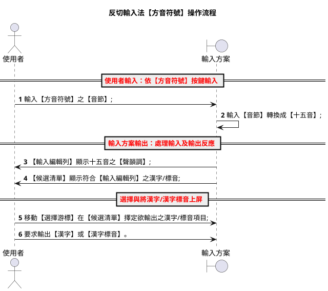
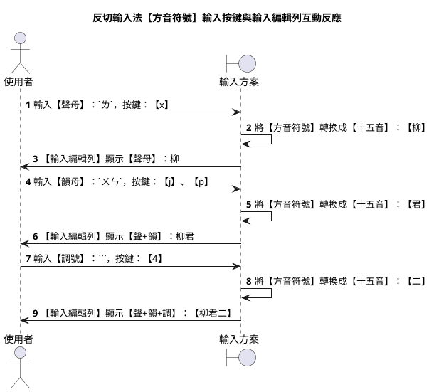
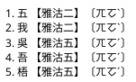
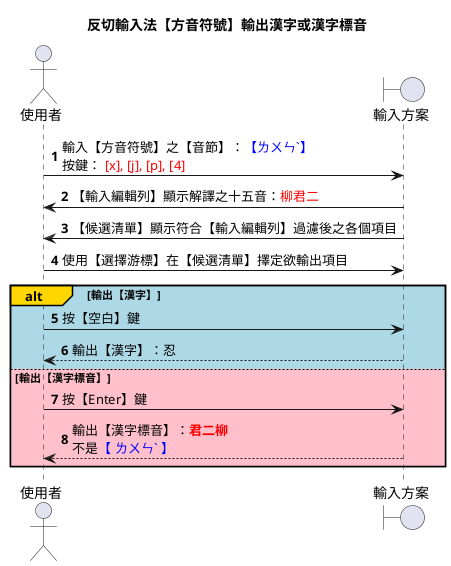
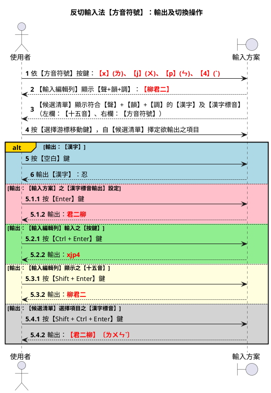
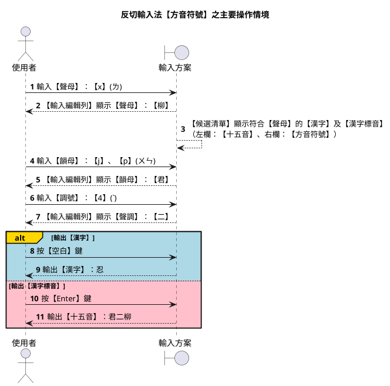
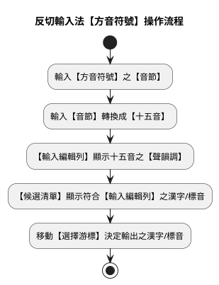

# 反切輸入法【方音符號】設計規格

`版本：V0.1.0.6`

---

## 摘要

### 特性說明

- 【輸入類型】：反切輸入法（採用：《彙集雅俗通十五音》）
- 【字典標準】：採漢字拼音法之【台羅拼音】，底層核心仍為【台語音標】（TLPA+）
- 【按鍵編碼】：以【方音符號】對映【十五音】之【聲】、【韻】、【調】
- 【輸入編輯列】：預設顯示【十五音】之【聲】+【韻】+【調】（可經【方案選項】切換顯示格式）
- 【候選清單】：採【雙欄】顯示
  1. 左欄為【十五音】（傳統格式：【韻】+【調】+【聲】，由 `reformat_comment_filter` 校調）
  2. 右欄為【方音符號】
- 【輸出類型】：
  1. 可輸出漢字
  2. 亦可輸出多種之【漢字標音】

        漢字：【老】...
        - 台語音標：lo2
        - 注音二式：lor2
        - 台羅拼音：ló
        - 白話字：ló
        - 閩拼方案：lǒ
        - 十五音：高二柳
        - 方音符號：ㄌㄜˋ
        - 國際音標：lɔ²

> #### 【漢字標音法及英文簡稱】
>
> |英文簡稱|漢字標音法  |反切/注音/拼音|
> |--------|------------|--------------|
> |sni     |十五音      |高二柳        |
> |tps     |方音符號    |ㄌㄜˋ        |
> |tlpa    |台語音標    |lo2           |
> |tl      |台羅拼音    |ló            |
> |bpm2    |台語注音二式|lor2          |
> |poj     |白話字      |ló            |
> |bp      |閩拼方案    |lǒ            |
> |ipa     |國際音標    |lɔ²           |

### 與【反切輸入法【台語音標】】之差異

| 項目         | 310 台語音標 (`huan_ciat_tlpa`) | 320 方音符號 (`huan_ciat_tps`) |
| ------------ | ------------------------------- | ------------------------------ |
| 鍵盤按鍵     | 羅馬拼音字母 + 調號符號         | 注音鍵盤（方音符號 + 調號按鍵） |
| 輸入編輯列   | 十五音（聲+韻+調）              | 十五音（聲+韻+調）             |
| 候選清單右欄 | 台語音標                        | 方音符號                       |
| Enter 預設   | 十五音                          | 十五音                         |

詳細操作說明請參考：[310_反切輸入法【台語音標】設計規格.md](./310_反切輸入法【台語音標】設計規格.md)。

---

## 操作情境

以漢字【忍】為例，說明本輸入方案如何將鍵盤之【方音符號】按鍵：`x`、`j`、`p`、`4`（即 `ㄌㄨㄣˋ`），轉換成【十五音】：【柳君二】，並於【輸入編輯列】及【候選清單】顯示，最後將【漢字】或【漢字標音】輸出。

- 聲母（聲）：ㄌ  →  柳
- 韻母（韻）：ㄨㄣ  →  君
- 聲調（調）：ˋ  →  二



### 1. 輸入【方音符號】之【音節】

使用者自鍵盤，依【音節】之結構，依序輸入：【聲】+【韻】+【調】。

- 【聲】與【韻】為【注音符號按鍵】；
- 【調】為【數字調號按鍵】。

以漢字【忍】為例，在「**反切輸入法【方音符號】**」，應輸入【方音符號】：`ㄌㄨㄣˋ`。

- 聲母（聲）：【ㄌ】，按鍵：【x】
- 韻母（韻）：【ㄨ】、【ㄣ】，按鍵：【j】、【p】
- 聲調（調）：【ˋ】，按鍵：【4】

==《注音符號之調號按鍵》==

|調號|符號按鍵|調名|
|:--:|:--:|:--:|
| 1 |:	 |上平 / 陰平|
| 2 |4	 |上上 / 陰上|
| 3 |3	 |上去 / 陰去|
| 4 |[	 |上入 / 陰入|
| 5 |6	 |下平 / 陽平|
| 6 |(無)|下上 / 陽上|
| 7 |5	 |下去 / 陽去|
| 8 |]	 |下入 / 陽入|


【聲韻調】與【鍵盤按鍵】之完整對照，請參考：

- [090_漢字標音轉換指引.md](./090_漢字標音轉換指引.md) §3 注音鍵盤對映
- [100_閩南語聲韻調對映指引.md](./100_閩南語聲韻調對映指引.md)

### 2. 輸入【音節】轉換成【十五音】

【輸入方案】之 YAML Script（`preedit_format`），負責將鍵盤接收之【按鍵】輸入，循轉換作業，將【方音符號】之【聲母】、【韻母】、【調號】，轉換成【十五音】之【聲母】、【韻母】、【調號】。

#### 方音符號轉換成十五音

- 聲母（聲）：ㄌ     ==> 柳
- 韻母（韻）：ㄨㄣ   ==> 君
- 聲調（調）：ˋ     ==> 二

   |按鍵|方音符號|十五音|
   |:---|--------|:----:|
   | x  | ㄌ     |  柳  |
   | jp | ㄨㄣ   |  君  |
   | 4  | ˋ      |  二  |



### 3. 【輸入編輯列】顯示十五音之聲韻調

按鍵經 `preedit_format` 處理後，以【十五音】之【聲母】、【韻母】、【調號】，於【輸入編輯列】顯示。

1. 自【鍵盤】，輸入【方音符號】之【聲母】，按鍵：【x】。
2. 【輸入方案】的 `preedit_format`，負責將：`x` → `ㄌ` → `柳`。
3. 【輸入編輯列】顯示：`柳↑`

4. 自【鍵盤】，輸入【方音符號】之【韻母】，按鍵：【j】、【p】。
5. 【輸入編輯列】顯示：`柳君↑`

6. 自【鍵盤】，輸入【方音符號】之【聲調】，按鍵：【4】。
7. 【輸入編輯列】顯示：`柳君二↑`


> 【註】：傳統【十五音】標音，其【音節】結構格式為：**【韻母】+【調號】+【聲母】**。【輸入方案】不在【輸入編輯列】進行處理；改在【候選清單】校調十五音之【音節】格式。**校調作業**則交由【輸入方案】的【插件】：**reformat_comment_filter** 處理。
>
> 當【**輸入方案**】使用【**方音符號**】作為【鍵盤按鍵】時，【忍】字之輸入編輯列為：`【柳君二】`（聲+韻+調）；但【候選清單】左欄之十五音為傳統格式：`【君二柳】`。

### 4. 【候選清單】顯示符合【輸入編輯列】之漢字/標音

【輸入方案】中 `comment_format` 段之 YAML Script，負責將**符合**【輸入編輯列】已取得之輸入，於【候選清單】顯示符合輸入之【漢字】、【十五音】、【方音符號】。

【候選清單】中所顯示之【漢字標音】共有兩種，分別為：

- 左欄：十五音，即：輸入方案使用的【漢字標音】；
- 右欄：方音符號，即：本方案專用之【注音類標音】。

**反切輸入法【方音符號】之候選清單格式**




> 【註】：
> 1. 在【輸入編輯列】顯示之十五音，其【音節】格式為：**【聲】、【韻】、【調】**；然【候選清單】所顯示之十五音，則為傳統之十五音格式（**【韻】、【調】、【聲】**）。
> 2. 【方音符號】之【音節】結構為：【聲母】+【韻母】+【調符】。

### 5. 移動【選擇游標】決定輸出之漢字/標音

移動【**選擇游標**】，選擇欲輸出之【項目】。

- 每個【候選清單】最多可顯示 5 條項目；
- 每條項目之結構為：【漢字】、【十五音】、【方音符號】。


【候選清單】中顯示之項目，可借由【pgup】、【pgdn】、【↑】、【↓】鍵之操作來進行選取。本輸入方案仿 `vim` 編輯器之 **hjkl** 按鍵，亦可用於操作【選擇游標】之移動。

- 翻到上一頁： [ctrl] + [h]
- 翻到下一頁： [ctrl] + [l]
- 移到上一個： [ctrl] + [j]
- 移到下一個： [ctrl] + [k]
- 移到中央處： [ctrl] + [m]
- 移到頂端處： [ctrl] + [/]
- 移到底端處： [ctrl] + [,]

### 6. 輸出使用者之輸入結果

【輸入方案】預設之【輸出】為：【漢字】，使用【按鍵】為：【空白】鍵；若是需要輸出：**【漢字標音】**（如：十五音、方音符號、台語音標...等），則可使用：【**enter**】按鍵。

- [Space] 按鍵：輸出漢字
- [Enter] 按鍵：輸出漢字標音



#### 各式輸出按鍵

除上述之【空白】、【Enter】鍵外，【輸入方案】可用的全部輸出按鍵，詳述如下：

- `space` → 漢字
- `enter (commit_composition)` → 【漢字標音輸出】選項，設定之【漢字標音】
- `ctrl+enter (commit_raw_input)` → 【輸入編輯列】接收之【按鍵】輸入
- `shift+enter (commit_script_text)` → 【輸入編輯列】顯示經 `preedit_format` 處理後之結果
- `shift+ctrl+enter (commit_comment)` → 【候選清單】選擇項目顯示之【漢字標音】



**操作情境說明**：

1. 操作步驟【1-4】：輸入漢字【忍】之【方音符號】按鍵 `xjp4`。
    - 【鍵盤】按鍵：【x】【j】【p】【4】
    - 【輸入編輯列】：`【柳君二】`
    - 【候選清單】：`忍  【君二柳】〔ㄌㄨㄣˋ〕`

2. 按【空白】鍵，輸出漢字：【忍】。

3. 按【Enter】鍵，輸出【漢字標音輸出】選項指定之【十五音】：`君二柳`。

4. 按【Ctrl + Enter】鍵，輸出原始按鍵：`xjp4`。

5. 按【Shift + Enter】鍵，輸出【輸入編輯列】所見之【十五音】：`柳君二`。

6. 按【Shift + Ctrl + Enter】鍵，輸出：`【君二柳】〔ㄌㄨㄣˋ〕`。

#### 切換【漢字標音輸出】設定

【輸入方案】遇按下【**Enter**】鍵，便依【候選清單】中【選擇游標】擇定之【項目】，輸出【漢字標音輸出】選項，設定之【漢字標音】。

本方案之【Enter】預設輸出：**十五音**。

切換方式：按 [Ctrl] + [`] 鍵，進入【輸入方案】之選項切換功能，變更【漢字標音輸出】選項。可選項目與 [310_反切輸入法【台語音標】設計規格.md](./310_反切輸入法【台語音標】設計規格.md) 相同。

#### 多音節連續輸入處理

漢字為：一字一音，本輸入方案提供【連續輸入】操作方式，供使用者連續輸入多個【音節】，一次完成多個【漢字】輸入。

如【辭彙】：「呑忍」之輸入操作...

|漢字|台語音標|十五音標音|方音符號|按鍵（忍）|
|:--:|:----:|:-------:|:----:|:--:|
|呑	|thun1	|他君一	|ㄊㄨㄣ |—|
|忍	|lun2	|柳君二	|ㄌㄨㄣˋ|xjp4|

1. 輸入第一字【呑】之【方音符號】按鍵後，【輸入編輯列】顯示：`【他君一】`。
2. 不按【空白】鍵，接續輸入第二字【忍】：`xjp4`。
3. 【輸入編輯列】顯示：`【他君一 柳君二】`。
4. 按【空白】鍵，輸出漢字：`呑忍`。

---

## 輸入方案設計規範

以下說明本輸入方案：如何於**中州韻(rime)輸入法平台**，實作【輸入方案】之規範。

- 識別代碼：**`huan_ciat_tps`**
- 檔案名稱：**`huan_ciat_tps.schema.yaml`**

### 主要操作情境



### 字典輸入與輸入方案編碼

`字典檔（.dict.yaml）`採用【漢字拼音法】之【台羅拼音】（`ji_khoo_tl`）。

由於輸入方案底層核心仍為【台語音標】（TLPA+），故自【字典檔】讀入之【聲】、【韻】、【調】等【音節】資料，需進行【編碼轉換】。轉換要點請參考 [090_漢字標音轉換指引.md](./090_漢字標音轉換指引.md) §2.1 及 [310_反切輸入法【台語音標】設計規格.md](./310_反切輸入法【台語音標】設計規格.md)「字典輸入與輸入方案編碼」一節。

`台羅拼音轉台語音標作業要點`

|台羅拼音| tlpa | tlpa+ |
|:------|:---- |:----- |
|  tsh  | ch   | c     |
|   ts  | c    | z     |

|台羅拼音|台語音標|
|:------|:---- |
|  onn  | oonn |

### 候選清單

#### 修正左欄：【十五音】音節結構

【候選清單】在【左欄】顯示之【十五音】，由 `comment_format`（`lib_comment_sni_and_tps`）負責産出，並經 **`reformat_comment_filter`** 將音節格式由【聲+韻+調】校調為傳統【韻+調+聲】。

【**例**】：忍【lun2】
--> [ l + un + 2 ]
--> 【 柳+君+二 】
--> 【 柳君二 】（輸入編輯列）
--> 【 君二柳 】（候選清單左欄）

#### 使用插件：lua_filter@reformat_comment_filter

```yaml
engine:
  filters:
    - lua_filter@reformat_comment_filter
```

### 變更【漢字標音輸出】選項

| 輸入方案                     | Enter 預設輸出 |
| ---------------------------- | -------------- |
| 反切輸入法【台語音標】       | 十五音         |
| 反切輸入法【方音符號】       | 十五音         |
| 注音輸入法【方音符號】       | 方音符號       |
| 注音輸入法【台語注音符號】   | 台語注音符號   |

#### 指定使用之 Lua 插件

```yaml
engine:
  processors:
    - lua_processor@aux_commit
    - lua_processor@jump_select
```

#### 設置輸入方案使用之選項

```yaml
switches:
  # 【漢字標音】輸出選項
  # reset: 0 → 預設 → 十五音
  - options:
      [ key_in_piau_im_sni, key_in_piau_im_tps, key_in_piau_im_tlpa,
        key_in_piau_im_tl, key_in_piau_im_poj, key_in_piau_im_bp,
        key_in_piau_im_bpm2, key_in_piau_im_ipa ]
    reset: 0
    states: [ 十五音, 方音符號, 台語音標, 台羅拼音, 白話字, 閩拼方案, 台語注音二式, 國際音標 ]
```

#### 輸入方案【editor】設定

```yaml
editor:
  bindings:
    Return: commit_composition              # 【漢字標音輸出】選項設定
    Control+Return: commit_raw_input        # 【鍵盤按鍵】：xjp4
    Shift+Return: commit_script_text        # 【輸入編輯列】：柳君二
    Control+Shift+Return: commit_comment    # 【候選字清單】：【君二柳】〔ㄌㄨㄣˋ〕
```

---

## 輸入方案/字典編碼/候選清單左/右欄對照

|類別|輸入方案名稱           |漢字標音法|字典編碼|鍵盤按鍵|輸入編輯列|候選清單左欄|候選清單右欄|
|----|-----------------------|----------|--------|--------|----------|------------|------------|
|反切|反切輸入法【台語音標】 |十五音    |台羅拼音|lo\     |柳君二    |君二柳      |lo2         |
|反切|反切輸入法【方音符號】 |十五音    |台羅拼音|xjp4    |柳君二    |君二柳      |ㄌㄨㄣˋ    |

> 漢字：【老】...
>
> - 台語音標：lo2
> - 十五音：高二柳
> - 方音符號：ㄌㄜˋ

### 雙欄式【候選清單】格式摘要

#### 反切類輸入法（huan_ciat_*.schema.yaml）

兩欄式【候選清單】格式：
【傳統十五音】〔字典編碼使用之漢字標音（台語音標/方音符號）〕

- `huan_ciat_tlpa` ==> 【十五音】〔台語音標〕
- `huan_ciat_tps`  ==> 【十五音】〔方音符號〕

---

## 漢字標音轉換對照

聲母、韻母、聲調之完整對照表，請參考：

- [090_漢字標音轉換指引.md](./090_漢字標音轉換指引.md)
- [100_閩南語聲韻調對映指引.md](./100_閩南語聲韻調對映指引.md)

### 字典編碼/鍵盤按鍵/注音符號對照（摘要）

以下摘錄本輸入方案常用之【聲母】對映；完整表見 [090_漢字標音轉換指引.md](./090_漢字標音轉換指引.md) §3.1。

| 台羅拼音 | 字典編碼 | 鍵盤按鍵 | 注音符號 |
| -------- | -------- | -------- | -------- |
| l        | l        | x        | ㄌ       |
| un       | un       | jp       | ㄨㄣ     |
| 2        | 2        | 4        | ˋ        |
| p        | p        | 1        | ㄅ       |
| ph       | P        | q        | ㄆ       |
| ts       | z        | y        | ㄗ       |
| tsh      | c        | h        | ㄘ       |

---

## 參考用補述

### 反切輸入法【方音符號】操作流程



### 相關文件

| 文件 | 說明 |
| ---- | ---- |
| [310_反切輸入法【台語音標】設計規格.md](./310_反切輸入法【台語音標】設計規格.md) | 反切類共用操作與輸出規格 |
| [330_注音輸入法【台語注音符號】設計規格.md](./330_注音輸入法【台語注音符號】設計規格.md) | 同鍵盤、不同候選清單格式之注音方案 |
| [110_漢字標音輸出規格.md](./110_漢字標音輸出規格.md) | Enter 輸出與方案選項 |
| [130_雙欄式候選清單架構與除錯總結.md](./130_雙欄式候選清單架構與除錯總結.md) | comment_format 與 Lua filter 分工 |
