<!-- markdownlint-disable MD024 -->

# 反切輸入法【方音符號】設計規格

`版本：V0.1.0.7`

## 摘要

規範`反切輸入法【方音符號】`之設計規格。本輸入方案屬【十五音反切】輸入法，參考之標準為《彙集雅俗通十五音》。但為「輸入便於操作」之考量，故而採用【方音符號】，取代傳統十五音之【聲母十五音】與【韻母五十韻】。

### 特性說明

- 【輸入類型】：反切輸入法（採用：《彙集雅俗通十五音》）
- 【字典標準】：採漢字拼音法之【台羅拼音】，底層核心仍為【台語音標】（TLPA+）
- 【按鍵編碼】：以【方音符號】對映【十五音】之【聲】、【韻】、【調】
- 【輸入框】：預設顯示【十五音】之【聲】+【韻】+【調】（可經【方案選項】切換顯示格式）
- 【候選清單】：採【雙欄】顯示
  1. 左欄為【十五音】（傳統格式：【韻】+【調】+【聲】，由 `reformat_comment_filter` 校調）
  2. 右欄為【方音符號】
- 【輸出類型】：
  1. 可輸出漢字
  2. 亦可輸出多種之【漢字標音】

     漢字：【老】...
     - 台語音標：lo2
     - 注音二式：lor2
     - 台羅拼音：ló
     - 白話字：ló
     - 閩拼方案：lǒ
     - 十五音：高二柳
     - 方音符號：ㄌㄜˋ
     - 國際音標：lɔ²

---
## 目錄

- [反切輸入法【方音符號】設計規格](#反切輸入法方音符號設計規格)
  - [摘要](#摘要)
    - [特性說明](#特性說明)
  - [目錄](#目錄)
  - [定義](#定義)
    - [漢字標音法之英文簡稱對照](#漢字標音法之英文簡稱對照)
    - [與「反切輸入法【台語音標】」之差異](#與反切輸入法台語音標之差異)
  - [一、輸入方案操作情境](#一輸入方案操作情境)
    - [1. 輸入【方音符號】之【音節】](#1-輸入方音符號之音節)
    - [2. 輸入【音節】轉換成【十五音】](#2-輸入音節轉換成十五音)
      - [方音符號轉換成十五音](#方音符號轉換成十五音)
    - [3. 【輸入框】顯示十五音之聲韻調](#3-輸入框顯示十五音之聲韻調)
    - [4. 【候選清單】顯示符合【輸入框】之漢字/標音](#4-候選清單顯示符合輸入框之漢字標音)
    - [5. 移動【選擇游標】決定輸出之漢字/標音](#5-移動選擇游標決定輸出之漢字標音)
    - [6. 輸出及上屏](#6-輸出及上屏)
      - [輸出【漢字】或【漢字標音】](#輸出漢字或漢字標音)
      - [輸出快捷鍵](#輸出快捷鍵)
  - [二、切換【漢字標音選項】設定](#二切換漢字標音選項設定)
    - [【**方案選單圖一**】](#方案選單圖一)
    - [【**方案選單圖二**】](#方案選單圖二)
    - [【漢字標音設定檔】](#漢字標音設定檔)
  - [三、輸出快捷按鍵](#三輸出快捷按鍵)
  - [四、多音節連續輸入處理](#四多音節連續輸入處理)
  - [五、輸出漢字附帶標音](#五輸出漢字附帶標音)
    - [操作情境](#操作情境)
    - [【辭彙字典檔】](#辭彙字典檔)
      - [全音節辭彙字典檔範例](#全音節辭彙字典檔範例)
      - [無調號音節辭彙字典檔範例](#無調號音節辭彙字典檔範例)
    - [【輸入框】與【候選字清單】](#輸入框與候選字清單)
    - [【漢字附帶標音設定檔】](#漢字附帶標音設定檔)
  - [輸入方案設計規範](#輸入方案設計規範)
    - [主要操作情境](#主要操作情境)
    - [字典輸入與輸入方案編碼](#字典輸入與輸入方案編碼)
    - [候選清單](#候選清單)
      - [修正左欄：【十五音】音節結構](#修正左欄十五音音節結構)
      - [使用插件：lua\_filter@reformat\_comment\_filter](#使用插件lua_filterreformat_comment_filter)
    - [變更【漢字標音選項】](#變更漢字標音選項)
      - [指定使用之 Lua 插件](#指定使用之-lua-插件)
      - [設置輸入方案使用之選項](#設置輸入方案使用之選項)
      - [輸入方案【editor】設定](#輸入方案editor設定)
  - [輸入方案/字典編碼/候選清單左/右欄對照](#輸入方案字典編碼候選清單左右欄對照)
    - [雙欄式【候選清單】格式摘要](#雙欄式候選清單格式摘要)
      - [反切類輸入法（huan\_ciat\_\*.schema.yaml）](#反切類輸入法huan_ciat_schemayaml)
  - [漢字標音轉換對照](#漢字標音轉換對照)
    - [字典編碼/鍵盤按鍵/注音符號對照（摘要）](#字典編碼鍵盤按鍵注音符號對照摘要)
  - [參考用補述](#參考用補述)
    - [反切輸入法【方音符號】操作流程](#反切輸入法方音符號操作流程)
    - [相關文件](#相關文件)
  - [10. 輸出漢字帶標音](#10-輸出漢字帶標音)
    - [操作情境](#操作情境-1)
    - [【辭彙字典檔】](#辭彙字典檔-1)
      - [全音節辭彙字典檔範例](#全音節辭彙字典檔範例-1)
      - [無調號音節辭彙字典檔範例](#無調號音節辭彙字典檔範例-1)
    - [【輸入框】與【候選字清單】](#輸入框與候選字清單-1)
    - [【漢字附帶標音設定檔】](#漢字附帶標音設定檔-1)


---

## 定義

### 漢字標音法之英文簡稱對照

| 英文簡稱 | 漢字標音法   | 反切/注音/拼音 |
| -------- | ------------ | -------------- |
| sni      | 十五音       | 高二柳         |
| tps      | 方音符號     | ㄌㄜˋ          |
| tlpa     | 台語音標     | lo2            |
| tl       | 台羅拼音     | ló             |
| bpm2     | 台語注音二式 | lor2           |
| poj      | 白話字       | ló             |
| bp       | 閩拼方案     | lǒ             |
| ipa      | 國際音標     | lɔ²            |

### 與「反切輸入法【台語音標】」之差異

| 項目         | 310 台語音標 (`huan_ciat_tlpa`) | 320 方音符號 (`huan_ciat_tps`)  |
| ------------ | ------------------------------- | ------------------------------- |
| 鍵盤按鍵     | 羅馬拼音字母 + 調號符號         | 注音鍵盤（方音符號 + 調號按鍵） |
| 輸入框   | 十五音（聲+韻+調）              | 十五音（聲+韻+調）              |
| 候選清單右欄 | 台語音標                        | 方音符號                        |
| Enter 預設   | 十五音                          | 十五音                          |

詳細操作說明請參考：[310_反切輸入法【台語音標】設計規格.md](./310_反切輸入法【台語音標】設計規格.md)。

---

## 一、輸入方案操作情境

以下用【操作情境】，對本輸入方案提供之功能，給予一大綱式的框架概述。

以漢字【忍】為例，說明入方案如何接收鍵盤之【按鍵】，將之轉換【十五音】之【聲母】、【韻母】及【調號】；然後據此將可能的漢字及其讀音，顯示在【候選清單】，供使用者選擇及上屏。

- 聲母（聲）：【x】 → ㄌ → 柳
- 韻母（韻）：【j+p】 → ㄨㄣ → 君
- 聲調（調）：【4】 → ˋ → 二

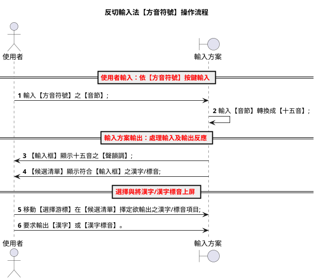

### 1. 輸入【方音符號】之【音節】

使用者自鍵盤，依【音節】之結構，依序輸入：【聲】+【韻】+【調】。

- 【聲】與【韻】為【注音符號按鍵】；
- 【調】為【數字調號按鍵】。

以漢字【忍】為例，在「**反切輸入法【方音符號】**」，應輸入【方音符號】：`ㄌㄨㄣˋ`。

- 聲母（聲）：【ㄌ】，按鍵：【x】
- 韻母（韻）：【ㄨ】、【ㄣ】，按鍵：【j】、【p】
- 聲調（調）：【ˋ】，按鍵：【4】

==《注音符號之調號按鍵》==

| 調號 | 符號按鍵 |    調名     |
| :--: | :------: | :---------: |
|  1   |    :     | 上平 / 陰平 |
|  2   |    4     | 上上 / 陰上 |
|  3   |    3     | 上去 / 陰去 |
|  4   |    [     | 上入 / 陰入 |
|  5   |    6     | 下平 / 陽平 |
|  6   |   (無)   | 下上 / 陽上 |
|  7   |    5     | 下去 / 陽去 |
|  8   |    ]     | 下入 / 陽入 |

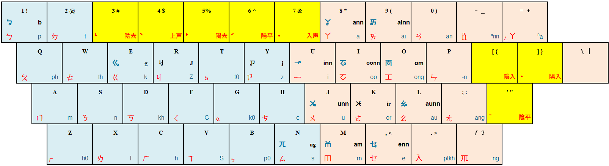

【聲韻調】與【鍵盤按鍵】之完整對照，請參考：

- [090_漢字標音轉換指引.md](./090_漢字標音轉換指引.md) §3 注音鍵盤對映
- [100_閩南語聲韻調對映指引.md](./100_閩南語聲韻調對映指引.md)

### 2. 輸入【音節】轉換成【十五音】

【輸入方案】之 YAML Script（`preedit_format`），負責將鍵盤接收之【按鍵】輸入，循轉換作業，將【方音符號】之【聲母】、【韻母】、【調號】，轉換成【十五音】之【聲母】、【韻母】、【調號】。

#### 方音符號轉換成十五音

- 聲母（聲）：ㄌ ==> 柳
- 韻母（韻）：ㄨㄣ ==> 君
- 聲調（調）：ˋ ==> 二

  | 按鍵 | 方音符號 | 十五音 |
  | :--- | -------- | :----: |
  | x    | ㄌ       |   柳   |
  | jp   | ㄨㄣ     |   君   |
  | 4    | ˋ        |   二   |

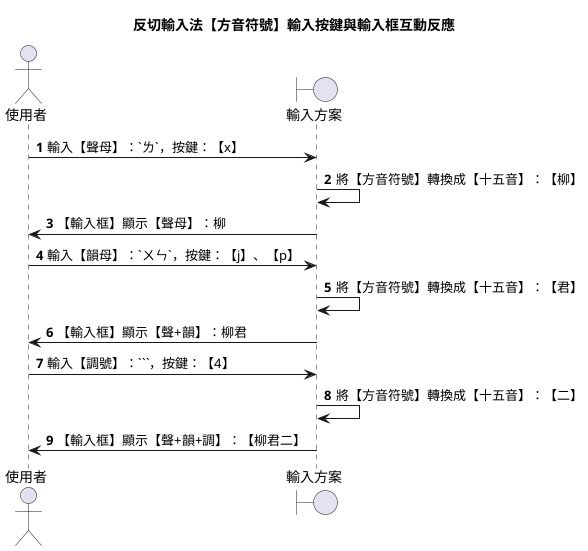

### 3. 【輸入框】顯示十五音之聲韻調

按鍵經 `preedit_format` 處理後，以【十五音】之【聲母】、【韻母】、【調號】，於【輸入框】顯示。

1. 自【鍵盤】，輸入【方音符號】之【聲母】，按鍵：【x】。
2. 【輸入方案】的 `preedit_format`，負責將：`x` → `ㄌ` → `柳`。
3. 【輸入框】顯示：`柳↑`

4. 自【鍵盤】，輸入【方音符號】之【韻母】，按鍵：【j】、【p】。
5. 【輸入框】顯示：`柳君↑`

6. 自【鍵盤】，輸入【方音符號】之【聲調】，按鍵：【4】。
7. 【輸入框】顯示：`柳君二↑`


> 【註】：傳統【十五音】標音，其【音節】結構格式為：**【韻母】+【調號】+【聲母】**。【輸入方案】不在【輸入框】進行處理；改在【候選清單】校調十五音之【音節】格式。**校調作業**則交由【輸入方案】的【插件】：**reformat_comment_filter** 處理。
>
> 當【**輸入方案**】使用【**方音符號**】作為【鍵盤按鍵】時，【忍】字之輸入框為：`【柳君二】`（聲+韻+調）；但【候選清單】左欄之十五音為傳統格式：`【君二柳】`。

### 4. 【候選清單】顯示符合【輸入框】之漢字/標音

【輸入方案】中 `comment_format` 段之 YAML Script，負責將**符合**【輸入框】已取得之輸入，於【候選清單】顯示符合輸入之【漢字】、【十五音】、【方音符號】。

【候選清單】中所顯示之【漢字標音】共有兩種，分別為：

- 左欄：十五音，即：輸入方案使用的【漢字標音】；
- 右欄：方音符號，即：本方案專用之【注音類標音】。

**反切輸入法【方音符號】之候選清單格式**

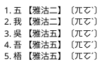

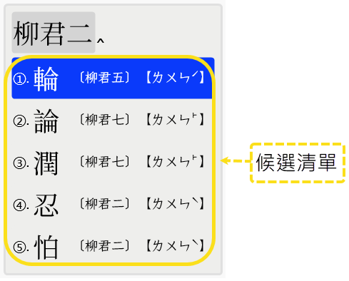

> 【註】：
>
> 1. 在【輸入框】顯示之十五音，其【音節】格式為：**【聲】、【韻】、【調】**；然【候選清單】所顯示之十五音，則為傳統之十五音格式（**【韻】、【調】、【聲】**）。
> 2. 【方音符號】之【音節】結構為：【聲母】+【韻母】+【調符】。

### 5. 移動【選擇游標】決定輸出之漢字/標音

移動【**選擇游標**】，選擇欲輸出之【項目】。

- 每個【候選清單】最多可顯示 5 條項目；
- 每條項目之結構為：【漢字】、【十五音】、【方音符號】。

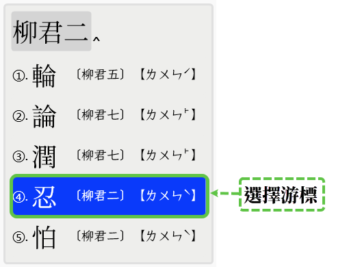

【候選清單】中顯示之項目，可借由【pgup】、【pgdn】、【↑】、【↓】鍵之操作來進行選取。本輸入方案仿 `vim` 編輯器之 **hjkl** 按鍵，亦可用於操作【選擇游標】之移動。

- 翻到上一頁： [ctrl] + [h]
- 翻到下一頁： [ctrl] + [l]
- 移到上一個： [ctrl] + [j]
- 移到下一個： [ctrl] + [k]
- 移到中央處： [ctrl] + [m]
- 移到頂端處： [ctrl] + [/]
- 移到底端處： [ctrl] + [,]

---

### 6. 輸出及上屏

【輸入方案】預設之【輸出】為：【漢字】，使用【按鍵】為：【空白】鍵；若是需要輸出：**【漢字標音】**（如：十五音、方音符號、台語音標...等），則可使用：【**enter**】按鍵。

- [Space] 按鍵：輸出漢字
- [Enter] 按鍵：輸出漢字標音

#### 輸出【漢字】或【漢字標音】

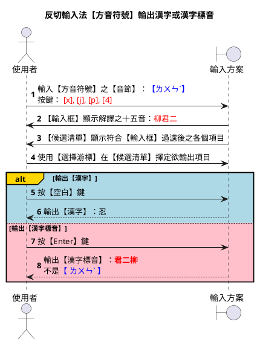

【輸入方案】遇按下【**Enter**】鍵，便依【候選清單】中【選擇游標】擇定之【項目】，輸出【漢字標音音選項】，設定之【漢字標音】。

本方案之【Enter】預設輸出：**十五音**。

若欲變更，可循切換【漢字標音選項】，來進行客製化設定。

#### 輸出快捷鍵

除上述之【空白】、【Enter】鍵外，【輸入方案】可用的全部輸出按鍵，詳述如下：

- `space` → 漢字
- `enter (commit_composition)` → 【漢字標音音選項】，設定之【漢字標音】
- `ctrl+enter (commit_raw_input)` → 【輸入框】接收之【按鍵】輸入
- `shift+enter (commit_script_text)` → 【輸入框】顯示經 `preedit_format` 處理後之結果
- `shift+ctrl+enter (commit_comment)` → 【候選清單】選擇項目顯示之【漢字標音】

輸出【漢字標音】由【輸入方案】之【漢字標音選項】設定。

## 二、切換【漢字標音選項】設定

小狼毫提供【方案方單】介面，供使用者透過圖形介面進行客製設定。使用快捷鍵： **[Ctrl] + [`]** （或改用 **[F4]** 按鍵），便可進行【漢字標音選項】之切換設定。

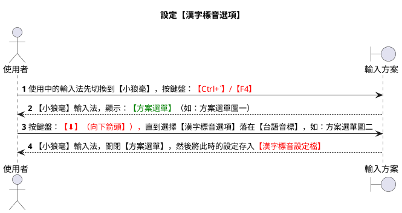

### 【**方案選單圖一**】

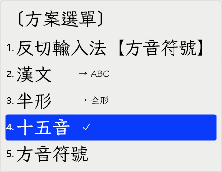

### 【**方案選單圖二**】

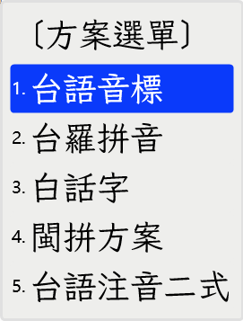

### 【漢字標音設定檔】

在操作情境之【步驟10】之後，螢幕輸出：`啥物〔siann2-mih4〕` ...

1. `【漢字附帶標音】使用的注音/拼音系統依據`：漢字辭彙【啥物】附帶的【漢字拼音】為何使用【台語音標】？原因為【漢字附帶標音設定檔】的設定中，【反切輸入法。方音符號】（huan_ciat_tps）之設定為【tlpa】。

2. `【漢字附帶標音】的左、右分隔符號`：漢字附帶標音：〔siann2-mih4〕，漢字附帶標音的分隔符號：`〔`與`〕`，由【漢字附帶標音設定檔】的 `config.han_ji_piau_im_hu_ho.left` `config.han_ji_piau_im_hu_ho.right` 所定義。

3. 【漢字附帶標音設定檔】在 schema_id 中使用的 value 設定值，需遵循《變更【漢字標音選項】》章節中之定義。

4. 每個【輸入方案】均可定義，其【漢字附帶標音】使用之【注音/拼音系統】。變更設定的方式有兩種：（1）使用【編輯器】直接變更；（2）使用輸入方案【方案選單】之【選項設定】圖形介面。

5. 【辭彙字典檔】中的【辭彙】，若屬【無調號】之【音節】，如：`管理  kuan li`，則...
   - 漢字附帶標音輸出格式為：〔kuan-li〕，即輸入方案不做任何處理，由使用者自行人工補入；
   - 由於標示漢字讀音的【音節】缺乏【調號】，此類【無調號音節】無法供`【標音系統轉換作業】`使用。所以，輸入方案原先可用【漢字標音選項】設定，進行【漢字標音轉換】的功能將無法使用。

存放路徑：

- 開發環境： [ProjectRootDir]\\lua\\rime_env.lua
- 執行環境： [AppDataRootDir]\\Roaming\\Rime\\lua\\rime_env.lua

```lua
local config = {
    -- 輸入法識別號(schema_id)與漢字附帶標音設定
    -- schema_id 可在【輸入方案檔案】（xyz.schema.yaml）中的 schema/schema_id 取得
    -- 設定值採《變更【漢字標音選項】》章節定義之選項名稱（key_in_piau_im_*）
    schema_id = {
        -- 反切輸入法類型
        huan_ciat_tlpa = "key_in_piau_im_tlpa",  -- 預設：台語音標（tlpa）
        huan_ciat_tps = "key_in_piau_im_tlpa",  -- 預設：方音符號（tps）
        -- 注音輸入法類型
        zu_im_bpm2 = "key_in_piau_im_bpm2",  -- 預設：台語注音二式（bpm2）
        zu_im_tlpa = "key_in_piau_im_tlpa_zu_im",  -- 預設：台語音標注音（tlpa_zu_im）
        zu_im_tps = "key_in_piau_im_tps",  -- 預設：方音符號（tps）
        -- 拼音輸入法類型
        phing_im_bp = "key_in_piau_im_bp",  -- 預設：閩拼方案（bp）
        phing_im_bpm2 = "key_in_piau_im_bpm2",  -- 預設：台語注音二式（bpm2）
        phing_im_poj = "key_in_piau_im_poj",  -- 預設：白話字（poj）
        phing_im_tl = "key_in_piau_im_tl",  -- 預設：台羅拼音（tl）
        phing_im_tlpa = "key_in_piau_im_tlpa",  -- 預設：台語音標（tlpa）
    },
    -- 漢字標音用符號
    han_ji_piau_im_hu_ho = {
        left = "〔",  -- 左分隔符號
        right = "〕",  -- 右分隔符號
        im_zat = "-",  -- 音節串接符號，多為【-】或【空白字元】兩種字元
    }
}
```
## 三、輸出快捷按鍵

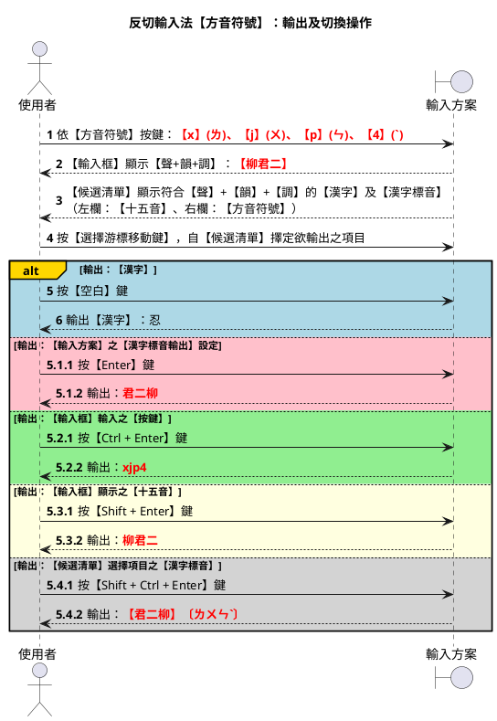

**操作情境說明**：

1. 操作步驟【1-4】：輸入漢字【忍】之【方音符號】按鍵 `xjp4`。
   - 【鍵盤】按鍵：【x】【j】【p】【4】
   - 【輸入框】：`【柳君二】`
   - 【候選清單】：`忍  【君二柳】〔ㄌㄨㄣˋ〕`

2. 按【空白】鍵，輸出漢字：【忍】。

3. 按【Enter】鍵，輸出【漢字標音音選項】指定之【十五音】：`君二柳`。

4. 按【Ctrl + Enter】鍵，輸出原始按鍵：`xjp4`。

5. 按【Shift + Enter】鍵，輸出【輸入框】所見之【十五音】：`柳君二`。

6. 按【Shift + Ctrl + Enter】鍵，輸出：`【君二柳】〔ㄌㄨㄣˋ〕`。

---

## 四、多音節連續輸入處理

漢字為：一字一音，本輸入方案提供【連續輸入】操作方式，供使用者連續輸入多個【音節】，一次完成多個【漢字】輸入。

如【辭彙】：「呑忍」之輸入操作...

| 漢字 | 台語音標 | 十五音標音 | 方音符號 | 按鍵（忍） |
| :--: | :------: | :--------: | :------: | :--------: |
|  呑  |  thun1   |   他君一   |  ㄊㄨㄣ  |     —      |
|  忍  |   lun2   |   柳君二   | ㄌㄨㄣˋ  |    xjp4    |

1. 輸入第一字【呑】之【方音符號】按鍵後，【輸入框】顯示：`【他君一】`。
2. 不按【空白】鍵，接續輸入第二字【忍】：`xjp4`。
3. 【輸入框】顯示：`【他君一 柳君二】`。
4. 按【空白】鍵，輸出漢字：`呑忍`。

---

## 五、輸出漢字附帶標音

- 啥：sinna2 = s + iann + 2 = ㄒ + ㄧㆩ ==》按鍵： `v` + (`u` + `*`)
- 物：mih4 = m + ih + 4 = ㄇ + ㄧㆷ ==》按鍵： `a` + (`u` + `z`)

使用輸入法的【辭彙輸入方式】，欲輸出【漢字】：【啥物】（國語：什麼），且需附帶【漢字標音】，如：啥物［siann2-mih4］。

### 操作情境

以下之操作情境係基於：使用者已先完成章節《**二、切換【漢字標音選項】設定**》，將【漢字標音選項】設定成：【台語音標】（TLPA）。

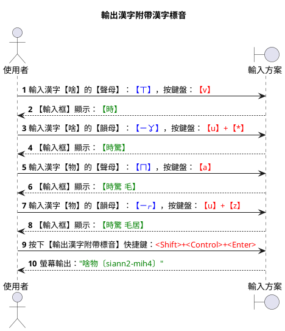

### 【辭彙字典檔】

操作情境在【步驟1/3/5/7】，能以【方音符號】輸入漢字辭彙的原因，憑借的是`【漢字辭彙字典檔】`中的設定。

關於`【漢字辭彙字典檔】`的檔案格式及特性，說明如下：

1. 字典檔使用之羅馬拼音系統共兩套：
   - TL：台羅拼音（注音：台羅拼音（TL）與台語音標（TLPA），看似相似，卻是兩套羅馬拼音系統）
   - BPM2：台語注音二式

2. 辭彙中標音漢字讀音的【音節】格式有兩種：
   - **全音節**：聲母 + 韻母 + 調號 ，如：辭彙【符號】之讀音使用 2 個【全音節】=【hu5 ho7】
   - **無調號簡化音節**：聲母 + 韻母，如：辭彙【符號】之讀音使用 2 個【無調號音節】=【hu ho】

#### 全音節辭彙字典檔範例

```yaml
# Rime dictionary
# encoding: utf-8
#
# 閩南語白話音漢字正字
#
---
name: ji_khoo_ziann_ji
version: "v0.1.0"
sort: by_weight
use_preset_vocabulary: false
columns:
  - text # 漢字
  - code # 台灣音標（TLPA）拼音
  - weight # 常用度（優先顯示度）
  - stem # 用法舉例
  - create # 建立時間
...
叫是	kio3 si7	0.60 	以為是	2026-07-05 11:18
啥物	siann2 mih4	0.60 	什麼	2026-07-05 11:18
```

#### 無調號音節辭彙字典檔範例

```yaml
# Rime ditstionary
# entsoding: utf-8
#
# Hokkien - 閩南語
#
#   阿托 <a-thok@outlook.tsom>
#
# 費神下底所列:
#
# * 百度 閩南語吧 (著重感謝lyf6499佮星期绿)
#   http://tieba.baidu.tsom/f?kw=%ts3%F6%ts4%tsF%D3%EF
#
# * 林建輝 Lim Kianhui
#   http://www.hokkienese.tsom/
#
# * 閩南語正字促進會
#   http://site.douban.tsom/108149/ (QQ群 22637566)
#
# * 「閩客語典藏」 - 台日大詞典
#   http://taigi.fhl.net/ditst/
#
# * 黃晉波 - 當代泉州音字彙
#   http://solution.tss.utsla.edu/~jinbo/dzl/
#
# * 臺灣教育部 - 台灣閩南語常用詞辭典
#   http://twblg.ditst.edu.tw/holoditst_new/default.jsp
#

---
name: banlam
version: "1.6"
sort: by_weight
use_preset_votsabulary: false
...
##	a/ah
啊	a0
啊	ah0
矣	ah0
阿	a1	10
鴉	a1
......
管理	kuan li
管理員	kuan li uan
管錢	kuan tsinn
管樂	kuan gak
管絃	kuan hian
管家	kuan ke
管家婆	kuan ke po
管區	kuan khu
管顧	kuan koo
管數	kuan siau
管束	kuan sok
管待	kuan thai
管教	kuan ka
管道	kuan to
管道	kuan toO
管制	kuan tse
......
```

### 【輸入框】與【候選字清單】

完成操作情境之【步驟7】後，此時之【輸入框】與【候選字清單】顯示，大致如下所示：

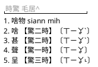

### 【漢字附帶標音設定檔】

在操作情境之【步驟10】之後，螢幕輸出：`啥物〔siann2-mih4〕` ...

1. `【漢字附帶標音】使用的注音/拼音系統依據`：漢字辭彙【啥物】附帶的【漢字拼音】為何使用【台語音標】？原因為【漢字附帶標音設定檔】的設定中，【反切輸入法。方音符號】（huan_ciat_tps）之設定為【tlpa】。

2. `【漢字附帶標音】的左、右分隔符號`：漢字附帶標音：〔siann2-mih4〕，漢字附帶標音的分隔符號：`〔`與`〕`，由【漢字附帶標音設定檔】的 `config.han_ji_piau_im_hu_ho.left` `config.han_ji_piau_im_hu_ho.right` 所定義。

3. 【漢字附帶標音設定檔】在 schema_id 中使用的 value 設定值，需遵循《變更【漢字標音選項】》章節中之定義。

4. 每個【輸入方案】均可定義，其【漢字附帶標音】使用之【注音/拼音系統】。變更設定的方式有兩種：（1）使用【編輯器】直接變更；（2）使用輸入方案【方案選單】之【選項設定】圖形介面。

5. 【辭彙字典檔】中的【辭彙】，若屬【無調號】之【音節】，如：`管理  kuan li`，則...
   - 漢字附帶標音輸出格式為：〔kuan-li〕，即輸入方案不做任何處理，由使用者自行人工補入；
   - 由於標示漢字讀音的【音節】缺乏【調號】，此類【無調號音節】無法供`【標音系統轉換作業】`使用。所以，輸入方案原先可用【漢字標音選項】設定，進行【漢字標音轉換】的功能將無法使用。

存放路徑：

- 開發環境： [ProjectRootDir]\\lua\\rime_env.lua
- 執行環境： [AppDataRootDir]\\Roaming\\Rime\\lua\\rime_env.lua

```lua
local config = {
    -- 輸入法識別號(schema_id)與漢字附帶標音設定
    -- schema_id 可在【輸入方案檔案】（xyz.schema.yaml）中的 schema/schema_id 取得
    -- 設定值採《變更【漢字標音選項】》章節定義之選項名稱（key_in_piau_im_*）
    schema_id = {
        -- 反切輸入法類型
        huan_ciat_tlpa = "key_in_piau_im_tlpa",  -- 預設：台語音標（tlpa）
        huan_ciat_tps = "key_in_piau_im_tlpa",  -- 預設：方音符號（tps）
        -- 注音輸入法類型
        zu_im_bpm2 = "key_in_piau_im_bpm2",  -- 預設：台語注音二式（bpm2）
        zu_im_tlpa = "key_in_piau_im_tlpa_zu_im",  -- 預設：台語音標注音（tlpa_zu_im）
        zu_im_tps = "key_in_piau_im_tps",  -- 預設：方音符號（tps）
        -- 拼音輸入法類型
        phing_im_bp = "key_in_piau_im_bp",  -- 預設：閩拼方案（bp）
        phing_im_bpm2 = "key_in_piau_im_bpm2",  -- 預設：台語注音二式（bpm2）
        phing_im_poj = "key_in_piau_im_poj",  -- 預設：白話字（poj）
        phing_im_tl = "key_in_piau_im_tl",  -- 預設：台羅拼音（tl）
        phing_im_tlpa = "key_in_piau_im_tlpa",  -- 預設：台語音標（tlpa）
    },
    -- 漢字標音用符號
    han_ji_piau_im_hu_ho = {
        left = "〔",  -- 左分隔符號
        right = "〕",  -- 右分隔符號
        im_zat = "-",  -- 音節串接符號，多為【-】或【空白字元】兩種字元
    }
}
```

---

## 輸入方案設計規範

以下說明本輸入方案：如何於**中州韻(rime)輸入法平台**，實作【輸入方案】之規範。

- 識別代碼：**`huan_ciat_tps`**
- 檔案名稱：**`huan_ciat_tps.schema.yaml`**

### 主要操作情境

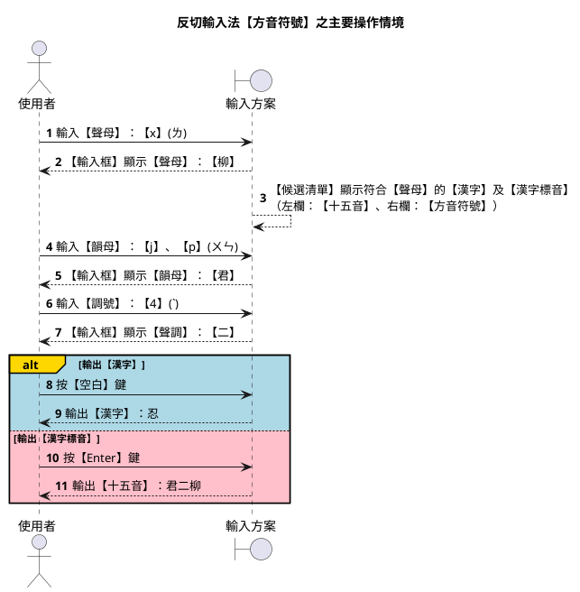

### 字典輸入與輸入方案編碼

`字典檔（.dict.yaml）`採用【漢字拼音法】之【台羅拼音】（`ji_khoo_tl`）。

由於輸入方案底層核心仍為【台語音標】（TLPA+），故自【字典檔】讀入之【聲】、【韻】、【調】等【音節】資料，需進行【編碼轉換】。轉換要點請參考 [090_漢字標音轉換指引.md](./090_漢字標音轉換指引.md) §2.1 及 [310_反切輸入法【台語音標】設計規格.md](./310_反切輸入法【台語音標】設計規格.md)「字典輸入與輸入方案編碼」一節。

`台羅拼音轉台語音標作業要點`

| 台羅拼音 | tlpa | tlpa+ |
| :------- | :--- | :---- |
| tsh      | ch   | c     |
| ts       | c    | z     |

| 台羅拼音 | 台語音標 |
| :------- | :------- |
| onn      | oonn     |

### 候選清單

#### 修正左欄：【十五音】音節結構

【候選清單】在【左欄】顯示之【十五音】，由 `comment_format`（`lib_comment_sni_and_tps`）負責産出，並經 **`reformat_comment_filter`** 將音節格式由【聲+韻+調】校調為傳統【韻+調+聲】。

【**例**】：忍【lun2】
--> [ l + un + 2 ]
--> 【 柳+君+二 】
--> 【 柳君二 】（輸入框）
--> 【 君二柳 】（候選清單左欄）

#### 使用插件：lua_filter@reformat_comment_filter

```yaml
engine:
  filters:
    - lua_filter@reformat_comment_filter
```

### 變更【漢字標音選項】

| 輸入方案                   | Enter 預設輸出 |
| -------------------------- | -------------- |
| 反切輸入法【台語音標】     | 十五音         |
| 反切輸入法【方音符號】     | 十五音         |
| 注音輸入法【方音符號】     | 方音符號       |
| 注音輸入法【台語注音符號】 | 台語注音符號   |

#### 指定使用之 Lua 插件

```yaml
engine:
  processors:
    - lua_processor@aux_commit
    - lua_processor@jump_select
```

#### 設置輸入方案使用之選項

```yaml
switches:
  # 【漢字標音選項】可供選用之項目
  # reset: 0 → 預設 → 十五音
  - options:
      [
        key_in_piau_im_sni,
        key_in_piau_im_tps,
        key_in_piau_im_tlpa,
        key_in_piau_im_tlpa_zu_im,
        key_in_piau_im_tl,
        key_in_piau_im_poj,
        key_in_piau_im_bp,
        key_in_piau_im_bpm2,
        key_in_piau_im_ipa,
      ]
    reset: 0
    states:
      [
        十五音,
        方音符號,
        台語音標,
        台語音標注音,
        台羅拼音,
        白話字,
        閩拼方案,
        台語注音二式,
        國際音標,
      ]
```

#### 輸入方案【editor】設定

```yaml
editor:
  bindings:
    Return: commit_composition # 【漢字標音音選項】設定
    Control+Return: commit_raw_input # 【鍵盤按鍵】：xjp4
    Shift+Return: commit_script_text # 【輸入框】：柳君二
    # Control+Shift+Return 不綁定 editor 功能：
    # 由 lua_processor@aux_commit 攔截，輸出【漢字附帶標音】（如：啥物〔siann2-mih4〕）
```

---

## 輸入方案/字典編碼/候選清單左/右欄對照

| 類別 | 輸入方案名稱           | 漢字標音法 | 字典編碼 | 鍵盤按鍵 | 輸入框 | 候選清單左欄 | 候選清單右欄 |
| ---- | ---------------------- | ---------- | -------- | -------- | ---------- | ------------ | ------------ |
| 反切 | 反切輸入法【台語音標】 | 十五音     | 台羅拼音 | lo\      | 柳君二     | 君二柳       | lo2          |
| 反切 | 反切輸入法【方音符號】 | 十五音     | 台羅拼音 | xjp4     | 柳君二     | 君二柳       | ㄌㄨㄣˋ      |

> 漢字：【老】...
>
> - 台語音標：lo2
> - 十五音：高二柳
> - 方音符號：ㄌㄜˋ

### 雙欄式【候選清單】格式摘要

#### 反切類輸入法（huan_ciat_*.schema.yaml）

兩欄式【候選清單】格式：
【傳統十五音】〔字典編碼使用之漢字標音（台語音標/方音符號）〕

- `huan_ciat_tlpa` ==> 【十五音】〔台語音標〕
- `huan_ciat_tps` ==> 【十五音】〔方音符號〕

---

## 漢字標音轉換對照

聲母、韻母、聲調之完整對照表，請參考：

- [090_漢字標音轉換指引.md](./090_漢字標音轉換指引.md)
- [100_閩南語聲韻調對映指引.md](./100_閩南語聲韻調對映指引.md)

### 字典編碼/鍵盤按鍵/注音符號對照（摘要）

以下摘錄本輸入方案常用之【聲母】對映；完整表見 [090_漢字標音轉換指引.md](./090_漢字標音轉換指引.md) §3.1。

| 台羅拼音 | 字典編碼 | 鍵盤按鍵 | 注音符號 |
| -------- | -------- | -------- | -------- |
| l        | l        | x        | ㄌ       |
| un       | un       | jp       | ㄨㄣ     |
| 2        | 2        | 4        | ˋ        |
| p        | p        | 1        | ㄅ       |
| ph       | P        | q        | ㄆ       |
| ts       | z        | y        | ㄗ       |
| tsh      | c        | h        | ㄘ       |

---
## 參考用補述

### 反切輸入法【方音符號】操作流程

```plantuml
@startuml
skinparam shadowing false

title 反切輸入法【方音符號】操作流程

start
:輸入【方音符號】之【音節】;
:輸入【音節】轉換成【十五音】;
:【輸入框】顯示十五音之【聲韻調】;
:【候選清單】顯示符合【輸入框】之漢字/標音;
:移動【選擇游標】決定輸出之漢字/標音;
stop

@enduml
````

### 相關文件

| 文件                                                                                     | 說明                               |
| ---------------------------------------------------------------------------------------- | ---------------------------------- |
| [310_反切輸入法【台語音標】設計規格.md](./310_反切輸入法【台語音標】設計規格.md)         | 反切類共用操作與輸出規格           |
| [330_注音輸入法【台語注音符號】設計規格.md](./330_注音輸入法【台語注音符號】設計規格.md) | 同鍵盤、不同候選清單格式之注音方案 |
| [110_漢字標音輸出規格.md](./110_漢字標音輸出規格.md)                                     | Enter 輸出與方案選項               |
| [130_雙欄式候選清單架構與除錯總結.md](./130_雙欄式候選清單架構與除錯總結.md)             | comment_format 與 Lua filter 分工  |

---


## 10. 輸出漢字帶標音

### 操作情境

使用輸入法的【辭彙輸入方式】，欲輸出【漢字】：【啥物】（國語：什麼），且需附帶【漢字標音】，如：啥物［siann2-mih4］。

- 啥：sinna2 = s + iann + 2 = ㄒ + ㄧㆩ ==》按鍵： `v` + (`u` + `*`)
- 物：mih4 = m + ih + 4 = ㄇ + ㄧㆷ ==》按鍵： `a` + (`u` + `z`)

```plantuml
@startuml
title 輸出漢字附帶漢字標音
actor 使用者 as user
boundary 輸入方案 as ime
autonumber

user -> ime : 輸入漢字【啥】的【聲母】：<color:blue>【ㄒ】<color:black>，按鍵盤：<color:red>【v】
ime --> user : 【輸入框】顯示：<color:green>【時】

user -> ime : 輸入漢字【啥】的【韻母】：<color:blue>【ㄧㆩ】<color:black>，按鍵盤：<color:red>【u】+【*】
ime --> user : 【輸入框】顯示：<color:green>【時驚】

user -> ime : 輸入漢字【物】的【聲母】：<color:blue>【ㄇ】<color:black>，按鍵盤：<color:red>【a】
ime --> user : 【輸入框】顯示：<color:green>【時驚 毛】

user -> ime : 輸入漢字【物】的【韻母】：<color:blue>【ㄧㆷ】<color:black>，按鍵盤：<color:red>【u】+【z】
ime --> user : 【輸入框】顯示：<color:green>【時驚 毛居】

user -> ime : 按下【輸出漢字附帶標音】快捷鍵：<color:red><Shift>+<Control>+<Enter>
ime --> user : 螢幕輸出：<color:green>"啥物〔siann2-mih4〕"

@enduml
```

### 【辭彙字典檔】

操作情境在【步驟1/3/5/7】，能以【方音符號】輸入漢字辭彙的原因，憑借的是`【漢字辭彙字典檔】`中的設定。

關於`【漢字辭彙字典檔】`的檔案格式及特性，說明如下：

1. 字典檔使用之羅馬拼音系統共兩套：
   - TL：台羅拼音（注音：台羅拼音（TL）與台語音標（TLPA），看似相似，卻是兩套羅馬拼音系統）
   - BPM2：台語注音二式

2. 辭彙中標音漢字讀音的【音節】格式有兩種：
   - **全音節**：聲母 + 韻母 + 調號 ，如：辭彙【符號】之讀音使用 2 個【全音節】=【hu5 ho7】
   - **無調號簡化音節**：聲母 + 韻母，如：辭彙【符號】之讀音使用 2 個【無調號音節】=【hu ho】

#### 全音節辭彙字典檔範例

```yaml
# Rime dictionary
# encoding: utf-8
#
# 閩南語白話音漢字正字
#
---
name: ji_khoo_ziann_ji
version: "v0.1.0"
sort: by_weight
use_preset_vocabulary: false
columns:
  - text # 漢字
  - code # 台灣音標（TLPA）拼音
  - weight # 常用度（優先顯示度）
  - stem # 用法舉例
  - create # 建立時間
...
叫是	kio3 si7	0.60 	以為是	2026-07-05 11:18
啥物	siann2 mih4	0.60 	什麼	2026-07-05 11:18
```

#### 無調號音節辭彙字典檔範例

```yaml
# Rime ditstionary
# entsoding: utf-8
#
# Hokkien - 閩南語
#
#   阿托 <a-thok@outlook.tsom>
#
# 費神下底所列:
#
# * 百度 閩南語吧 (著重感謝lyf6499佮星期绿)
#   http://tieba.baidu.tsom/f?kw=%ts3%F6%ts4%tsF%D3%EF
#
# * 林建輝 Lim Kianhui
#   http://www.hokkienese.tsom/
#
# * 閩南語正字促進會
#   http://site.douban.tsom/108149/ (QQ群 22637566)
#
# * 「閩客語典藏」 - 台日大詞典
#   http://taigi.fhl.net/ditst/
#
# * 黃晉波 - 當代泉州音字彙
#   http://solution.tss.utsla.edu/~jinbo/dzl/
#
# * 臺灣教育部 - 台灣閩南語常用詞辭典
#   http://twblg.ditst.edu.tw/holoditst_new/default.jsp
#

---
name: banlam
version: "1.6"
sort: by_weight
use_preset_votsabulary: false
...
##	a/ah
啊	a0
啊	ah0
矣	ah0
阿	a1	10
鴉	a1
......
管理	kuan li
管理員	kuan li uan
管錢	kuan tsinn
管樂	kuan gak
管絃	kuan hian
管家	kuan ke
管家婆	kuan ke po
管區	kuan khu
管顧	kuan koo
管數	kuan siau
管束	kuan sok
管待	kuan thai
管教	kuan ka
管道	kuan to
管道	kuan toO
管制	kuan tse
......
```

### 【輸入框】與【候選字清單】

完成操作情境之【步驟7】後，此時之【輸入框】與【候選字清單】顯示，大致如下所示：


### 【漢字附帶標音設定檔】

在操作情境之【步驟10】之後，螢幕輸出：`啥物〔siann2-mih4〕` ...

1. `【漢字附帶標音】使用的注音/拼音系統依據`：漢字辭彙【啥物】附帶的【漢字拼音】為何使用【台語音標】？原因為【漢字附帶標音設定檔】的設定中，【反切輸入法。方音符號】（huan_ciat_tps）之設定為【tlpa】。

2. `【漢字附帶標音】的左、右分隔符號`：漢字附帶標音：〔siann2-mih4〕，漢字附帶標音的分隔符號：`〔`與`〕`，由【漢字附帶標音設定檔】的 `config.han_ji_piau_im_hu_ho.left` `config.han_ji_piau_im_hu_ho.right` 所定義。

3. 每個【輸入方案】均可定義，其【漢字附帶標音】使用之【注音/拼音系統】。變更設定的方式有兩種：（1）使用【編輯器】直接變更；（2）使用輸入方案【方案選單】之【選項設定】圖形介面。的客製設定按鍵

存放路徑：

- 開發環境： [ProjectRootDir]\\lua\\rime_env.lua
- 執行環境： [AppDataRootDir]\\Roaming\\Rime\\lua\\rime_env.lua

````yaml
local config = {
    -- 輸入法識別號(schema_id)與漢字附帶標音設定
    -- schema_id 可在【輸入方案檔案】（xyz.schema.yaml）中的 schema/schema_id 取得
    -- 設定值採《變更【漢字標音選項】》章節定義之選項名稱（key_in_piau_im_*）
    schema_id = {
        -- 反切輸入法類型
        huan_ciat_tlpa = "key_in_piau_im_tlpa",  -- 預設：台語音標（tlpa）
        huan_ciat_tps = "key_in_piau_im_tlpa",  -- 預設：方音符號（tps）
        -- 注音輸入法類型
        zu_im_bpm2 = "key_in_piau_im_bpm2",  -- 預設：台語注音二式（bpm2）
        zu_im_tlpa = "key_in_piau_im_tlpa_zu_im",  -- 預設：台語音標注音（tlpa_zu_im）
        zu_im_tps = "key_in_piau_im_tps",  -- 預設：方音符號（tps）
        -- 拼音輸入法類型
        phing_im_bp = "key_in_piau_im_bp",  -- 預設：閩拼方案（bp）
        phing_im_bpm2 = "key_in_piau_im_bpm2",  -- 預設：台語注音二式（bpm2）
        phing_im_poj = "key_in_piau_im_poj",  -- 預設：白話字（poj）
        phing_im_tl = "key_in_piau_im_tl",  -- 預設：台羅拼音（tl）
        phing_im_tlpa = "key_in_piau_im_tlpa",  -- 預設：台語音標（tlpa）
    },
    -- 漢字標音用符號
    han_ji_piau_im_hu_ho = {
        left = "〔",  -- 左分隔符號
        right = "〕",  -- 右分隔符號
        im_zat = "-",  -- 音節串接符號，多為【-】或【空白字元】兩種字元
    }
}


---

## 輸入方案設計規範

以下說明本輸入方案：如何於**中州韻(rime)輸入法平台**，實作【輸入方案】之規範。

- 識別代碼：**`huan_ciat_tps`**
- 檔案名稱：**`huan_ciat_tps.schema.yaml`**

### 主要操作情境


### 字典輸入與輸入方案編碼

`字典檔（.dict.yaml）`採用【漢字拼音法】之【台羅拼音】（`ji_khoo_tl`）。

由於輸入方案底層核心仍為【台語音標】（TLPA+），故自【字典檔】讀入之【聲】、【韻】、【調】等【音節】資料，需進行【編碼轉換】。轉換要點請參考 [090_漢字標音轉換指引.md](./090_漢字標音轉換指引.md) §2.1 及 [310_反切輸入法【台語音標】設計規格.md](./310_反切輸入法【台語音標】設計規格.md)「字典輸入與輸入方案編碼」一節。

`台羅拼音轉台語音標作業要點`

| 台羅拼音 | tlpa | tlpa+ |
| :------- | :--- | :---- |
| tsh      | ch   | c     |
| ts       | c    | z     |

| 台羅拼音 | 台語音標 |
| :------- | :------- |
| onn      | oonn     |

### 候選清單

#### 修正左欄：【十五音】音節結構

【候選清單】在【左欄】顯示之【十五音】，由 `comment_format`（`lib_comment_sni_and_tps`）負責産出，並經 **`reformat_comment_filter`** 將音節格式由【聲+韻+調】校調為傳統【韻+調+聲】。

【**例**】：忍【lun2】
--> [ l + un + 2 ]
--> 【 柳+君+二 】
--> 【 柳君二 】（輸入框）
--> 【 君二柳 】（候選清單左欄）

#### 使用插件：lua_filter@reformat_comment_filter

```yaml
engine:
  filters:
    - lua_filter@reformat_comment_filter
```

### 變更【漢字標音音選項】

| 輸入方案                   | Enter 預設輸出 |
| -------------------------- | -------------- |
| 反切輸入法【台語音標】     | 十五音         |
| 反切輸入法【方音符號】     | 十五音         |
| 注音輸入法【方音符號】     | 方音符號       |
| 注音輸入法【台語注音符號】 | 台語注音符號   |

#### 指定使用之 Lua 插件

```yaml
engine:
  processors:
    - lua_processor@aux_commit
    - lua_processor@jump_select
```

#### 設置輸入方案使用之選項

```yaml
switches:
  # 【漢字標音】輸出選項
  # reset: 0 → 預設 → 十五音
  - options:
      [
        key_in_piau_im_sni,
        key_in_piau_im_tps,
        key_in_piau_im_tlpa,
        key_in_piau_im_tl,
        key_in_piau_im_poj,
        key_in_piau_im_bp,
        key_in_piau_im_bpm2,
        key_in_piau_im_ipa,
      ]
    reset: 0
    states:
      [
        十五音,
        方音符號,
        台語音標,
        台羅拼音,
        白話字,
        閩拼方案,
        台語注音二式,
        國際音標,
      ]
```

#### 輸入方案【editor】設定

```yaml
editor:
  bindings:
    Return: commit_composition # 【漢字標音音選項】設定
    Control+Return: commit_raw_input # 【鍵盤按鍵】：xjp4
    Shift+Return: commit_script_text # 【輸入框】：柳君二
    # Control+Shift+Return 不綁定 editor 功能：
    # 由 lua_processor@aux_commit 攔截，輸出【漢字附帶標音】（如：啥物〔siann2-mih4〕）
```

---

## 輸入方案/字典編碼/候選清單左/右欄對照

| 類別 | 輸入方案名稱           | 漢字標音法 | 字典編碼 | 鍵盤按鍵 | 輸入框 | 候選清單左欄 | 候選清單右欄 |
| ---- | ---------------------- | ---------- | -------- | -------- | ---------- | ------------ | ------------ |
| 反切 | 反切輸入法【台語音標】 | 十五音     | 台羅拼音 | lo\      | 柳君二     | 君二柳       | lo2          |
| 反切 | 反切輸入法【方音符號】 | 十五音     | 台羅拼音 | xjp4     | 柳君二     | 君二柳       | ㄌㄨㄣˋ      |

> 漢字：【老】...
>
> - 台語音標：lo2
> - 十五音：高二柳
> - 方音符號：ㄌㄜˋ

### 雙欄式【候選清單】格式摘要

#### 反切類輸入法（huan_ciat_*.schema.yaml）

兩欄式【候選清單】格式：
【傳統十五音】〔字典編碼使用之漢字標音（台語音標/方音符號）〕

- `huan_ciat_tlpa` ==> 【十五音】〔台語音標〕
- `huan_ciat_tps` ==> 【十五音】〔方音符號〕

---

## 漢字標音轉換對照

聲母、韻母、聲調之完整對照表，請參考：

- [090_漢字標音轉換指引.md](./090_漢字標音轉換指引.md)
- [100_閩南語聲韻調對映指引.md](./100_閩南語聲韻調對映指引.md)

### 字典編碼/鍵盤按鍵/注音符號對照（摘要）

以下摘錄本輸入方案常用之【聲母】對映；完整表見 [090_漢字標音轉換指引.md](./090_漢字標音轉換指引.md) §3.1。

| 台羅拼音 | 字典編碼 | 鍵盤按鍵 | 注音符號 |
| -------- | -------- | -------- | -------- |
| l        | l        | x        | ㄌ       |
| un       | un       | jp       | ㄨㄣ     |
| 2        | 2        | 4        | ˋ        |
| p        | p        | 1        | ㄅ       |
| ph       | P        | q        | ㄆ       |
| ts       | z        | y        | ㄗ       |
| tsh      | c        | h        | ㄘ       |

---

---
## 參考用補述

### 反切輸入法【方音符號】操作流程

```plantuml
@startuml
skinparam shadowing false

title 反切輸入法【方音符號】操作流程

start
:輸入【方音符號】之【音節】;
:輸入【音節】轉換成【十五音】;
:【輸入框】顯示十五音之【聲韻調】;
:【候選清單】顯示符合【輸入框】之漢字/標音;
:移動【選擇游標】決定輸出之漢字/標音;
stop

@enduml
````
