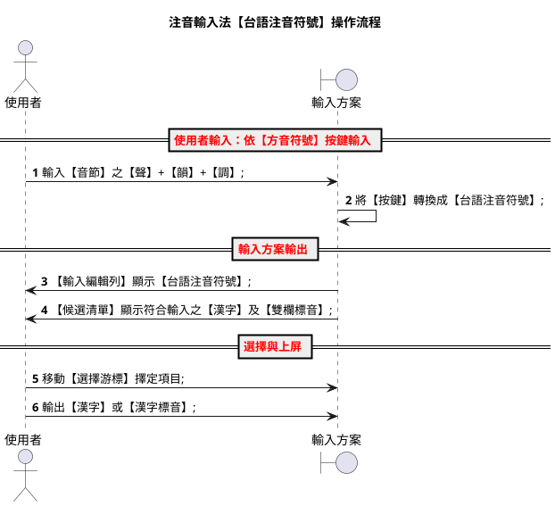
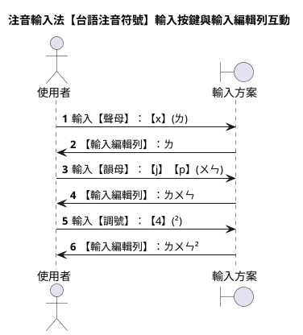
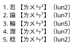
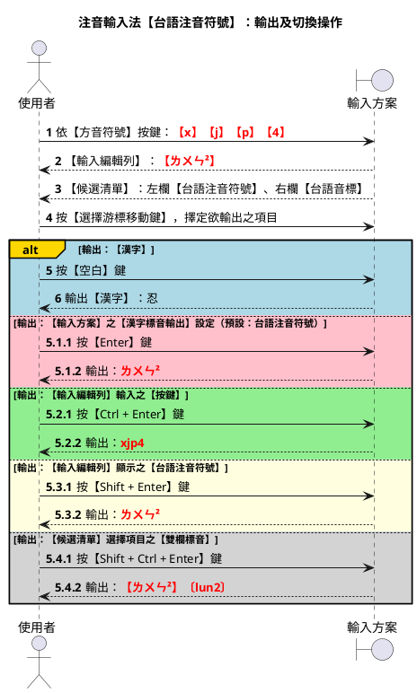
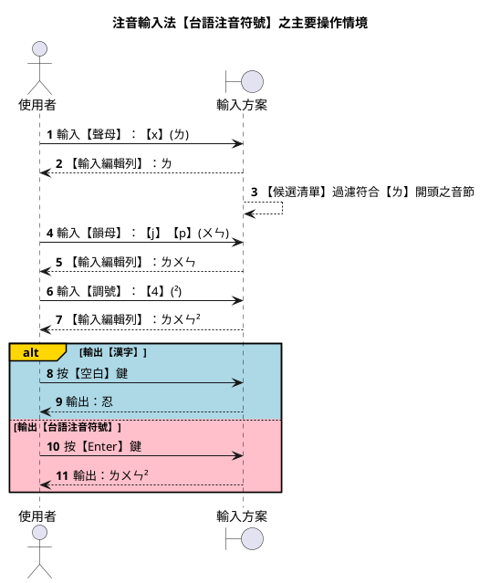
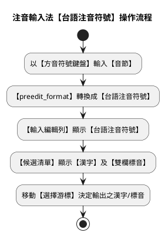

# 注音輸入法【台語注音符號】設計規格

`版本：V0.1.0.8`

---

## 摘要

### 特性說明

- 【輸入類型】：注音輸入法（改良之【台語注音符號】，非反切）
- 【字典標準】：採漢字拼音法之【台羅拼音】，底層核心為【台語音標】（TLPA+）
- 【按鍵編碼】：以【方音符號鍵盤】輸入，與反切【方音符號】方案共用同一套按鍵對映
- 【輸入編輯列】：顯示【台語注音符號】（含【上標調號】數值格式）
- 【候選清單】：採【雙欄】顯示
  1. 左欄為【台語注音符號】（`【】` 括號）
  2. 右欄為【台語音標】（`〔〕` 括號，字典編碼）
- 【輸出類型】：
  1. 可輸出漢字
  2. 亦可輸出多種之【漢字標音】

        漢字：【老】...
        - 台語注音符號：ㄌㄜ²
        - 台語音標：lo2
        - 方音符號：ㄌㄜˋ
        - 十五音：高二柳
        - 台羅拼音：ló

> #### 【漢字標音法及英文簡稱】
>
> |英文簡稱|漢字標音法  |注音/拼音範例|
> |--------|------------|--------------|
> |tlpa_tps|台語注音符號|ㄌㄜ²         |
> |tlpa    |台語音標    |lo2           |
> |tps     |方音符號    |ㄌㄜˋ         |
> |sni     |十五音      |高二柳        |
> |tl      |台羅拼音    |ló            |
> |bpm2    |台語注音二式|lor2          |
> |poj     |白話字      |ló            |
> |bp      |閩拼方案    |lǒ            |
> |ipa     |國際音標    |lɔ²           |

### 與相關注音方案之差異

| 項目           | 330 台語注音符號 (`zu_im_tlpa`) | 注音【方音符號】(`zu_im_tps`) | 反切【方音符號】(`huan_ciat_tps`) |
| -------------- | ------------------------------- | ----------------------------- | --------------------------------- |
| 輸入法類別     | 注音                            | 注音                          | 反切（十五音）                    |
| 輸入編輯列     | 台語注音符號（上標調號）        | 方音符號（方音調符）          | 十五音（聲+韻+調）                |
| 候選左欄       | 台語注音符號                    | 方音符號                      | 十五音                            |
| 候選右欄       | 台語音標                        | 台語音標                      | 方音符號                          |
| Enter 預設     | 台語注音符號                    | 方音符號                      | 十五音                            |

【台語注音符號】與【方音符號】之主要差異：

- 【台語注音符號】：調號以【上標數值】標示（如 `¹`、`²`）；部分聲母、韻母採 TLPA 改良寫法（如 `ㄪ`、`⁰ㄫ`、`ㄝ`、`ㄛ`）。
- 【方音符號】：調號以【方音調符】標示（如 `ˋ`、`ˊ`、`˫`）；採吳守禮《台語方音符號》標準。

詳細轉換規則請參考 [090_漢字標音轉換指引.md](./090_漢字標音轉換指引.md) 聲母、韻母對映表中之【台語注音】欄。

---

## 操作情境

以漢字【忍】為例，說明本輸入方案如何以【方音符號鍵盤】輸入 `x`、`j`、`p`、`4`（即 `ㄌㄨㄣˋ`），於【輸入編輯列】顯示【台語注音符號】，並於【候選清單】列出【漢字】及其標音。

- 聲母（聲）：ㄌ  →  ㄌ
- 韻母（韻）：ㄨㄣ  →  ㄨㄣ
- 聲調（調）：2  →  ²（上標）



### 1. 輸入【音節】

使用者自鍵盤，依【音節】之結構，依序輸入：【聲】+【韻】+【調】。

- 【聲】與【韻】為【注音符號按鍵】；
- 【調】為【數字調號按鍵】。

以漢字【忍】為例：

- 聲母（聲）：【ㄌ】，按鍵：【x】
- 韻母（韻）：【ㄨ】、【ㄣ】，按鍵：【j】、【p】
- 聲調（調）：【2】，按鍵：【4】

==《注音符號之調號按鍵》==

|調號|符號按鍵|調名|台語注音符號顯示|
|:--:|:--:|:--:|:--:|
| 1 |:	 |上平 / 陰平|¹（或略）|
| 2 |4	 |上上 / 陰上|²|
| 3 |3	 |上去 / 陰去|³|
| 4 |[	 |上入 / 陰入|⁴（或略）|
| 5 |6	 |下平 / 陽平|⁵|
| 6 |(無)|下上 / 陽上|⁶|
| 7 |5	 |下去 / 陽去|⁷|
| 8 |]	 |下入 / 陽入|⁸|


【聲韻調】與【鍵盤按鍵】之完整對照，請參考：

- [090_漢字標音轉換指引.md](./090_漢字標音轉換指引.md) §3 注音鍵盤對映
- [100_閩南語聲韻調對映指引.md](./100_閩南語聲韻調對映指引.md)

### 2. 【輸入編輯列】顯示【台語注音符號】

【輸入方案】之 `preedit_format`，負責將鍵盤【按鍵】轉換成【台語注音符號】，並將【調號】格式化為【上標數值】。

#### 輸入按鍵與輸入編輯列互動

| 步驟 | 按鍵 | 中間（注音鍵） | 輸入編輯列 |
|:----:|:----:|:--------------:|:----------:|
| 1    | x    | ㄌ             | ㄌ↑        |
| 2    | jp   | ㄨㄣ           | ㄌㄨㄣ↑    |
| 3    | 4    | ²              | ㄌㄨㄣ²↑   |



【註】：【台語注音符號】之【鼻化韻母】，以【前綴 `⁰`】標示（如 `⁰ㄧ`、`⁰ㄚ`）；可用【-】鍵輸入【ㄥ】前綴，或連續輸入兩次元音韻母達成鼻化。

### 3. 【候選清單】顯示符合輸入之漢字/標音

【輸入方案】中 `comment_format` 段之 YAML Script，負責將符合輸入之【漢字】及其【台語注音符號】、【台語音標】，以雙欄格式顯示。

**注音輸入法【台語注音符號】之候選清單格式**



【候選清單】格式規則：

1. **單一漢字**：`忍 【ㄌㄨㄣ²】〔lun2〕`
2. **連續漢字**：`呑忍 【ㄊㄨㄣ¹】【ㄌㄨㄣ²】〔thun1 lun2〕`

> 【註】：左欄【台語注音符號】以 `【】` 括號；右欄【台語音標】以 `〔〕` 括號。Lua filter `reformat_comment_filter` 對本方案**不竄改** YAML 輸出之 comment 字串（詳 [130_雙欄式候選清單架構與除錯總結.md](./130_雙欄式候選清單架構與除錯總結.md)）。


### 4. 移動【選擇游標】決定輸出之漢字/標音

- 每個【候選清單】最多可顯示 5 條項目；
- 每條項目之結構為：【漢字】、【台語注音符號】、【台語音標】。

【候選清單】操作快捷鍵（仿 vim **hjkl**）：

- 翻到上一頁： [ctrl] + [h]
- 翻到下一頁： [ctrl] + [l]
- 移到上一個： [ctrl] + [j]
- 移到下一個： [ctrl] + [k]
- 移到中央處： [ctrl] + [m]
- 移到頂端處： [ctrl] + [/]
- 移到底端處： [ctrl] + [,]

### 5. 輸出使用者之輸入結果

- [Space] 按鍵：輸出漢字
- [Enter] 按鍵：輸出【漢字標音輸出】選項指定之【漢字標音】



**操作情境說明**：

1. 輸入【忍】：按鍵 `xjp4`，【輸入編輯列】`ㄌㄨㄣ²`，【候選】`忍 【ㄌㄨㄣ²】〔lun2〕`。
2. 按【空白】鍵 → 輸出漢字【忍】。
3. 按【Enter】鍵 → 輸出預設之【台語注音符號】：`ㄌㄨㄣ²`。
4. 按【Ctrl + Enter】→ 輸出原始按鍵：`xjp4`。
5. 按【Shift + Enter】→ 輸出【輸入編輯列】：`ㄌㄨㄣ²`。
6. 按【Shift + Ctrl + Enter】→ 輸出：`【ㄌㄨㄣ²】〔lun2〕`。

#### 切換【漢字標音輸出】設定

按 [Ctrl] + [`] 鍵進入【方案選單】，變更【漢字標音輸出】選項。本方案之 Enter 預設輸出：**台語注音符號**。

可選項目：十五音、方音符號、台語音標、台羅拼音、白話字、閩拼方案、台語注音二式、國際音標、台語注音符號。

#### 多音節連續輸入處理

|漢字|台語音標|台語注音符號|方音符號按鍵（忍）|
|:--:|:----:|:---------:|:--:|
|呑	|thun1	|ㄊㄨㄣ¹    |—|
|忍	|lun2	|ㄌㄨㄣ²    |xjp4|

1. 輸入第一字【呑】之按鍵，【輸入編輯列】：`ㄊㄨㄣ¹`。
2. 不按【空白】，接續輸入第二字：`xjp4`。
3. 【輸入編輯列】：`ㄊㄨㄣ¹ ㄌㄨㄣ²`；【候選】：`呑忍 【ㄊㄨㄣ¹】【ㄌㄨㄣ²】〔thun1 lun2〕`。
4. 按【空白】鍵，輸出：`呑忍`。

---

## 輸入方案設計規範

- 識別代碼：**`zu_im_tlpa`**
- 檔案名稱：**`zu_im_tlpa.schema.yaml`**
- 字典檔：**`ji_khoo_tl`**（台羅拼音編碼）

### 主要操作情境



### 字典輸入與輸入方案編碼

`字典檔`採用【台羅拼音】。`speller/algebra` 負責：

1. 台羅拼音 → TLPA+ 字典編碼標準化（`ts→z`、`tsh→c`、`onn→O` 等）；
2. 字典編碼 → 鍵盤按鍵（`xlit` 對映表）；
3. 閩南話變調衍生（17325 舒聲、48 入聲規則）。

轉換要點請參考 [090_漢字標音轉換指引.md](./090_漢字標音轉換指引.md) 及 [100_閩南語聲韻調對映指引.md](./100_閩南語聲韻調對映指引.md)。

### preedit_format：按鍵 → 台語注音符號

`preedit_format` 主要處理：

1. `xlit`：按鍵 → 注音符號字元；
2. 調號數字 → 上標數值（`¹`、`²`…`⁸`、`⁰`）；
3. 鼻化韻母：`⁰` 前綴或 `ㄥ` 前綴輸入；
4. 顎化：`ㄗ+ㄧ→ㄐ`、`ㄘ+ㄧ→ㄑ`、`ㄙ+ㄧ→ㄒ`、`ㆡ+ㄧ→ㆢ`；
5. 聲母/韻母 TLPA 改良寫法：`ㆠ→ㄪ`、`ㄫ→⁰ㄫ`、`ㆣ→ㄫ`、`ㆤ→ㄝ`、`ㆦ→ㄛ` 等。

### comment_format：候選清單雙欄

`comment_format` 將字典編碼（TLPA）轉換為：

- 左欄【台語注音符號】：聲母、韻母、上標調號；
- 右欄〔台語音標〕：字典原碼（如 `lun2`）。

### 變更【漢字標音輸出】選項

```yaml
switches:
  - options:
      [ key_in_piau_im_sni, key_in_piau_im_tps, key_in_piau_im_tlpa,
        key_in_piau_im_tl, key_in_piau_im_poj, key_in_piau_im_bp,
        key_in_piau_im_bpm2, key_in_piau_im_ipa, key_in_piau_im_tlpa_tps ]
    reset: 8
    states: [ 十五音, 方音符號, 台語音標, 台羅拼音, 白話字, 閩拼方案,
               台語注音二式, 國際音標, 台語注音符號 ]
```

#### Lua 插件

```yaml
engine:
  processors:
    - lua_processor@aux_commit
    - lua_processor@jump_select
  filters:
    - lua_filter@reformat_comment_filter
```

【註】：`reformat_comment_filter` 對 `zu_im_tlpa` 不修改 comment 內容，僅處理其它反切類方案。

#### 輸入方案【editor】設定

```yaml
editor:
  bindings:
    Return: commit_composition              # 預設：台語注音符號
    Control+Return: commit_raw_input        # 原始按鍵：xjp4
    Shift+Return: commit_script_text        # 輸入編輯列：ㄌㄨㄣ²
    Control+Shift+Return: commit_comment    # 候選項目：【ㄌㄨㄣ²】〔lun2〕
```

---

## 輸入方案/字典編碼/候選清單左/右欄對照

|類別|輸入方案名稱               |漢字標音法  |字典編碼|鍵盤按鍵|輸入編輯列|候選清單左欄|候選清單右欄|
|----|---------------------------|------------|--------|--------|----------|------------|------------|
|注音|注音輸入法【台語注音符號】 |台語注音符號|台羅拼音|xjp4    |ㄌㄨㄣ²   |ㄌㄨㄣ²     |lun2        |
|注音|注音輸入法【方音符號】     |方音符號    |台羅拼音|xjp4    |ㄌㄨㄣˋ   |ㄌㄨㄣˋ     |lo2         |
|注音|注音輸入法【台語注音二式】 |方音符號    |注音二式|—       |—         |—           |lor2        |

> 漢字：【老】...
>
> - 台語注音符號：ㄌㄜ²
> - 台語音標：lo2
> - 方音符號：ㄌㄜˋ
> - 十五音：高二柳

### 雙欄式【候選清單】格式摘要

#### 注音類輸入法（zu_im_*.schema.yaml）

兩欄式【候選清單】格式：
【輸入方案使用之注音類漢字標音】〔字典編碼使用之漢字標音〕

- `zu_im_tlpa` ==> 【台語注音符號】〔台語音標〕
- `zu_im_tps`  ==> 【方音符號】〔台語音標〕
- `zu_im_bpm2` ==> 【方音符號】〔台語注音二式〕

---

## 漢字標音轉換對照

### 台語注音符號 vs 方音符號（聲母摘要）

| 台語音標 | 方音符號 | 台語注音符號 | 鍵盤按鍵 |
| -------- | -------- | ------------ | -------- |
| b        | ㆠ        | ㄪ           | !        |
| p        | ㄅ        | ㄅ           | 1        |
| ph       | ㄆ        | ㄆ           | q        |
| g        | ㆣ        | ㄫ           | E        |
| ng       | ㄫ        | ⁰ㄫ          | G        |
| j        | ㆡ        | ㄖ           | Y        |
| z        | ㄗ        | ㄗ           | y        |
| zi       | ㄐ        | ㄐ           | r        |
| l        | ㄌ        | ㄌ           | x        |

完整對照表請參考 [090_漢字標音轉換指引.md](./090_漢字標音轉換指引.md) 及 [100_閩南語聲韻調對映指引.md](./100_閩南語聲韻調對映指引.md)。

### 字典編碼/鍵盤按鍵/注音符號對照（摘要）

| 台羅拼音 | 字典編碼 | 鍵盤按鍵 | 注音符號 |
| -------- | -------- | -------- | -------- |
| l        | l        | x        | ㄌ       |
| un       | un       | jp       | ㄨㄣ     |
| 2        | 2        | 4        | ˋ → ²    |
| ann      | d        | *        | ⁰ㄚ      |
| inn      | f        | U        | ⁰ㄧ      |
| onn      | v        | I        | ⁰ㄛ      |

---

## 參考用補述

### 注音輸入法【台語注音符號】操作流程



### 相關文件

| 文件 | 說明 |
| ---- | ---- |
| [320_反切輸入法【方音符號】設計規格.md](./320_反切輸入法【方音符號】設計規格.md) | 同鍵盤之反切方案 |
| [110_漢字標音輸出規格.md](./110_漢字標音輸出規格.md) | Enter 輸出與方案選項 |
| [130_雙欄式候選清單架構與除錯總結.md](./130_雙欄式候選清單架構與除錯總結.md) | comment_format 與 Lua 分工 |

### 調號以上標數值顯示（暫不實作）

部分使用者希望【Enter】輸出時，調號可切換【一般數字】/【上標數字】。此功能規劃以 `supers_tone` 方案選項實作，目前尚未啟用。詳見 [310_反切輸入法【台語音標】設計規格.md](./310_反切輸入法【台語音標】設計規格.md)「調號以上標數值顯示（暫不實作）」一節。
