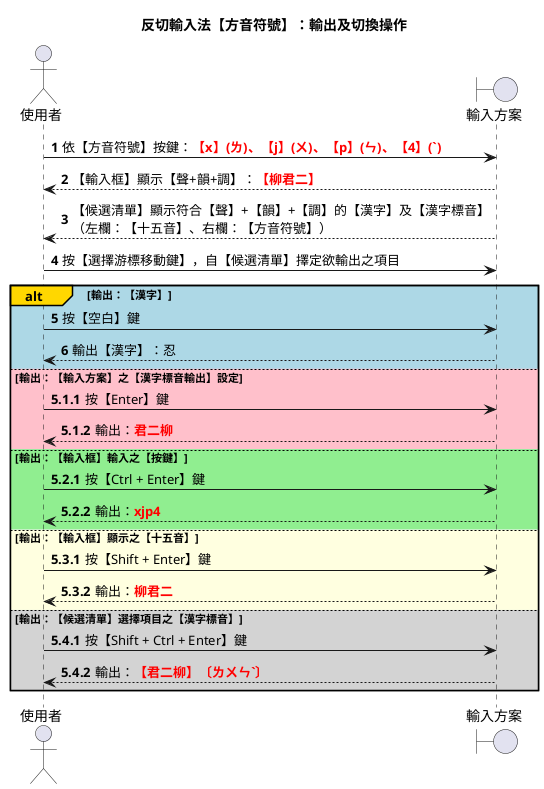
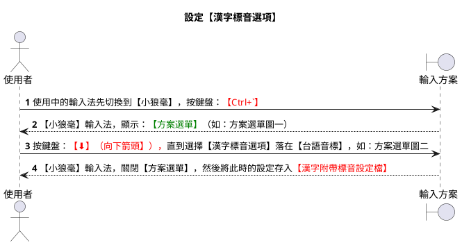

# 十八音【方音符號】需求規格書 v0.0.1


## 摘要

### 方案識別

- schema_id: tsap_peh_im_tps
- name: 十八音【方音符號】
- dictionary: ji_khoo_tl （台羅拼音系統）
- prism: tsap_peh_im_tps

## 辭彙解釋

- 【BP】：表【閩拼方案】。
- 【TPS】：表【方音符號】。
- 【TL】：表【台羅拼音】。
- 【TLPA】：表【台語音標】。
- 【十八音】：表【十五音】之改良版，新增三個【聲母】：n【耐】、m【毛】、ng【雅】。

---

## 需求規格

屬【注音輸入】類別之輸入方案。亦即自鍵盤接收到之【按鍵】，輸入方案處理後，在【輸入框】顯示【方音符號】。

【候選清單】

G. 人  ㄌㄤˊ    [柳江五]
H. 路  ㄌㆦ˫    [柳沽七]
J. 凉  ㄌㄧㄤˊ  [柳姜五]
K. 羅  ㄌㄜˊ    [柳高五]
L. 你  ㄌㄧˋ    [柳居二]

### 聲母

| 序 |台羅拼音|方音符號|十五音|
|----|--------|--------|------|
| 1  | Ø      |    | 英 |
| 2  | p      | ㄅ | 邊 |
| 3  | b      | ㆠ | 門 |
| 4  | ph     | ㄆ | 頗 |
| 5  | m      | ㄇ | 毛 |
| 6  | t      | ㄉ | 地 |
| 7  | th     | ㄊ | 他 |
| 8  | n      | ㄋ | 耐 |
| 9  | l      | ㄌ | 柳 |
| 10 | k      | ㄍ | 求 |
| 11 | g      | ㆣ | 語 |
| 12 | kh     | ㄎ | 去 |
| 13 | ng     | ㄫ | 雅 |
| 14 | h      | ㄏ | 喜 |
| 15 | ts     | ㄗ | 曾 |
| 16 | j      | ㆡ | 入 |
| 17 | tsh    | ㄘ | 出 |
| 18 | s      | ㄙ | 時 |
| 19 | ts+i   | ㄐ |   |
| 20 | j + i  | ㆢ |   |
| 21 | tsh +i | ㄑ |   |
| 22 | s + i  | ㄒ |   |

為求方便，以下聲母自【台羅拼音】改用【台語音標】（或【台語注音二式】）。

|台羅拼音|台語音標|
|--------|--------|
| tsh    | c |
| ts     | z |

### 韻母

#### 舒聲韻接入聲調（4/8/&），自動改正成促聲韻

|漢字|  舒聲韻  |  促聲韻  | 鍵盤鍵入 |輸入框顯示|
|:--:|----------|----------|----------|----------|
| 不 | ㄨㄣ(un) | ㄨㆵ(ut)  | ㄅㄨㄣ[  | ㄅㄨㆵ    |
| 不 | ㄨㄣ(un) | ㄨㆵ(ut)  | ㄅㄨㄣ7  | ㄅㄨㆵ入  |

#### 舒聲韻與促聲韻對照

| 韻序 | 國際音標 | 台羅拼音  | 方音符號 | 韻母   |
|----|------|-------|------|------|
| 1  | un   | un    | ㄨㄣ   | 君（舒） |
| 1  | ut̚  | ut    | ㄨㆵ   | 君（促） |
| 2  | ɪan  | ian   | ㄧㄢ   | 堅（舒） |
| 2  | ɪat̚ | iat   | ㄧㄚㆵ  | 堅（促） |
| 3  | im   | im    | ㄧㆬ   | 金（舒） |
| 3  | ip̚  | ip    | 一ㆴ   | 金（促） |
| 4  | ui   | ui    | ㄨㄧ   | 規（舒） |
| 5  | ɛ    | ee    | ㄝ    | 嘉（舒） |
| 5  | ɛʔ   | eeh   | ㄝㆷ   | 嘉（促） |
| 6  | an   | an    | ㄢ    | 干（舒） |
| 6  | at̚  | at    | ㄚㆵ   | 干（促） |
| 7  | ɔŋ   | ong   | ㆲ    | 公（舒） |
| 7  | ɔk̚  | ok    | ㆦㆻ   | 公（促） |
| 8  | uai  | uai   | ㄨㄞ   | 乖（舒） |
| 9  | ɛŋ   | ing   | ㄧㄥ   | 經（舒） |
| 9  | ɛk   | ik    | ㄧㆻ   | 經（促） |
| 10 | uan  | uan   | ㄨㄢ   | 觀（舒） |
| 10 | uat̚ | uat   | ㄨㄚㆵ  | 觀（促） |
| 11 | ou   | oo    | ㆦ    | 沽（舒） |
| 11 | ɔh   | ooh   | ㆦㆷ   | 沽（促） |
| 12 | ɪaʊ  | iau   | ㄧㄠ   | 嬌（舒） |
| 12 | ɪaʊʔ | iauh  | ㄧㄠㆷ  | 嬌（促） |
| 13 | ei   | e     | ㆤ    | 稽（舒） |
| 14 | ɪɔŋ  | iong  | ㄧㆲ   | 恭（舒） |
| 14 | ɪɔk̚ | iok   | ㄧㆦㆻ  | 恭（促） |
| 15 | ə    | o     | ㄜ    | 高（舒） |
| 15 | əʔ   | oh    | ㄜㆷ   | 高（促） |
| 16 | aɪ   | ai    | ㄞ    | 皆（舒） |
| 17 | in   | in    | ㄧㄣ   | 巾（舒） |
| 17 | it̚  | it    | ㄧㆵ   | 巾（促） |
| 18 | ɪaŋ  | iang  | ㄧㄤ   | 姜（舒） |
| 18 | ɪak̚ | iak   | ㄧㄚㆻ  | 姜（促） |
| 19 | am   | am    | ㆰ    | 甘（舒） |
| 19 | ap̚  | ap    | ㄚㆴ   | 甘（促） |
| 20 | ua   | ua    | ㄨㄚ   | 瓜（舒） |
| 20 | uaʔ  | uah   | ㄨㄚㆷ  | 瓜（促） |
| 21 | aŋ   | ang   | ㄤ    | 江（舒） |
| 21 | ak̚  | ak    | ㄚㆻ   | 江（促） |
| 22 | ɪam  | iam   | ㄧㆰ   | 兼（舒） |
| 22 | ɪap̚ | iap   | ㄧㄚㆴ  | 兼（促） |
| 23 | aʊ   | au    | ㄠ    | 交（舒） |
| 23 | auʔ  | auh   | ㄠㆷ   | 交（促） |
| 24 | ɪa   | ia    | ㄧㄚ   | 迦（舒） |
| 24 | ɪaʔ  | iah   | ㄧㄚㆷ  | 迦（促） |
| 25 | uei  | ue    | ㄨㆤ   | 檜（舒） |
| 25 | ueiʔ | ueh   | ㄨㆤㆷ  | 檜（促） |
| 26 | ã   | ann   | ㆩ    | 監（舒） |
| 26 | ãʔ  | annh  | ㆩㆷ   | 監（促） |
| 27 | u    | u     | ㄨ    | 艍（舒） |
| 27 | uʔ   | uh    | ㄨㆷ   | 艍（促） |
| 28 | a    | a     | ㄚ    | 膠（舒） |
| 28 | aʔ   | ah    | ㄚㆷ   | 膠（促） |
| 29 | i    | i     | ㄧ    | 居（舒） |
| 29 | iʔ   | ih    | ㄧㆷ   | 居（促） |
| 30 | ɪu   | iu    | ㄧㄨ   | 丩（舒） |
| 31 | ɛ̃   | enn   | ㆥ    | 更（舒） |
| 31 | ɛ̃ʔ  | ennh  | ㆥㆷ   | 更（促） |
| 33 | ɪə   | io    | ㄧㄜ   | 茄（舒） |
| 33 | ɪəʔ  | ioh   | ㄧㄜㆷ  | 茄（促） |
| 34 | ĩ    | inn   | ㆪ    | 梔（舒） |
| 35 | ɪɔ̃  | ionn  | ㄧㆧ   | 薑（舒） |
| 36 | ɪã  | iann  | ㄧㆩ   | 驚（舒） |
| 36 | ɪãh | iannh | ㄧㆩㆷ  | 驚（促） |
| 37 | uã  | uann  | ㄨㆩ   | 官（舒） |
| 38 | ŋ̍   | ng    | ㆭ    | 鋼（舒） |
| 38 | ŋ̍h  | ngh   | ㆭㆷ   | 鋼（促） |
| 39 | eʔ   | eh    | ㆤㆷ   | 伽（促） |
| 40 | ãɪ  | ainn  | ㆮ    | 閒（舒） |
| 41 | õu  | onn   | ㆧ    | 姑（舒） |
| 42 | m̩   | m     | ㆬ    | 姆（舒） |
| 42 | m̩h  | mh    | ㆬㆷ   | 姆（促） |
| 43 | uaŋ  | uang  | ㄨㄤ   | 光（舒） |
| 44 | uãi | uainn | ㄨㆮ   | 閂（舒） |
| 46 | ɪãʊ | iaunn | ㄧㆯ   | 嘄（舒） |
| 47 | ɔm   | om    | ㆱ    | 箴（舒） |
| 49 | ɔ̃   | onn   |      | 扛（舒） |
| 49 | ɔ̃ʔ  | onnh  | ㆧㆷ   | 扛（促） |
| 50 | ɪũ  | iunn  | ㄧㆫ   | 牛（舒） |
| 50 | ɪũʔ | iunnh | ㄧㆫㆷ  | 牛（促） |

### 聲調按鍵

| 調號 | 符號按鍵 |    調名     |
| :--: | :------: | :---------: |
|  1   |    :     | 上平 / 陰平 |
|  2   |    4     | 上上 / 陰上 |
|  3   |    3     | 上去 / 陰去 |
|  4   |    [     | 上入 / 陰入 |
|  5   |    6     | 下平 / 陽平 |
|  6   |   (無)   | 下上 / 陽上 |
|  7   |    5     | 下去 / 陽去 |
|  8   |    ]     | 下入 / 陽入 |

### 顎化相容

在【台羅拼音】，聲母： ts, tsh, s, j ，其後接【韻母】，若韻母之首字為 i ，前面聲母仍不變。

但【方音符號】聲母：ㄗ（ts）、ㄘ（tsh）、ㄙ（s）、ㆡ（j），其後之【韻母】，若韻母之首字為ㄧ（i），則原聲母需變改為：ㄐ、ㄑ、ㄒ、ㆢ。

輸入方案之處理作業，遇使用者輸入有錯之時，則自動更正：

|按鍵輸入|自動更正|
|--------|--------|
| ㄗㄧ | ㄐㄧ |
| ㄘㄧ | ㄑㄧ |
| ㄙㄧ | ㄒㄧ |
| ㆡㄧ | ㆢㄧ |

### 鼻韻母處理

輸入【鼻韻母】時，可用【鼻韻符號】前置格式操作。以【日文鼻濁音符號】 `゜` 表【鼻韻符號】，如同【白話字】使用之【ⁿ】。

| 鼻韻母   | 方音符號 | 改鼻韻符 | 鼻韻符置前 | 鼻韻符置前方音符號 |
|-------|------|------|-------|-----------|
| inn   | ㆪ    | iⁿ   | ⁿi    | ゜ㄧ        |
| unn   | ㆫ    | uⁿ   | ⁿu    | ゜ㄨ        |
| ann   | ㆩ    | aⁿ   | ⁿa    | ゜ㄚ        |
| onn   | ㆧ    | oⁿ   | ⁿo    | ゜ㆦ        |
| enn   | ㆥ    | eⁿ   | ⁿe    | ゜ㆤ        |
| ainn  | ㆮ    | aiⁿ  | ⁿai   | ゜ㄞ        |
| aunn  | ㆯ    | auⁿ  | ⁿau   | ゜ㄠ        |
| ionn  | ㄧㆧ   | ioⁿ  | ⁿio   | ゜ㄧㆦ       |
| iunn  | ㄧㆫ   | iuⁿ  | ⁿiu   | ゜ㄧㄨ       |
| iann  | ㄧㆩ   | iaⁿ  | ⁿia   | ゜ㄧㄚ       |
| iaunn | ㄧㆯ   | iauⁿ | ⁿiau  | ゜ㄧㄠ       |
| uann  | ㄨㆩ   | uaⁿ  | ⁿua   | ゜ㄨㄚ       |
| uainn | ㄨㆮ   | uaiⁿ | ⁿuai  | ゜ㄨㄞ       |

【按鍵】：【-】，【輸入框】：顯示【゜】。【候選清單】顯示之【方音符號】不變改，仍循標準。

《例》：漢字【腔】，台羅拼音【khiunn1】= kh + ⁿiu = ㄎ + ( ゜ + ㄧ + ㄨ ) 。

 1. 【按鍵】：鍵入 `d`（ㄎ）, `-`（゜） + `u`（ㄧ） + `j`（ㄨ）；
 2. 【輸入框】：顯示`ㄎ゜ㄧㄨ`；
 3. 【候選清單】顯示`腔 ㄎㄧㆫ [氣牛一]`。

### 標點符號處理

`,`、`;`、`.`、`[` 等已是方音鍵，無法像拼音方案直接出全形標點。作法與「注音輸入法【方音符號】」相同：先按 `` ` `` 進入標點，再按標點鍵。

|按鍵|輸出|
|----|----|
| `` `, `` | ， |
| `` `. `` | 。 |
| `` `' `` | 、 |
| `` `[ `` | 「」…（成對，再按切換） |
| `` `< `` | 《》… |

### 反查支援

都須先按【反查前置鍵】（與倉頡、注音同一列）：

|前置鍵|輸入法|
|------|------|
| `X` | 漢語拼音 |
| `C` | 倉頡五代 |
| `Z` | 注音符號 |

`` ` `` 已改作標點，不再當漢語拼音反查。

### 漢字連打

| 按鍵 | 輸入框 | 候選清單（調整後） |
|------|-----|---|
| `ggun'e` | `ggun'e` | `ggun2 [語君二] e7 [英伽七]` |
| `lang'gong'ze` | `lang'gong'ze` | `lang5 [柳江五] gong2 [求公二] ze2 [曾伽二]` |

---

## 設計規格

### 程式碼

- 程式功能架構：套用「十八音【台語注音二式】輸入方案」（tsap_peh_im_bpm2）
- 注音輸入方案參考案例：
  - 十五音輸入法【方音符號】：sip_ngoo_im_tps
  - 注音輸入法【方音符號】：zu_im_tps

### 鍵盤

#### 1. 輸入方案使用按鍵

```yaml
speller:
  alphabet: "!qa2wsxeEdNcyYhnrRfv8ujK,ikmp/btgz9lM0;Oo*UJ<I(L:5346][7-"
  initials: "!qa2wsxeEdNcyYhnrRfv8ujK,ikmp/btgz9lM0;Oo*UJ<I(L"
  initials: ":5346][7-"
  delimiter: "'"
  use_space: true
```

#### 2. 標音、按鍵、編碼及方音符號對映

以下之【標音】指：自【.dict.yaml】字典檔讀入之【漢字標音】即：【台羅拼音】。

|序號| 標音 | 編碼 | 按鍵 | 方音符號 |
|----|------|------|----|------|
| 1  | b    | b    | !  | ㆠ    |
| 2  | p    | p    | 1  | ㄅ    |
| 3  | ph   | P    | q  | ㄆ    |
| 4  | m    | m    | a  | ㄇ    |
| 5  | n    | n    | s  | ㄋ    |
| 6  | t    | t    | 2  | ㄉ    |
| 7  | th   | T    | w  | ㄊ    |
| 8  | l    | l    | x  | ㄌ    |
| 9  | g    | g    | E  | ㆣ    |
| 10 | k    | k    | e  | ㄍ    |
| 11 | kh   | K    | d  | ㄎ    |
| 12 | ng   | ŋ    | N  | ㄫ    |
| 13 | j    | j    | Y  | ㆡ    |
| 14 | ts   | z    | y  | ㄗ    |
| 15 | tsh  | c    | h  | ㄘ    |
| 16 | s    | s    | n  | ㄙ    |
| 17 | h    | h    | c  | ㄏ    |
| 18 | j(i) | J    | R  | ㆢ    |
| 19 | z(i) | Z    | r  | ㄐ    |
| 20 | c(i) | C    | f  | ㄑ    |
| 21 | s(i) | S    | v  | ㄒ    |
| 22 | a    | a    | 8  | ㄚ    |
| 23 | i    | i    | u  | ㄧ    |
| 24 | ir   | w    | K  | ㆨ    |
| 25 | u    | u    | j  | ㄨ    |
| 26 | e    | e    | ,  | ㆤ    |
| 27 | oo   | O    | i  | ㆦ    |
| 28 | o    | ə    | k  | ㄜ    |
| 29 | -m   | M    | m  | ㆬ    |
| 30 | -n   | N    | p  | ㄣ    |
| 31 | -ng  | G    | /  | ㆭ    |
| 32 | -p   | R    | b  | ㆴ    |
| 33 | -t   | F    | t  | ㆵ    |
| 34 | -k   | Q    | g  | ㆻ    |
| 35 | -h   | V    | z  | ㆷ    |
| 36 | ai   | I    | 9  | ㄞ    |
| 37 | au   | U    | l  | ㄠ    |
| 38 | am   | Y    | M  | ㆰ    |
| 39 | an   | @    | 0  | ㄢ    |
| 40 | ang  | A    | ;  | ㄤ    |
| 41 | om   | W    | O  | ㆱ    |
| 42 | ong  | H    | o  | ㆲ    |
| 43 | aⁿ   | d    | *  | ㆩ    |
| 44 | iⁿ   | f    | U  | ㆪ    |
| 45 | uⁿ   | q    | J  | ㆫ    |
| 46 | eⁿ   | r    | <  | ㆥ    |
| 47 | oⁿ   | v    | I  | ㆧ    |
| 48 | aiⁿ  | x    | (  | ㆮ    |
| 49 | auⁿ  | y    | L  | ㆯ    |
| 50 | 1    | 1    | :  | 一    |
| 51 | 7    | 7    | 5  | 七    |
| 52 | 3    | 3    | 3  | 三    |
| 53 | 2    | 2    | 4  | 二    |
| 54 | 5    | 5    | 6  | 五    |
| 55 | 8    | 8    | ]  | 八    |
| 56 | 4    | 4    | [  | 四    |
| 57 | 0    | &    | 7  | 入    |
| 58 | L    | L    | -  | ゜    |

【註】：【鼻韻符號】改 `ㄥ` 用 `゜` 代。


```yaml
speller:
  algebra:
    #==========================================================================
    # 【台羅拼音】對映【按鍵】之【編碼】
    #==========================================================================
    # 唇音/雙唇音            : p, ph, b, m
    # 舌音/舌尖中音（齒齦音）: t, th, n, l
    # 齒音/舌尖前音（齒齦音）: ts/z, tsh/c, j, s
    # 齒音/舌尖前音（齦顎音）: zi, ci, ji, si
    # 牙音/舌根音（軟顎音）  : k, kh, g, ng
    # 喉音（聲門音）         : h
    #--------------------------------------------------------------------------
    # 【舌齒音 + i 】轉【齦顎音】
    # ts ==> z,  tsh ==> c
    # - z + i = Z + i ==> ㄗㄧ = ㄐㄧ
    # - c + i = C + i ==> ㄘㄧ = ㄑㄧ
    # - s + i = S + i ==> ㄙㄧ = ㄒㄧ
    # - j + i = J + i ==> ㆡㄧ = ㆢㄧ
    #--------------------------------------------------------------------------
    # 舌齒音
    - xform/^ts(?!h)/z/ # ㄗ [ts]
    # - xform/^j/j/     # ㆡ [j]
    - xform/^tsh/c/     # ㄘ [tsh]
    # - xform/^s/s/     # ㄙ [s]
    # 齦顎音（舌尖前音）:
    - derive/^z(?i)/Z/  # ㄐ[zi]
    - derive/^j(?i)/J/  # ㆢ[ji]
    - derive/^c(?i)/C/  # ㄑ[ci]
    - derive/^s(?i)/S/  # ㄒ[si]
    # --------------------------------------------------------------------------
    # 鼻音
    - xform/^ng(?!\d|$)/ŋ/  # ㄫ [ng]
    # - xform/^n/n/         # ㄋ [n]
    # - xform/^m/m/         # ㄇ [m]
    #--------------------------------------------------------------------------
    # 清塞音/塞擦音：不送氣
    # - xform/p(?!h)/p/     # ㄅ [ p ]
    # - xform/t(?!h)/t/     # ㄊ [ t ]
    # - xform/k(?!h)/k/     # ㄍ [ k ]
    #--------------------------------------------------------------------------
    # 濁音
    # - xform/^b/b/         # ㆠ [g]
    # - xform/^g/g/         # ㆣ [g]
    #--------------------------------------------------------------------------
    # 清塞音/塞擦音：送氣
    - xform/^ph/P/          # ㄆ [ph]
    - xform/^th/T/          # ㄊ [th]
    - xform/^kh/K/          # ㄎ [kh]
    #--------------------------------------------------------------------------
    # 邊音
    # - xform/^l/l/         # ㄌ [l]
    # 擦音
    # - xform/^h/h/         # ㄏ [h]

    # --------------------------------------------------------------------------
    # 韻母
    # --------------------------------------------------------------------------
    - derive/ionn/iOnn/
    - derive/iong/iOng/
    - derive/iok/iOk/ # 台語注音二式無此韻母，其拼音為：[iook] ==> [iOk] ==> ㄧㆦㄍ
    - derive/ong/Ong/
    - derive/onn/Onn/ # ㆧ [oonn] = O + nn
    - derive/ok/Ok/
    - derive/om/Om/
    - derive/op/Op/
    # --------------------------------------------------------------------------
    - xform/o/ə/ # ㄜ [ə] - 只轉換獨立的 o
    # --------------------------------------------------------------------------
    - derive/ai/I/ # ㄞ [ai]
    - derive/au/U/ # ㄠ [au]
    # --------------------------------------------------------------------------
    - derive/ann/d/ # ㆩ [ann]
    - derive/inn/f/ # ㆪ [inn]
    - derive/unn/q/ # ㆫ [unn]
    - derive/enn/r/ # ㆥ [enn]
    - derive/Onn/v/ # ㆧ [onn]
    - derive/Inn/x/ # ㆮ [ainn]
    - derive/Unn/y/ # ㆯ [aunn]
......
    # 編碼與按鍵對映：自字典檔讀入之【台羅拼音】，經【編碼】後；其與鍵盤【按鍵】之應映。
    - xlit|bPmtTnlkgKŋhzjcsZJCSaiuweOəMNGRFQVIUY@AWHdfqrvxy1732584&L|!qa2wsxeEdNcyYhnrRfv8ujK,ikmp/btgz9lM0;Oo*UJ<I(L:5346][7-|

......
translator:
  preedit_format:
    # 按鍵與方音符號對映：鍵盤之按鍵壓下後，【輸入框】應顯示之【方音符號】
    - xlit|!1qa2wsxeEdNcyYhnrRfv8ujK,ikmp/btgz9lM0;Oo*UJ<I(L:5346][7-|ㆠㄅㄆㄇㄉㄊㄋㄌㄍㆣㄎㄫㄏㄗㆡㄘㄙㄐㆢㄑㄒㄚㄧㄨㆨㆤㆦㄜㆬㄣㆭㆴㆵㆻㆷㄞㄠㆰㄢㄤㆱㆲㆩㆪㆫㆥㆧㆮㆯ一七三二五八四入゜|
```

#### 3. 操作按鍵

```yaml
......
key_binder:
  import_preset: default
  bindings:
    #---------------------------------------------------
    # 注音輸入法：使用【-】鍵，輸入【所有鼻化之元音韻母】
    - { when: composing, accept: minus, send: minus }
    - { when: has_menu, accept: minus, send: minus }
    #---------------------------------------------------
    # 【候選字清單】以 VIM 模式，操作【游標】之移動，達到【上/下/翻到前頁/翻到後頁】操作
    #---------------------------------------------------
    - { when: has_menu, accept: "Control+h", send: Page_Up }
    - { when: has_menu, accept: "Control+l", send: Page_Down }
    - { when: has_menu, accept: "Control+k", send: Up }
    - { when: has_menu, accept: "Control+j", send: Down }
```

#### 4. 輸入框輸出鍵

```yaml
......
editor:
  bindings:
    Return: commit_composition              # 【漢字標音】上屏
    Control+Return: commit_raw_input        # 【按鍵】上屏（未經 preedit_format 轉換的原始按鍵）
    Shift+Return: commit_script_text        # 【輸入框】上屏（經 preedit_format 轉換後的結果，如：方音符號）
    # Shift+Control+Return 由 lua_processor@aux_commit 攔截：【漢字附帶標音】上屏（如：啥物〔siann2-mih4〕）
```

### 變調

為達：【我手寫我口】之目標（打字之按鍵輸入，可以隨著【口語】發音之【聲調】習慣輸入），本輸入方案備有【連打變調】處理功能。

```
【Cursor的聊天紀錄】
若還要更貼「只有非末字才變調」，還有兩條可往後做（這次沒改）：

現在這層「防連鎖」先讓你指定的第 2 調真的只找第 2 調（以及本調就是 2、變調後讀 2 的字）。
```

【Cursor 建言：未來可考慮變更方向】

| 作法 | 效果 | 代價 |
|---|---|---|
| 只對詞庫裡「後面還有字」的音節做變調（`1 ` → `7 `） | 人生／晏子整詞最準，末字永遠本調 | 組句、詞庫沒有的詞，首字用變調可能對不到 |
| 末音節已打出完整調號時，用 Lua 濾掉「只靠變調對上、本調不符」的候選 | 單字、組句都能守末字本調 | 要另寫 filter |

#### 舒聲變調

| 本調 | 口語變調 |
|---|---|
| 1 陰平 | 7 |
| 7 陽去 | 3 |
| 3 陰去 | 2 |
| 2 陰上 | 1 |
| 5 陽平 | 7 |

1. 舉例

    單字之本調
    - 人〔ㆢㄧㄣˊ〕(jin5)
    - 生〔ㄒㄧㄥ〕(sing1)

    組成辭彙後之變調
    - 人生〔ㆢㄧㄣ˫ ㄒㄧㄥ〕(jin7 sing1)

1. 舉例

    單字之本調
    - 無〔ㆠㄜˊ〕(bo5)
    - 改〔ㄍㄞˋ〕(kai2)
    - 變〔ㄅㄧㄢ˪〕(pian3)

    組成辭彙後之變調
    - 無改變〔bo7 kai1 pian3〕

| 漢字 | 本調 | 口語變調 | 按鍵（方音） | 候選清單（仍標本調） |
|---|---|---|---|---|
| 無 | bo5 〔ㆠㄜˊ〕 | bo7 〔ㆠㄜ˫〕 | `!k5` | [門高五] |
| 改 | kai2 〔ㄍㄞˋ〕 | kai1 〔ㄍㄞˉ〕 | `e9:` | [求皆二] |
| 變 | pian3 〔ㄅㄧㄢ˪〕 | pian3（末字本調） | `1u03` | [邊堅三] |
| 無改變 | | `bo7 kai1 pian3` | `!k5'e9:'1u03` | 第一候選：無改變 |

#### 促聲變調

| 韻尾 | 本調 | 口語變調 | 實測 |
|---|---|---|---|
| -p/-t/-k | 4 陰入 | 8 | `1jp]`（put8）→ 不〔邊君四〕 |
| -p/-t/-k | 8 陽入 | 4 | （對稱：打 4 可對到本調 8） |
| -h | 4 陰入 | 2 | `1,c4`（peh2）→ 八〔邊伽四〕 |
| -h | 8 陽入 | 3 | `yu8c3`（tsiah3）→ 食〔曾迦八〕 |

1. 舉例：俗語
    - 俗〔ㄒㄧㆦㆻ˙〕： 風俗〔ㄏㆲ ㄒㄧㆦㆻ˙〕
    - 俗語〔ㄒㄧㆦㆻ˙ ㆣㄨˋ〕

| 漢字 | 本調 | 口語變調 |  按鍵  | 輸入框 | 候選清單（仍標本調） |
|------|------|----------|--------|--------|----------------------|
| 俗 |〔ㄒㄧㆦㆻ˙〕 siok8 || nukg]  |ㄒㄧㆦㆻ˙ | ㄒㄧㆦㆻ˙ [門高五] |
| 語 |〔ㆣㄨˋ〕 gu4      || Ej4    |ㆣㄨˋ    | ㆣㄨˋ [求皆二]    |
| 俗語 | |〔ㄒㄧㆦㆻ ㆣㄨˋ〕 | `nukg[ Ej4` |ㄒㄧㆦㆻ ㆣㄨˋ | 無改變 |

#### 候選清單

在【拼音類輸入法】可用之【 選字鍵】，即【按鍵】： G H J K L（每頁 5 個），因【方音符號】已佔用 G, H 此二【按鍵】，故而本輸入方案不支援。

移動【**選擇游標**】，選擇欲輸出之【項目】。

- 每個【候選清單】最多可顯示 5 條項目；
- 每條項目之結構為：【漢字】、【十五音】、【方音符號】。


【候選清單】中顯示之項目，可借由【pgup】、【pgdn】、【↑】、【↓】鍵之操作來進行選取。本輸入方案仿 `vim` 編輯器之 **hjkl** 按鍵，亦可用於操作【選擇游標】之移動。

【**前後翻頁**】
- 翻到前一頁： [ctrl] + [h]
- 翻到後一頁： [ctrl] + [l]

【**上下移動**】
- 移到上一個： [ctrl] + [j]
- 移到下一個： [ctrl] + [k]

【**頂央底跳躍**】
- 移到頂端處： [ctrl] + [/]
- 移到中央處： [ctrl] + [m]
- 移到底端處： [ctrl] + [,]

### 上屏輸出

#### 基本操作

【輸入方案】預設之【輸出】為：【漢字】，使用【按鍵】為：【空白】鍵；若是需要輸出：**【漢字標音】**（如：十五音、方音符號、台語音標...等），則可使用：【**enter**】按鍵。

- `space` → 輸出漢字
- `enter (commit_composition)` → 輸出漢字標音（依【漢字標音音選項】之設定輸出）
- `shift+enter (commit_script_text)` → 【輸入框】顯示經 `preedit_format` 處理後之結果
- `shift+ctrl+enter (commit_comment)` → 【候選清單】選擇項目顯示之【漢字標音】
- `ctrl+enter (commit_raw_input)` → 【輸入框】接收之【按鍵】輸入



**操作情境說明**：

1. 操作步驟【1-4】：輸入漢字【忍】之【方音符號】按鍵 `xjp4`。
   - 【鍵盤】按鍵：【x】【j】【p】【4】
   - 【輸入框】：`【柳君二】`
   - 【候選清單】：`忍  【君二柳】〔ㄌㄨㄣˋ〕`

2. 按【空白】鍵，輸出漢字：【忍】。

3. 按【Enter】鍵，輸出【漢字標音音選項】指定之【十五音】：`君二柳`。

4. 按【Ctrl + Enter】鍵，輸出原始按鍵：`xjp4`。

5. 按【Shift + Enter】鍵，輸出【輸入框】所見之【十五音】：`柳君二`。

6. 按【Shift + Ctrl + Enter】鍵，輸出：`【君二柳】〔ㄌㄨㄣˋ〕`。

#### 切換【漢字標音選項】設定

【輸入方案】遇按下【**Enter**】鍵，便依【候選清單】中【選擇游標】擇定之【項目】，輸出【漢字標音音選項】，設定之【漢字標音】。

本方案之【Enter】預設輸出：**十八音**。

若欲變更，可循切換【漢字標音選項】，來進行客製化設定。

小狼毫提供【方案方單】介面，供使用者透過圖形介面進行客製設定。使用快捷鍵： `[Ctrl] + [\`]`，便可進行【漢字標音選項】之切換設定。



【**方案選單圖一**】


【**方案選單圖二**】


---

## 維護管理

### 常用字備份

#### 常用字功能釋疑

每個輸入方案均有： dictionary 與 prism 設定，此二者之功能說明如下：

##### dictionary

在【輸入方案】操作，輸入之【漢字】，使用【上屏】功能輸出後，此時漢字的【音節】（台羅拼音），便記錄在【常用字/自造詞】裡，不是記在 prism 裡，請參考下表。

| 設定 | 實際是什麼 | 上屏後寫到哪 |
|---|---|---|
| `dictionary: ji_khoo_tl` | 漢字的**台羅編碼**（人 = `lang5`） | `ji_khoo_tl.userdb`（常用字／自造詞） |
| `prism: tsap_peh_im_tps` | 把 `speller/algebra` **編譯成「按鍵 → 台羅」對照表** | 不記常用字；部署時產生 `.prism.bin` |

##### prism

上屏時 RIME 記下的是字典編碼（lang5），不是方音按鍵（x;6）。prism 只在「你按了哪些鍵」和「字典裡的台羅」之間做翻譯。

#### 常用字可共用嗎？

三個方案共用同一個 prism：不行。 鍵盤與輸入序並不一樣。

| 方案 | 字典 | 輸入序 | 和另外兩個差在哪 |
|---|---|---|---|
| 注音輸入法【方音符號】`zu_im_tps` | `ji_khoo_tl` | 聲+韻+調 | 陰平 `"`、鼻化鍵不同 |
| 十八音【方音符號】`tsap_peh_im_tps` | `ji_khoo_tl` | 聲+韻+調 | 陰平 `:`、鼻韻 `゜`、入聲 `7`、還有變調 derive |
| 十五音【方音符號】`sip_ngoo_im_tps` | `ji_khoo_sni_tl` | **韻+調+聲** | 字典編碼順序就不同 |

若硬把 prism: zu_im_tps 寫進十八音，按 : 當陰平會對不到 " 編出來的表，變調規則也不會進那份 prism。

想共用「常用字」：靠的是 dictionary 同名，不是 prism。

`注音輸入法【方音符號】（A）`與`十八音【方音符號】（B）`兩個輸入方案，均使用同一【字典】（dictionary）： ji_khoo_tl，所以 ji_khoo_tl.userdb 可供此二輸入方案共用【常用字】。在 A 方案選過的「人 lang5」，切到 B 只要打得到同一個 lang5，權重還在。

`十五音【方音符號】`輸入方案使用另一個【字典】： ji_khoo_sni_tl（韻+調+聲），因此其【常用字】存放在另一個 userdb；即使改掛 ji_khoo_tl，記入的 lang5 也對不進十五音的 ang5l 編碼。

結論：prism 必須各編各的；常用字能否共用，只看字典編碼是否同一套。前兩個方音方案已經共用；十五音要共用，得先統一成同一種音節編碼（目前沒有）。

#### 該如何備份【常用字】？

常用字在用戶資料夾的 *.userdb，不在方案的 prism，也不在這個 git 專案裡。

十八音【方音符號】與注音【方音符號】共用：

C:\Users\AlanJui\AppData\Roaming\Rime\ji_khoo_tl.userdb

裡面是台羅編碼（如 lang5）和權重，不是方音按鍵。今天 13:37 還寫入過。

| 方案 | 常用字資料夾 |
|---|---|
| 十八音／注音輸入法【方音符號】、台羅拼音方案 | `ji_khoo_tl.userdb` |
| 十八音【台語注音二式】 | `ji_khoo_bpm2.userdb` |
| 十五音【方音符號】 | `ji_khoo_sni_tl.userdb` |
| 十五音【台語注音二式】 | `ji_khoo_sni_bpm2.userdb` |

##### 備份操作

先退出小狼毫（或等它沒在寫），再複製整個資料夾。不要只拷裡面某一個 .ldb。

```powershell
$src = "$env:APPDATA\Rime\ji_khoo_tl.userdb"
$dst = "D:\backup\rime\ji_khoo_tl.userdb-$(Get-Date -Format yyyyMMdd)"
Copy-Item -Recurse -Force $src $dst
```

要一次帶走上面四套，把 ji_khoo_*.userdb 整批複製即可。build\ 裡的 .prism.bin 不必備，部署會重編。

##### 還原操作：

退出小狼毫 → 把備份資料夾放回 %APPDATA%\Rime\，名稱保持 ji_khoo_tl.userdb → 再開輸入法。不必重新部署。

---

## 參考

## 聲母發音部位

| 發音部位               | 台羅拼音（TL）    | 閔拼方案（BP）|
|------------------------|-------------------|---------------|
| 唇音/雙唇音            | p, ph, b, m       | b, p, bb, m   |
| 舌音/舌尖中音（齒齦音）| t, th, n, l       | d, t, ln, l   |
| 齒音/舌尖前音（齒齦音）| ts/z, tsh/c, j, s | z, c, j, s    |
| 齒音/舌尖前音（齦顎音）| zi, ci, ji, si    | j, ch, jj, sh |
| 牙音/舌根音（軟顎音）  | k, kh, g, ng      | k, kh, g, ng  |
| 喉音（聲門音）         | h                 | h             |


### 台語注音二式

【台語注音二式拼音系統】原名為【台語注音符號二式】是依據教育部公告之國語注音二式（羅馬拼音）延伸擬定出來
的台語注音符號的羅馬拼音。


#### 聲母

| 序號 | 國際音標 | 台羅拼音 | 注音二式 | 方音符號 | 十五音 | 漢字例 | 備註               |
|----|------|------|------|------|-----|-----|------------------|
| 1  |      |     |     |     | 英   | 以   | 零聲母              |
| 2  | p    | p    | b    | ㄅ    | 邊   | 比   |                  |
| 3  | pʰ   | ph   | p    | ㄆ    | 頗   | 鄙   |                  |
| 4  | m    | m    | m    | ㄇ    | 毛   | 毛   | m/b 本不分，此處分毛/門   |
| 5  | b    | b    | bb   | ㆠ    | 門   | 美   |                  |
| 6  | t    | t    | d    | ㄉ    | 地   | 底   |                  |
| 7  | tʰ   | th   | t    | ㄊ    | 他   | 恥   |                  |
| 8  | n    | n    | n    | ㄋ    | 耐   | 耐   | n/l 本不分，此處分耐/柳   |
| 9  | l    | l    | l    | ㄌ    | 柳   | 理   |                  |
| 10 | k    | k    | g    | ㄍ    | 求   | 己   |                  |
| 11 | kʰ   | kh   | k    | ㄎ    | 去   | 起   |                  |
| 12 | ŋ    | ng   | ng   | ㄫ    | 雅   | 雅   | ng/g 本不分，此處分雅/語  |
| 13 | ɡ    | g    | gg   | ㆣ    | 語   | 禦   |                  |
| 14 | ʦ    | ts   | z    | ㄗ    | 曾   | 阻   |                  |
| 15 | ʦʰ   | tsh  | c    | ㄘ    | 出   | 取   |                  |
| 16 | s    | s    | s    | ㄙ    | 時   | 詞   |                  |
| 17 | ʣ    | j    | zz   | ㆡ    | 入   | 熱   |                  |
| 18 | h    | h    | h    | ㄏ    | 喜   | 喜   |                  |
| 19 | ʨ    | tsi  | j    | ㄐ    | 曾   | 止   | ㄐ = ㄗㄧ           |
| 20 | ʨʰ   | tshi | ch   | ㄑ    | 出   | 測   | ㄑ = ㄘㄧ           |
| 21 | ɕ    | si   | sh   | ㄒ    | 時   | 惜   | ㄒ = ㄙㄧ           |
| 22 | ʥ    | ji   | jj   | ㆢ    | 入   | 熱   | ㆢ = ㆡㄧ           |

#### 韻母

| 序號 | 國際音標  | 台羅拼音   | 台語注音二式 | 方音符號 | 十五音   | 漢字例 |
|----|-------|--------|--------|------|-------|:---:|
| 1  | a     | a      | a      | ㄚ    | 膠 (舒) | 些   |
| 2  | aʔ    | ah     | ah     | ㄚㆷ   | 膠 (促) | 百   |
| 3  | aɪ    | ai     | ai     | ㄞ    | 皆 (舒) | 埃   |
| 4  | aɪʔ   | aih    | aih    | ㄞㆷ   | 皆 (促) | ◯   |
| 5  | ãɪ   | ainn   | ainn   | ㆮ    | 閒 (舒) | 挨   |
| 6  | ak̚   | ak     | ak     | ㄚㆻ   | 江 (促) | 角   |
| 7  | am    | am     | am     | ㆰ    | 甘 (舒) | 堪   |
| 8  | an    | an     | an     | ㄢ    | 干 (舒) | 蘭   |
| 9  | aŋ    | ang    | ang    | ㄤ    | 江 (舒) | 邦   |
| 10 | ã    | ann    | ann    | ㆩ    | 監 (舒) | 聽   |
| 11 | ãʔ   | annh   | annh   | ㆩㆷ   | 監 (促) | 含   |
| 12 | ap̚   | ap     | ap     | ㄚㆴ   | 甘 (促) | 答   |
| 13 | at̚   | at     | at     | ㄚㆵ   | 干 (促) | 識   |
| 14 | aʊ    | au     | au     | ㄠ    | 交 (舒) | 鬧   |
| 15 | auʔ   | auh    | auh    | ㄠㆷ   | 交 (促) | 暴   |
| 16 | e     | e      | e      | ㆤ    | 稽 (舒) | 遞   |
| 17 | ɛ     | ee     |        | ㄝ    | 嘉 (舒) | 家   |
| 18 | ɛʔ    | eeh    |        | ㄝㆷ   | 嘉 (促) | 八   |
| 19 | eʔ    | eh     | eh     | ㆤㆷ   | 伽 (促) | 伯   |
| 20 | ɪk    | ek     |        | ㄝㆻ   | 經 (促) | ◯   |
| 21 | ɪŋ    | eng    |        | ㄝㆭ   | 經 (舒) | ◯   |
| 22 | ẽ     | enn    | enn    | ㆥ    | 更 (舒) | 爭   |
| 23 | ẽʔ    | ennh   | ennh   | ㆥㆷ   | 更 (促) | 挾   |
| 24 | i     | i      | i      | ㄧ    | 居 (舒) | 爾   |
| 25 | ɪa    | ia     | ia     | ㄧㄚ   | 迦 (舒) | 名   |
| 26 | ɪaʔ   | iah    | iah    | ㄧㄚㆷ  | 迦 (促) | 壁   |
| 27 | ɪak̚  | iak    | iak    | ㄧㄚㆻ  | 姜 (促) | 爆   |
| 28 | ɪam   | iam    | iam    | ㄧㆰ   | 兼 (舒) | 尖   |
| 29 | ɪan   | ian    | ian    | ㄧㄢ   | 堅 (舒) | 掀   |
| 30 | ɪaŋ   | iang   | iang   | ㄧㄤ   | 姜 (舒) | 將   |
| 31 | ɪã   | iann   | iann   | ㄧㆩ   | 驚 (舒) | ◯   |
| 32 | ɪãʔ  | iannh  | iannh  | ㄧㆩㆷ  | 迦 (促) | 且   |
| 33 | ɪap̚  | iap    | iap    | ㄧㄚㆴ  | 兼 (促) | 接   |
| 34 | ɪat̚  | iat    | iat    | ㄧㄚㆵ  | 堅 (促) | 別   |
| 35 | ɪaʊ   | iau    | iau    | ㄧㄠ   | 嬌 (舒) | 遙   |
| 36 | ɪaʊʔ  | iauh   | iauh   | ㄧㄠㆷ  | 嬌 (促) | 噭   |
| 37 | ɪãʊ  | iaunn  | iaunn  | ㄧㆯ   | 嘄 (舒) | 鳥   |
| 38 | iʔ    | ih     | ih     | ㄧㆷ   | 居 (促) | 逼   |
| 39 | ik̚   | ik     | iek    | ㄧㆻ   | 經 (促) | 益   |
| 40 | im    | im     | im     | ㄧㆬ   | 金 (舒) | 深   |
| 41 | in    | in     | in     | ㄧㄣ   | 巾 (舒) | 恩   |
| 42 | iŋ    | ing    | ing    | ㄧㄥ   | 經 (舒) | 情   |
| 43 | ĩ     | inn    | inn    | ㆪ    | 梔 (舒) | 庚   |
| 44 | ɪə    | io     | ior    | ㄧㄜ   | 茄 (舒) | 少   |
| 45 | ɪəʔ   | ioh    | iorh   | ㄧㄜㆷ  | 茄 (促) | 著   |
| 46 | ɪɔk̚  | iok    | iook   | ㄧㆦㆻ  | 恭 (促) | 俗   |
| 47 | ɪɔŋ   | iong   | iong   | ㄧㆲ   | 恭 (舒) | 中   |
| 48 | ip̚   | ip     | ip     | 一ㆴ   | 金 (促) | 蟄   |
| 49 | it̚   | it     | it     | ㄧㆵ   | 巾 (促) | 一   |
| 50 | ɪɔ̃   | ionn   | ioonn  | ㄧㆧ   | 薑 (舒) | 腔   |
| 51 | ɪu    | iu     | iu     | ㄧㄨ   | 丩 (舒) | 油   |
| 52 | ɪũ   | iunn   | iunn   | ㄧㆫ   | 牛 (舒) | 香   |
| 53 | ɪũʔ  | iunnh  | iunnh  | ㄧㆫㆷ  | 牛 (促) | ◯   |
| 54 | m̩    | m      | m      | ㆬ    | 姆 (舒) | 姆   |
| 55 | m̩ʔ   | mh     | mh     | ㆬㆷ   | 姆 (促) | ◯   |
| 56 | ŋ̍    | ng     | ng     | ㆭ    | 鋼 (舒) | 床   |
| 57 | ŋ̍ʔ   | ngh    | ngh    | ㆭㆷ   | 鋼 (促) | ◯   |
| 58 | ə     | o      | or     | ㄜ    | 高 (舒) | 果   |
| 59 | əʔ    | oh     | orh    | ㄜㆷ   | 高 (促) | 卜   |
| 60 | ɔk̚   | ok     | ok     | ㆦㆻ   | 公 (促) | 福   |
| 61 | ɔm    | om     | oom    | ㆱ    | 箴 (舒) | 丼   |
| 62 | ɔŋ    | ong    | ong    | ㆲ    | 公 (舒) | 風   |
| 63 | ɔ̃    | onn    | oonn   | ㆧ    | 姑 (舒) | 張   |
| 64 | ɔ̃ʔ   | onnh   | onnh   | ㆧㆷ   | 扛 (促) | ◯   |
| 65 | ɔ     | oo     | oo     | ㆦ    | 沽 (舒) | 捕   |
| 66 | ɔʔ    | ooh    | ooh    | ㆦㆷ   | 沽 (促) | ◯   |
| 67 | ɔp̚   | op     | oop    | ㆦㆴ   | 箴 (促) | 吷   |
| 68 | u     | u      | u      | ㄨ    | 艍 (舒) | 夫   |
| 69 | ua    | ua     | ua     | ㄨㄚ   | 瓜 (舒) | 花   |
| 70 | uaʔ   | uah    | uah    | ㄨㄚㆷ  | 瓜 (促) | 缽   |
| 71 | uai   | uai    | uai    | ㄨㄞ   | 乖 (舒) | 怪   |
| 72 | uãi  | uainn  | uainn  | ㄨㆮ   | 閂 (舒) | 檨   |
| 73 | uaiʔ  | uaih   | uaih   | ㄨㄞㆷ  | 乖 (促) | ◯   |
| 74 | uãiʔ | uainnh | uainnh | ㄨㆮㆷ  | 閂 (促) | 蹶   |
| 75 | uan   | uan    | uan    | ㄨㄢ   | 觀 (舒) | 猿   |
| 76 | uaŋ   | uang   | uang   | ㄨㄤ   | 光 (舒) | 闖   |
| 77 | uã   | uann   | uann   | ㄨㆩ   | 官 (舒) | 肝   |
| 78 | uat̚  | uat    | uat    | ㄨㄚㆵ  | 觀 (促) | 說   |
| 79 | ue    | ue     | ue     | ㄨㆤ   | 檜 (舒) | 話   |
| 80 | ueʔ   | ueh    | ueh    | ㄨㆤㆷ  | 檜 (促) | 拔   |
| 81 | uʔ    | uh     | uh     | ㄨㆷ   | 艍 (促) | 勃   |
| 82 | ui    | ui     | ui     | ㄨㄧ   | 規 (舒) | 歸   |
| 83 | uiʔ   | uih    | uih    | ㄨㄧㆷ  | 褌 (促) | ◯   |
| 84 | uĩ    | uinn   | uinn   | ㄨㆪ   | 褌 (舒) | 荒   |
| 85 | un    | un     | un     | ㄨㄣ   | 君 (舒) | 汾   |
| 86 | ut̚   | ut     | ut     | ㄨㆵ   | 君 (促) | 不   |

## Log 2026-09-20

### 方案識別

| 項目 | 值 |
|---|---|
| schema_id | `tsap_peh_im_tps` |
| 名稱 | 十八音【方音符號】 |
| 字典 | `ji_khoo_tl`（台羅拼音） |
| prism | `tsap_peh_im_tps`（自行編譯；鍵盤近 `zu_im_tps`，但鼻韻符為 `゜`、陰平為 `:`、入聲通配 `7`＝`&`） |
| 輸入序 | 聲 + 韻 + 調 |

規格草稿的 alphabet／xlit 漏了 ㄅ／鍵 1（對照表第 2 列有），已補上，否則邊母打不出來。

### 實測（與規格例對得上）

| 按鍵 | 輸入框 | 候選 |
|---|-----|---|
| `x;6` | `ㄌㄤˊ` | `人 ㄌㄤˊ [柳江五]` |
| `xi5` | `ㄌㆦ˫` | `路 ㄌㆦ˫ [柳沽七]` |
| `xk6` | `ㄌㄜˊ` | `… ㄌㄜˊ [柳高五]` |
| `xu;6` | `ㄌㄧㄤˊ` | `凉 ㄌㄧㄤˊ [柳姜五]` |
| `xu4` | `ㄌㄧˋ` | `… ㄌㄧˋ [柳居二]` |
| `d-uj:` | `ㄎ゜ㄧㄨ` | `腔 ㄎㄧㆫ [氣牛一]` |
| `1jp[` | `ㄅㄨㆵ` | `不 ㄅㄨㆵ [邊君四]` |
| `1jp7` | `ㄅㄨㆵ入` | `不／孛（4 與 8）` |
| `yu4` | `ㄐㄧˋ` | `止 ㄐㄧˋ [曾居二]`（ㄗㄧ→ㄐㄧ） |
| `x;6'eo4'y,4` | `ㄌㄤˊ ㄍㆲˋ ㄗㆤˋ` | `… [柳江五] [求公二] [曾伽二]` |

選字鍵為 G H J K L（每頁 5 個）。

### 已實作的規格重點

- 輸入框顯示方音；候選為「方音調符 + [聲韻調]」，kh 用「氣」
- 舒聲韻 + 入聲調自動改促聲韻（ㄅㄨㄣ[ → ㄅㄨㆵ）
- 顎化：ㄗㄧ／ㄘㄧ／ㄙㄧ／ㆡㄧ 自動改 ㄐ／ㄑ／ㄒ／ㆢ
- 鼻韻前置：- → ゜（輸入框保留 ゜；候選仍用標準 ㄧㆫ 等）
- 標點成對：未組字時 [【】、]「」、<《》、>〈〉、(（）
- 反查：` 漢語拼音、C 倉頡、Z 注音；註解改回方音 + [十八音]
- 上屏：Enter 標音、Ctrl+Enter 原按鍵、Shift+Enter 輸入框、Ctrl+Shift+Enter 漢字附帶標音（預設方音符號）

### 主要新增／修改檔：

- tsap_peh_im_tps.schema.yaml
- rime.lua
- lua/rime_env.lua
- config/default.custom*.yaml
- deploy_rime.ps1
- 發行清單。

