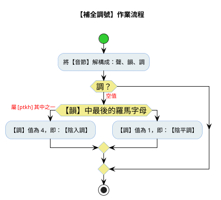

# 【台羅拼音辭彙】轉換成【中州韻字庫】

## 摘要

規範程式功能：以便將存放在 Excel 活頁簿檔中的【台羅拼音辭彙】，轉換成符合【中州韻使用的字典格式（YAML）】。

## 1956 台灣白話基礎句

檔案：【1956台灣白話基礎句】ChhoeTaigi_TaioanPehoeKichhooGiku.xlsx 。

### 需求規格

#### 需求摘要

在【RIME_Dict】工作表，存放於【儲存格】：【G2:G5421】的【台語白話音辭彙】，透過**程式**轉換，然後將轉換後的結果，存放到與【G欄】相對映的【B欄】之中。

| text  | code | weight | stem          | create           |  |            |
|-------|------|--------|---------------|------------------|--|------------|
| 姑父    |      |        | koo-tiunn7:姑父 | 2026-06-29 12:23 |  | koo-tiunn7 |
| 舅舅、舅父 |      |        | a-ku7:舅舅、舅父   | 2026-06-29 12:23 |  | a-ku7      |
| 舅母    |      |        | a-kim7:舅母     | 2026-06-29 12:23 |  | a-kim7     |
| 姨母    |      |        | a-i5:姨母       | 2026-06-29 12:23 |  | a-i5       |
| 姨父    |      |        | i5-tiunn7:姨父  | 2026-06-29 12:23 |  | i5-tiunn7  |
| 伯伯、伯父 |      |        | a-peh:伯伯、伯父   | 2026-06-29 12:23 |  | a-peh      |

每個【辭彙】，由兩個以上的【漢字】所構成。而一個漢字，都有一個對映的【音節】（= 聲母 + 韻母 + 調號 = 聲 + 韻 + 調）。為強調【整體】，經常會在【漢字】所對映的【音節】之間，以【-】符號相連。


#### 台語白話音辭彙特性說明

| 漢字辭彙 | 台羅拼音            | 音節數 | 【一階轉換】去除辭彙符號    | 【二階轉換】補全調號      | 備註                                                                            |
|------|-----------------|-----|-----------------|-----------------|-------------------------------------------------------------------------------|
| 姨丈   | i5-tiunn7       | 2   | i5 tiunn7       | i5 tiunn7       | 每個音節，聲、韻、調俱全。                                                                 |
| 姑丈   | koo-tiunn7      | 2   | koo tiunn7      | koo1 tiunn7     | 第1個音節，因為陽平調，調號1被省略。                                                           |
| 阿叔   | a-tsik          | 2   | a tsik          | a1 tsik4        | 2個音節，每個音節都缺調號。第2個音節是因為陰入調，所以調號4被略去。                                           |
| 記不住  | ki3 be7-tiau5   | 3   | ki3 be7 tiau5   | ki3 be7 tiau5   | 此為特例，辭彙中僅第2音節與第3音節之間，有連結的辭彙符號。故知：辭彙中的音節，不一定都用“-”串接；也就是說辭彙的【台羅拼音】，可能會出現【空白】字元。 |
| 民主黨  | bin5-tsu2-tong2 | 3   | bin5 tsu2 tong2 | bin5 tsu2 tong2 | 此亦為特例，每個音節之間，都需使用“-”相連。                                                       |
| 啤仔酒  | beh8-a2-tsiu2   | 3   | beh8 a2 tsiu2   | beh8 a2 tsiu2   | 同上                                                                            |

【台羅拼音】允許使用【調號】（音調編號）為【音節】標注讀音。但顧及手工書寫時的【便利性】，允許【陰平調】（調號：1）或【陰入調】（調號：4）可略去不寫。

` 【二階轉換】補全調號`的作用，便是將原先已略去的【調號】，將之回復。令每【音節】的結構，均為：聲、韻、調俱全。


### 作業流程



### 設計規格

1. 程式語言：Python Script
2. Excel 操作套件庫： xlwings
3. 程式檔名稱： a100_su_lui_converter.py
4. 程式存放路徑： tools\
5. 操作用法：

```python
# 先驗證邏輯(不需 Excel)
python tools/convert_su_lui_to_rime_dict.py --selftest

# 對預設檔執行轉換(需 xlwings + 開著的 Excel)
python tools/convert_su_lui_to_rime_dict.py
```


### 參考

RIME字典庫模版：

```yml
# Rime dictionary
# encoding: utf-8
#
# 台語白話音日常辭庫
#
---
name: ji_khoo_su_lui
version: "v0.1.0"
sort: by_weight
use_preset_vocabulary: false
columns:
  - text    # 漢字
  - code    # 台灣音標（TLPA）拼音
  - weight  # 常用度（優先顯示度）
  - stem    # 用法舉例
  - create  # 建立時間
...
或是	a2 si2	0.60 	a2:或、或是、還是	2026-06-28 21:14
阿祖	a0 tsoo2	0.60 	a:阿	2026-06-28 21:14
```
