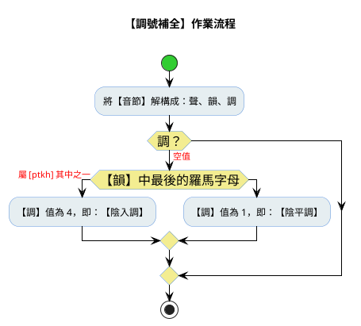

# 甘字典轉換指引

## 摘要

規範存放在 Excel 檔案中的《甘字典》，如何轉換成符合中州韻【輸入方案】使用的【字典檔】（YAML檔案格式）。

## 來源 Excel 檔

檔案：【甘字典】ChhoeTaigi_KamJitian.xlsx。

### 需求規格

#### 需求摘要

##### 1. 【甘字典】工作表結構簡介

此為轉換作業，提供來源的工作表。

每個【漢字】使用一個【音節】來標示其讀音。一個完整的【音節】，其結構應俱備：聲母、韻母、調號（音調）。

音節 = 聲母 + 韻母 + 調號 = 聲 + 韻 + 調

每個【辭彙】，由兩個以上的【漢字】所構成。一個【漢字】會有一個相對映之【音節】，由兩個【音節】所構成之【辭彙】，兩【音節】之間，以【-】符號相連構成。

【甘字典】工作表的欄位，有 A 至 N 欄。但實際使用的欄位，僅只： D/H/J/L 這四欄。

| A          | D              | H                          | J        | L                |
|------------|----------------|----------------------------|----------|------------------|
| DictWordID | HanLoTaibunPoj | KaisoehHanLoPoj            | KipInput | HanbunImKipInput |
| 25121| 云 | 山川 ê 氣, 雲霧; 振動, 常常, 講話, 應答, 字姓.          | Un5  |       |
| 8572 | 仁	| 人 ê 心 應該 著 存 ê 好款, 相疼, 親愛, 吞忍; 物 結實.   | Jin5 |       |
| 4478 | 五 | 五月, 親chiâⁿ 五月, 五穀, 五月節; 五總頭.               | goo7 | Ngoo2 |

- DictWordID（A欄）：字典識別碼
- HanLoTaibunPoj（D欄）：漢字
- KaisoehPoj（H欄）：不完全之白話字/漢字譯文
- KipInput（J欄）：白話音漢字標音/文讀音與白話音相同之漢字標音（使用【台羅標音】）
- HanbunImKipInput（M欄）：文讀音漢字標音

當【KipInput】或【HanbunImKipInput】欄內的【音節】（使用【台羅拼音】），若其羅馬字母首字為：大寫，表此【音節】屬【文讀音】；小寫，則改表【白話音】。

如：漢字【水】：其台羅音標【tsui2】表：白話音；【Sui2】表：文讀音。

##### 2. RIME 工作表

此為轉換作業，用於存儲結果的標的工作表。

###### 【轉換對映規則】

- text 欄：存放【漢字】 = 【來源工作表】的【HanLoTaibunPoj】欄
- code 欄：存放【音節】的【台羅拼音】= 【來源工作表】的【KipInput】或【HanbunImKipInput】欄
  - 台羅拼音的羅馬字母，一律使用【小寫】；原為首字母大寫者，需改為小寫；
  - 台羅拼音使用【輸入式】格式 = 聲母 + 韻母 + 調號
  - 聲母允許為空值，所以音節的台羅拼音有可能 = 韻母 + 調號
  - 因【台羅拼音】允許【調號 1】（陰平調）及【調號 4】（陰入調）可省略，但在【字典檔】的`code欄`需將之補回來。
- weight 欄：存放判讀音節為【文讀音】或【白話音】的數值。
  - 0.80：表【文讀音】
  - 0.60：表【白話音】
- stem 欄：存放【漢字】的解釋，原文為【白話字】。其值 = 【`[來源工作表的DictWordID欄]`】`[來源工作表的KaisoehPoj欄]`
- create 欄：存放資料建檔的【時刻】值，格式為：`yyyy-mm-dd hh:mm`

###### 【標的工作表轉換作業舉例】

| text  | code | weight | stem          | create           |
|-------|------|--------|---------------|------------------|
| 云| un5      | 0.90   |【25121】山川 ê 氣, 雲霧; 振動, 常常, 講話, 應答, 字姓.  |2026-06-29 12:23|
| 五| goo7     | 0.60   |【4478】五月, 親chiâⁿ 五月, 五穀, 五月節; 五總頭.        |2026-06-29 12:23|
| 五| ngoo2    | 0.80   |【4478】五月, 親chiâⁿ 五月, 五穀, 五月節; 五總頭.        |2026-06-29 12:23|
| 井| tsing2   | 0.80   |【1440】水堀 ê 空, 深, 清, 次序, 水井, 卜卦 ê 名.        |2026-06-29 12:23|


1. 來源工作表的 row 3 ：因為填入【KipInput】欄的音節資料，其台羅拼音為：【Un5】（首字大寫，為文讀音），故知是為【文讀音】，所以【weight】欄填入值【0.80】。又因【HanbunImKipInput】欄為空值，所以；所以漢字【云】俱有的特性為：只有【文讀音】，沒有【白話音】；或是【文讀音】與【白話音】為相同音。這筆資料填入【標的工作表】的 row 2。
2. 來源工作表的 row 4：因為填入【KipInput】欄的音節資料，其台羅拼音為：【goo7】，故知是為【白話音】，所以【weight】欄填入值【0.60】，這筆資料填入【標的工作表】的 row 3。
3. 來源工作表的 row 4：因為不僅【KipInput】欄有填音節資料，且【HanbunImKipInput】欄也有資料填入，故得拆分兩筆資料紀錄，分別寫入【RIME】工作表。因此欄填入之台羅拼音為：【Ngoo2】，故知是為【文讀音】，所以【weight】欄填值【0.80】。這筆資料填入【標的工作表】的 row 4。

#### 3. 中州韻輸入方案字典檔格式

```yml
# Rime dictionary
# encoding: utf-8
#
# 台語白話音日常辭庫
#
---
name: ji_khoo_kam_ji_tian
version: "v0.1.0"
sort: by_weight
use_preset_vocabulary: false
columns:
  - text    # 漢字
  - code    # 台灣音標（TLPA）拼音
  - weight  # 常用度（優先顯示度）
  - stem    # 用法舉例
  - create  # 建立時間
...
云	un5   	0.90	【25121】山川 ê 氣, 雲霧; 振動, 常常, 講話, 應答, 字姓.	2026-06-29 12:23
五	goo7  	0.60	【4478】五月, 親chiâⁿ 五月, 五穀, 五月節; 五總頭.      	2026-06-29 12:23
五	ngoo2 	0.80	【4478】五月, 親chiâⁿ 五月, 五穀, 五月節; 五總頭.      	2026-06-29 12:23
```

### 作業流程

### 設計規格

1. 程式語言：Python Script
2. Excel 操作套件庫： xlwings
3. 程式檔名稱： convert_kam_ji_tian_to_rime_dict.py
4. 程式存放路徑： tools\
5. 操作用法：

```python
py tools/convert_kam_ji_tian_to_rime_dict.py

python tools/convert_kam_ji_tian_to_rime_dict.py --selftest   # 驗證邏輯
python tools/convert_kam_ji_tian_to_rime_dict.py              # 執行轉換（Excel 開著即可）
python tools/convert_kam_ji_tian_to_rime_dict.py --yaml ji_khoo_kam_ji_tian.dict.yaml  # 加匯出字典檔
```


### 參考

- `400_台羅拼音辭彙_轉換成RIME字典.md`：補全調號的作業流程中，如何判斷【調號】應該填【1】？還是【4】？的流程如下圖所：

