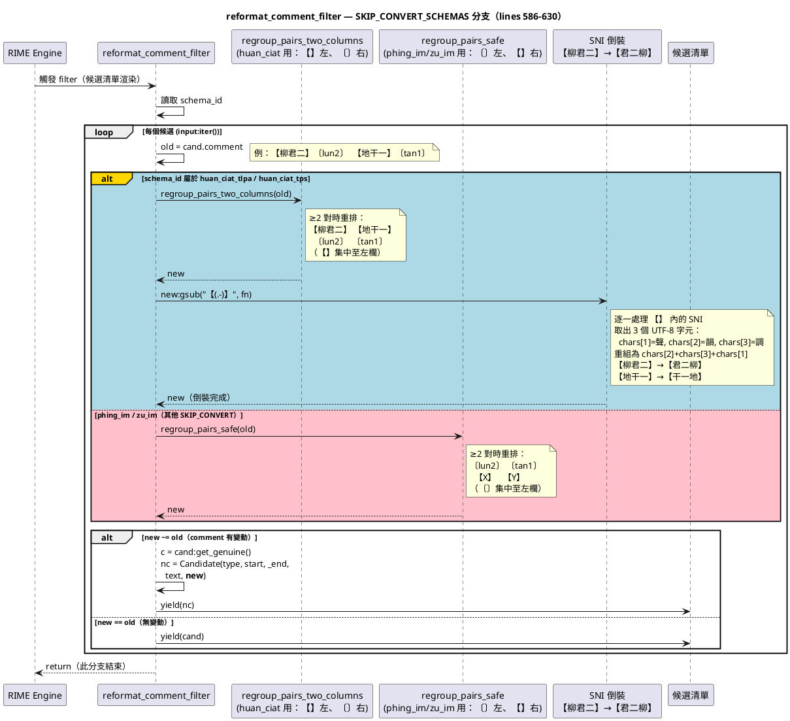

# rime.lua 程式碼指引

## reformat_comment_filter()

### 程式碼解說（第 586–630 行）

```lua
function reformat_comment_filter(input, env)
    -- ...
	if SKIP_CONVERT_SCHEMAS[schema_id] then
		for cand in input:iter() do
			local old = cand.comment or ""
			-- <<< 註解有問題，待修訂：
			-- huan_ciat：【SNI】〔字典〕格式，需將 【】 排左欄
			-- 其他方案：〔字典〕【注音/拼音〕格式，沿用 regroup_pairs_safe
			-- >>>
			local new
			if schema_id == "huan_ciat_tlpa" or schema_id == "huan_ciat_tps" then
				new = regroup_pairs_two_columns(old)
			else
				new = regroup_pairs_safe(old)
			end
			-- 【反切】方案（huan_ciat）：左欄【十五音】需從【聲+韻+調】調整成【韻+調+聲】
			-- 例：柳君二 → 君二柳
			-- 反切兩種方案均使用 【十五音】〔字典編碼〕 格式：
			--   huan_ciat_tlpa：【十五音】〔台語音標〕
			--   huan_ciat_tps ：【十五音】〔方音符號〕
			-- 只倒裝 【...】 中的十五音（三字元），不碰右欄 〔...〕
			if schema_id == "huan_ciat_tlpa" or schema_id == "huan_ciat_tps" then
				new = new:gsub("【(.-)】", function(s)
					local chars = {}
					for uchar in s:gmatch("[%z\1-\127\194-\244][\128-\191]*") do
						table.insert(chars, uchar)
					end
					if #chars == 3 then
						return "【" .. chars[2] .. chars[3] .. chars[1] .. "】"
					else
						return "【" .. s .. "】"
					end
				end)
			end
			log.info("[reformat_comment_filter] skip_convert raw=[" .. old .. "] new=[" .. new .. "]")
			if new ~= old then
				local c = cand:get_genuine()
				local nc = Candidate(c.type, c.start, c._end, c.text, new)
				nc.preedit = cand.preedit
				nc.quality = cand.quality
				yield(nc)
			else
				yield(cand)
			end
		end
		return
	end
    -- ...
end
```

這段是 reformat_comment_filter 的 SKIP_CONVERT_SCHEMAS 分支，負責在 RIME 顯示候選清單之前，把每個候選的 comment（標注欄）重新格式化。分三個步驟處理：

#### 步驟 1 — 重排兩欄（重組多音節詞）

```lua
if schema_id == "huan_ciat_tlpa" or schema_id == "huan_ciat_tps" then    
    new = regroup_pairs_two_columns(old)   -- 【】 左欄、〔〕 右欄
else    
    new = regroup_pairs_safe(old)          -- 〔〕 左欄、【】 右欄
end
```

|方案	|輸入（原始 comment）	|輸出（重排後）|
|-------|-----------------------|--------------|
|huan_ciat|	【柳君二】〔lun2〕  【地干一】〔tan1〕	|【柳君二】 【地干一】  〔lun2〕 〔tan1〕|
|phing_im / zu_im|	〔lun2〕【柳君二】  〔tan1〕【地干一】	〔lun2〕 〔tan1〕  |【柳君二】 【地干一】|

單音節（只有一對）不觸發條件，原樣回傳。

#### 步驟 2 — 十五音 SNI 倒裝（僅 huan_ciat）

```lua
new = new:gsub("【(.-)】", function(s)
    local chars = {}
    for uchar in s:gmatch("...") do table.insert(chars, uchar) end
    if #chars == 3 then
        return "【" .. chars[2] .. chars[3] .. chars[1] .. "】"
    end
end)
```

把 【】 內的 SNI 三字元從 聲+韻+調 → 韻+調+聲 順序：

- 【柳君二】 → 【君二柳】
- 【地干一】 → 【干一地】

#### 步驟 3 — 輸出候選

```lua
if new ~= old then
    local nc = Candidate(c.type, c.start, c._end, c.text, new)
    yield(nc)   -- 建新候選，附上修改後的 commentelse    yield(cand) -- 未變動，直接輸出原候選
end
```

### 循序圖

